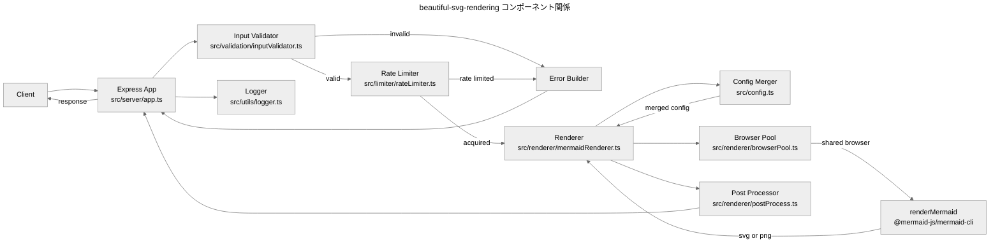
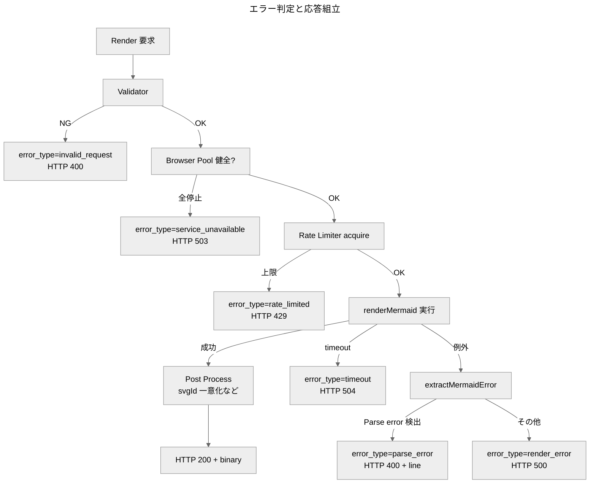
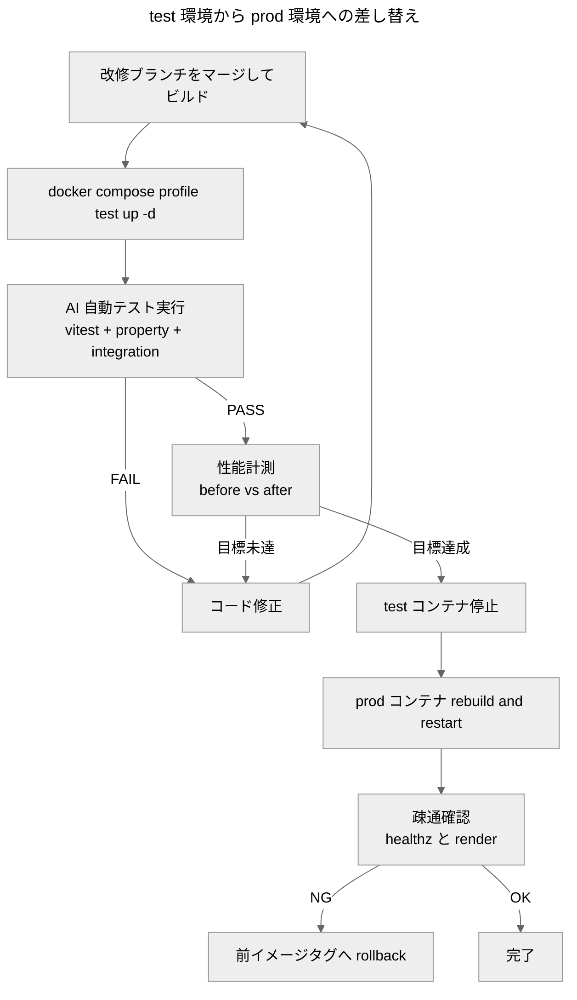

# 設計書: beautiful-svg-rendering

## 1. 概要

### 1.1 設計目標

本改修は要件定義書(`requirements.md`)の REQ-* / US-* を満たす実装方針を定める。中核となる設計目標は次の 4 点である。

| ID | 目標 | 達成手段の概略 | 関連要件 |
|---|---|---|---|
| **G-1** | 配布 HTML 用途で「美しい」既定出力 | Beautiful_Defaults を `src/config.ts` に集約、`themeCSS` で foreignObject クリップ抑制 | REQ-U-01, US-01〜US-03 |
| **G-2** | コンシューマフォント差による視覚的見切れの解消 | `htmlLabels: true` 維持 + `themeCSS: ".label foreignObject { overflow: visible }"` 注入 | REQ-U-01, US-02 |
| **G-3** | レイテンシ短縮(req あたり 1〜2 秒 → 0.1〜0.3 秒) | `mmdc` subprocess → `renderMermaid()` Programmatic_API + Browser_Pool 共有 | REQ-U-08, US-07, NFR-01 |
| **G-4** | リクエスト形状の後方互換維持・出力構造の安全性 | 新フィールドは全て optional / Server_Locked_Setting で固定 | REQ-U-02, REQ-UN-01〜04 |

### 1.2 要件参照規約

本設計書は要件定義書の REQ-* / US-* / NFR-* / C-*(技術的制約)を**参照のみ**し、要件本文を再掲しない(DRY)。関連 ID の併記形式は文脈に応じて次のいずれかを採用する:

- **§5「正確性プロパティ」表**: `Validates` 列に REQ-* を明示(自動テストとの紐付けが目的のため形式統一)
- **設計判断・コンポーネント設計テーブル**: 表の「関連要件」「根拠」列に ID を列挙
- **本文段落**: 末尾または該当箇所に括弧書きで `(REQ-X / C-Y)` 形式

いずれの形式でも、関連 ID が必ず 1 つ以上明示されることを要求する。

## 2. アーキテクチャ

### 2.1 現行構造の課題

| 課題 | 出処 | 影響 |
|---|---|---|
| `mmdc` 起動毎に Puppeteer/Chromium をブート | `src/renderer/mermaidRenderer.ts:42-65` の `execFileAsync('npx', ['--yes','mmdc',...])` | リクエストごとに 1〜2 秒固定オーバーヘッド(NFR-01 違反) |
| Mermaid 設定がサーバ起動時の固定ファイル | `src/server/server.ts:30-38` で `mermaid.config.json` を一度だけ書き出し | リクエストごとの設定差替えが原理的に不可能(REQ-U-03 未達) |
| `MERMAID_PADDING` は themeCSS の `svg { padding }` 注入のみ | `src/config.ts:37-50` の `generateMermaidConfig()` | ノード内余白制御に介入できない(US-03 未達) |
| エラー応答は `mmdc` 生 stderr のみ | `src/server/app.ts:43-63` の `sendError()` | 行番号・抽出本文がない(US-05 未達) |

### 2.2 新アーキテクチャ

`mmdc` subprocess 方式を廃し、`@mermaid-js/mermaid-cli` が export する `renderMermaid()` Programmatic_API に切り替える。Puppeteer ブラウザインスタンスは Browser_Pool としてサーバ起動時に常駐させ、リクエスト間で共有する。Mermaid 設定はリクエストごとにオブジェクトを組み立てて `mermaidConfig` として直渡しする(一時ファイル不要)。

#### 図 1: コンポーネント関係(新アーキテクチャ)



#### 図 2: 1 リクエストの処理シーケンス(現行 vs 新方式)


### 2.3 アーキテクチャ判断の根拠

- **Programmatic_API 採用** ← C-M-05(`mmdc` に inline config 渡しフラグが無く、リクエスト毎の設定差替えに毎回ファイル書出しが必要)+ NFR-01(レイテンシ目標) + REQ-U-08(Browser_Pool 常駐) を同時に解決するため。
- **Browser_Pool** ← Puppeteer/Chromium 起動が支配的コストで、リクエスト間で共有可能(`renderMermaid(browser, ...)` のシグネチャ)。
- **semver 対象外リスク(C-M-07)** ← NFR-02 で `@mermaid-js/mermaid-cli@^11.12.0` を継続採用し、依存バージョンを `package.json` で pinning。テスト用 Docker で先行検証(NFR-03)してから本番差替えで吸収。
- **`htmlLabels: true` 維持** ← C-M-03 で v11.11+ に複数 Approved Bug が open。`themeCSS` の `foreignObject overflow visible` で代替対応(G-2)。

## 3. コンポーネント設計

### 3.1 `src/config.ts` の拡張

#### 既存定数の維持

`DEFAULT_TIMEOUT_MS` / `MAX_CONCURRENT_RENDERERS` / `MAX_CODE_SIZE` / `TEMP_DIR` / `SUPPORTED_FORMATS` / `PUPPETEER_CONFIG_PATH` / `PNG_RENDER_SCALE` / `MERMAID_CONFIG_PATH` は現状の責務のまま継続。`toPositiveInt()` ユーティリティも継承。

#### 新規追加

| シンボル | 種別 | 役割 |
|---|---|---|
| `DEFAULT_FORMAT` | `'svg'` const | DRY 改善: `inputValidator.ts` ハードコードを集約 |
| `CONTENT_TYPE_MAP` | `Readonly<Record<'svg'\|'png', string>>` | DRY 改善: `server/app.ts` ローカル定義を集約 |
| `BEAUTIFUL_DEFAULTS` | `Readonly<MermaidConfig>` | Beautiful_Defaults の単一情報源 |
| `SERVER_LOCKED_SETTINGS` | `Readonly<MermaidConfig>` | Server_Locked_Setting の単一情報源 |
| `BROWSER_POOL_SIZE` | `number`(env: `BROWSER_POOL_SIZE`、default `MAX_CONCURRENT_RENDERERS` と同値) | Browser_Pool のサイズ |
| `MAX_THEME_CSS_LENGTH` | `number` const = `4096` | `themeCSS` 入力の上限長(REQ-UN-05) |
| `THEME_CSS_FORBIDDEN_PATTERNS` | `readonly string[]` | `themeCSS` 入力の禁止部分文字列リスト(下記 §3.3 参照) |
| `MERMAID_PADDING` | 既存維持、default を `0` に変更 | C-H-02 と整合(SVG ルート CSS padding 廃止) |

#### `BEAUTIFUL_DEFAULTS` の確定値

| キー | 値 | 根拠 |
|---|---|---|
| `theme` | `"base"` | 親システム既定継承 |
| `themeVariables.fontFamily` | `'"Noto Sans CJK JP", "IPAexGothic", sans-serif'` | 親システム既定継承(サーバ側 Noto 同梱) |
| `themeCSS` | `.label foreignObject { overflow: visible; }` | G-2(C-H-03 対応) |
| `htmlLabels` | `true`(root レベル) | C-M-02 / REQ-UN-02 / G-2 |
| `securityLevel` | `"strict"` | C-S-01(Server_Locked_Setting と二重指定) |
| `suppressErrorRendering` | `true` | REQ-U-07 |
| `flowchart.useMaxWidth` | `false` | C-H-02 / US-04 |
| `flowchart.diagramPadding` | `0` | US-03(外周余白圧縮) |
| `flowchart.nodeSpacing` | `30` | US-03(コンパクト) |
| `flowchart.rankSpacing` | `40` | US-03(コンパクト) |
| `flowchart.curve` | `"basis"` | Mermaid 既定継承(配布資料に無難) |
| `flowchart.wrappingWidth` | `200` | Mermaid 既定継承 |
| `flowchart.defaultRenderer` | `"dagre-wrapper"` | REQ-UN-03(ELK 既定化禁止) |

#### `SERVER_LOCKED_SETTINGS` の確定値

| キー | 値 | 根拠 |
|---|---|---|
| `securityLevel` | `"strict"` | REQ-UN-01 / C-S-01 |
| `maxTextSize` | `50000` | C-S-02 |
| `maxEdges` | `500` | C-S-02 |

#### 関数

```ts
// 旧: generateMermaidConfig(padding: number)
// 新: 引数を取り、Beautiful_Defaults を返すだけの参照関数に簡素化
//     リクエストごとのマージは buildRequestMermaidConfig() で行う
export function getBeautifulDefaults(): Readonly<MermaidConfig>

// リクエスト時マージ(REQ-E-01)
//   merged = deepMerge(BEAUTIFUL_DEFAULTS, userOverride)
//   merged = deepMerge(merged, SERVER_LOCKED_SETTINGS)   // 最後に強制適用
export function buildRequestMermaidConfig(
  userOverride: Partial<MermaidConfig> | undefined,
  warnings: WarningCollector
): MermaidConfig

// 廃止: サーバ起動時の mermaid.config.json 書き出し(server.ts)
// 代わりに renderMermaid() に直接渡す
```

### 3.2 `src/renderer/mermaidRenderer.ts` の刷新

#### `BrowserPool` クラス(新規 `src/renderer/browserPool.ts`)

```ts
class BrowserPool {
  // Puppeteer ブラウザインスタンスを BROWSER_POOL_SIZE 個保持
  // Promise.race ベースで acquire / release
  async acquire(): Promise<Browser>
  release(browser: Browser): void
  async close(): Promise<void>
  // ヘルスチェック: page.evaluate('1') で生存確認、失敗インスタンスを除外
  // REQ-S-02 を実現
}
```

Browser_Pool は Express アプリ起動時に初期化、シャットダウン時に全インスタンスを `close()`。初期化が完了するまで `/render` は 503 を返す(REQ-S-01)。

#### `MermaidRenderer.render()` の新シグネチャ

```ts
interface RenderInput {
  requestId: string
  code: string
  format: 'svg' | 'png'
  timeoutMs: number
  mermaidConfig: MermaidConfig        // 既にマージ済(buildRequestMermaidConfig の結果)
  postProcess?: PostProcessOption
  svgId: string                       // request_id 由来の一意 ID(§7)
}

interface RenderResult {
  success: boolean
  data?: Buffer
  stderr?: string
  exitCode?: number | null
  errorType?: ErrorType
  errorMessage?: string | null         // 新規(REQ-U-05)
  line?: number | null                 // 新規(REQ-E-04)
}
```

実装:
- `renderMermaid(browser, code, format, { mermaidConfig, svgId, ... })` を呼出
- 例外/エラーは `extractMermaidError()`(下記 §6)で構造化
- 成功時に `postProcess` を適用(§7)
- 一時ファイル不要(`mmdc --configFile` ルート廃止)

### 3.3 `src/validation/inputValidator.ts` の拡張

#### 受理する新フィールド

```ts
interface RenderRequestInput {
  // 既存
  code?: unknown
  format?: unknown
  timeout_ms?: unknown
  // 新規
  mermaid_config?: unknown
  post_process?: unknown
}
```

#### バリデーション規約

- `mermaid_config` は `object` 型のみ受理、それ以外は HTTP 400(REQ-E-07)
- `mermaid_config` 配下の未知キーは**無視 + 警告ログ**(REQ-E-06)
- `mermaid_config.securityLevel` 指定は**無視 + 警告ログ**(REQ-E-02)
  - 同様に `SERVER_LOCKED_SETTINGS` に列挙されているキーは全て無視
- `post_process` は `object` 型のみ受理、未知キーは無視 + 警告ログ
- `post_process.rewrite_ids: boolean` を許可(default は true)
- `post_process.strip_max_width: boolean` を許可(default は false。`useMaxWidth: false` 既定で大半は不要)
- `format=png` と SVG 専用 `post_process.*` の同時指定は無視 + 警告ログ(REQ-E-05)
- `mermaid_config.themeCSS` の検証(REQ-UN-05):
  - 文字列長 > `MAX_THEME_CSS_LENGTH`(`4096`)→ HTTP 400 / `error_type=invalid_request` / 警告コード `theme_css_rejected`
  - `THEME_CSS_FORBIDDEN_PATTERNS` のいずれかを **case-insensitive substring match** で含む → 同上で拒否
  - 禁止部分文字列リスト: `</style`, `<script`, `javascript:`, `@import`, `expression(`, `url(`, `behavior:`
  - 二段防御の根拠: Mermaid 内 DOMPurify(`securityLevel=strict`)に依存せず、API 入口で粗いブロックを挟むことで、依存ライブラリの挙動変化(C-M-07)に対する追加防御層を設ける

#### `WarningCollector` の導入

```ts
class WarningCollector {
  add(code: string, detail: Record<string, unknown>): void
  drain(): Warning[]   // ログ出力時に消費
}
```

警告コードは enum 化(`unknown_key` / `locked_setting_override_ignored` / `svg_only_option_in_png` 等)し、構造化ログ(`logger.ts`)で `warnings: [...]` として記録(NFR-04)。

### 3.4 `src/server/app.ts` の拡張

- リクエスト boundary でバリデータから返る `RenderInput` を `MermaidRenderer.render()` に渡す
- レスポンス失敗時 JSON 組立に `error_message` / `line` を追加
- `Content-Type` 解決は `CONTENT_TYPE_MAP`(§3.1)を参照
- Browser_Pool 未初期化検知時に 503 + `error_type=service_unavailable` を返却(REQ-S-01)

### 3.5 マージロジック(`buildRequestMermaidConfig`)の優先順位

```
1. BEAUTIFUL_DEFAULTS                       (最弱・基底)
2. ユーザー mermaid_config(SERVER_LOCKED_SETTINGS キーは除外済)
3. SERVER_LOCKED_SETTINGS                   (最強・上書き不可)
```

deep merge は浅い merge ではなく、`flowchart.diagramPadding` 単独指定でも他の `flowchart.*` キーが消えないように再帰的に行う(`utils/deepMerge.ts` を新規作成、または既存ライブラリの最小コピー)。

## 4. データモデル

### 4.1 API リクエスト型(TypeScript)

```ts
// src/types/api.ts(新規 or app.ts 配下)
interface RenderRequest {
  code: string
  format?: 'svg' | 'png'           // 既存
  timeout_ms?: number              // 既存
  mermaid_config?: Partial<MermaidConfig>  // 新規(REQ-U-03)
  post_process?: {                          // 新規(REQ-U-04)
    rewrite_ids?: boolean
    strip_max_width?: boolean
  }
}

// MermaidConfig は Mermaid 公式型を参照(@mermaid-js/mermaid 由来)
// 本 API では Partial<MermaidConfig> を受理し、サーバ側で deep merge
```

### 4.2 API レスポンス型

```ts
// 成功時はバイナリ(SVG/PNG)+ ヘッダ(変更なし)
// 失敗時 JSON:
interface RenderErrorResponse {
  request_id: string                  // 既存
  error_type: ErrorType               // 既存(+ 'service_unavailable' を追加)
  status_code: number                 // 既存
  stderr: string                      // 既存(raw 保持)
  exit_code: number | null            // 既存
  format: 'svg' | 'png'               // 既存
  error_message: string | null        // 新規(REQ-U-05)
  line: number | null                 // 新規(REQ-E-04)
}

type ErrorType =
  | 'parse_error'
  | 'render_error'
  | 'timeout'
  | 'rate_limited'
  | 'invalid_request'
  | 'service_unavailable'            // 新規(REQ-S-01)
```

### 4.3 内部レンダリングコンテキスト型

```ts
// Validator → Renderer 間の DTO
interface RenderContext {
  requestId: string
  code: string
  format: 'svg' | 'png'
  timeoutMs: number
  mermaidConfig: MermaidConfig         // マージ済(buildRequestMermaidConfig の結果)
  postProcess: NormalizedPostProcess   // default 値が埋まった正規化済
  svgId: string                        // request_id 由来の一意 ID
  warnings: WarningCollector
}
```

## 5. 正確性プロパティ(検証可能仕様)

| ID | 内容 | Validates |
|---|---|---|
| **PROP-1** | 既存リクエスト `{code, format}` のみで POST → HTTP 200、Content-Type 一致 | REQ-U-02 |
| **PROP-2** | `mermaid_config.securityLevel = "loose"` を送信 → 実際のレンダリング設定は `"strict"`、警告ログ 1 件 | REQ-E-02, REQ-UN-01 |
| **PROP-3** | `mermaid_config` 未指定リクエストの実際適用設定 = `BEAUTIFUL_DEFAULTS` | REQ-U-01, REQ-E-01 |
| **PROP-4** | `format=png` + `post_process.strip_max_width=true` → PNG 200 + 警告ログ 1 件 | REQ-E-05 |
| **PROP-5** | パース失敗時のレスポンス JSON で `line` が `null` または正の整数 | REQ-E-04 |
| **PROP-6** | 100 連続リクエスト後、Puppeteer プロセス数 ≤ `BROWSER_POOL_SIZE` | REQ-U-08 |
| **PROP-7** | Browser_Pool 初期化前にリクエスト → 503 + `error_type=service_unavailable` | REQ-S-01 |
| **PROP-8** | `mermaid_config.flowchart.diagramPadding = 16` を指定 → 単独 `diagramPadding` 変更で他 `flowchart.*` キーが消えない(deep merge 検証) | REQ-E-01 |
| **PROP-9** | `mermaid_config.themeCSS` の文字列長が上限超過 → HTTP 400 | REQ-UN-05 |
| **PROP-10** | 構文エラー入力で SVG ボディ "Syntax error" を含まない | REQ-U-07 |
| **PROP-11** | `mermaid_config.themeCSS` が `THEME_CSS_FORBIDDEN_PATTERNS` のいずれかを含む → HTTP 400 + `error_type=invalid_request` + 警告コード `theme_css_rejected` | REQ-UN-05 |

各プロパティは `test/property/*.property.test.ts` に fast-check ベースで実装する(§9)。

## 6. エラーハンドリング

### 6.1 エラー種別マッピング

| 発生源 | 検出方法 | `error_type` | HTTP |
|---|---|---|---|
| 入力バリデーション | validator が return | `invalid_request` | 400 |
| Mermaid パースエラー | 例外メッセージ正規表現 `^Parse error on line` / `^Lexical error on line` | `parse_error` | 400 |
| Mermaid レンダリング失敗(その他) | 例外発生・空 SVG 等 | `render_error` | 500 |
| タイムアウト | `setTimeout` で `renderMermaid()` を競争 → 勝敗 | `timeout` | 504 |
| 同時実行上限 | RateLimiter で acquire 拒否 | `rate_limited` | 429 |
| Browser_Pool 未初期化 / 全停止 | Pool 状態フラグ | `service_unavailable` | 503 |

#### 図 3: エラー判定と応答組立



### 6.2 `extractMermaidError()` 規約

```ts
function extractMermaidError(rawErrorText: string): {
  errorType: 'parse_error' | 'render_error'
  errorMessage: string | null
  line: number | null
}
```

#### 適用する正規表現(順序適用、最初にマッチしたもの)

| 順位 | 正規表現 | 抽出 | 由来 |
|---|---|---|---|
| 1 | `/Parse error on line\s+(\d+):\s*([\s\S]*?)(?=\n\s*at\s|\nError:|\n\n|$)/i` | line, message | 専門家レビュー §3.6 |
| 2 | `/Lexical error on line\s+(\d+)\.?\s*([\s\S]*?)(?=\n\s*at\s|\nError:|\n\n|$)/i` | line, message | 同上 |
| 3 | `/Error:\s*([\s\S]*?)(?=\n\s*at\s|$)/i` | message のみ | 同上 |
| 4 | (どれにもマッチしない) | message=null, line=null | フォールバック |

#### 行番号扱い(C-M-06)

抽出した `line` は応答に整数で含める。**抽出失敗時は `null`**。行番号がずれる可能性は API 仕様(`requirements.md` §5)に明示しており、UI 側で「N 行目付近」と表現する責任は呼出側に委ねる。

#### "Syntax error" 図混入防止(REQ-U-07)

`suppressErrorRendering: true` を `BEAUTIFUL_DEFAULTS` で固定。同設定下では Mermaid が `parse_error` を例外として throw するため、サーバ側で確実に捕捉できる。

## 7. Post Process 設計

本改修で実装する Post_Process_Option は **`rewrite_ids`(SVG 生成時に適用)** と **`strip_max_width`(SVG 生成後に適用)** の 2 種類。それぞれの責務と仕様を以下に定義する。

### 7.1 ID 衝突対策(軽量版): `rewrite_ids`

要件定義書 §8 で「同一ページ複数 SVG embed の完全対応は将来別票」と定めた。本改修では次のみ実装する:

- `renderMermaid()` 呼出時に `svgId: \`mermaid-\${requestId}\`` を渡す
- これにより SVG ルート要素の `id` 属性が `mermaid-<UUID>` となり、最低限の名前空間分離が達成される
- 適用経路: **SVG 生成時**(`renderMermaid()` 引数経由、SVG 文字列を加工しない)

#### 7.1.1 フェーズ別セマンティクス

| 値 | Phase 1(本改修) | Phase 2(将来別票) |
|---|---|---|
| `true`(default) | SVG ルート要素の `id` 属性を `mermaid-<requestId>` で一意化。SVG 内部 ID(`<marker>` / `<clipPath>` / `<filter>` / `<linearGradient>`)はそのまま | 内部 ID も `mermaid-<requestId>-<original>` 形式で全 rewrite |
| `false` | Mermaid 既定 `svgId`(`mermaid-1` 等)で出力。ID 一意化を行わない | 同左 |

> 注: Phase 1 では `rewrite_ids: true` の効果は **ルート ID 一意化のみ** であり、同一 HTML に複数 SVG embed すると `<marker id="arrowhead">` 等が衝突する(C-H-01 / 要件定義書 §8 Out of Scope)。Phase 2 は Phase 1 利用者の挙動を内包する形(superset)で拡張するため、`true` 指定の API 利用者は後方互換が保たれる。

### 7.2 `max-width` インラインスタイル除去: `strip_max_width`

- 適用経路: **SVG 生成後**(`src/renderer/postProcess.ts` で SVG 文字列を加工)
- 対象: **ルート `<svg>` 要素の `style` 属性のみ**(子要素の `style` には触らない)
- 処理: `style` 属性内の `max-width` CSS 宣言のみを **case-insensitive** で除去。他の宣言(`color`, `background`, `font-family` 等)は保持する
- 例:
  - Before: `<svg ... style="max-width: 300px; color: black;">` → After: `<svg ... style="color: black;">`
  - Before: `<svg ... style="max-width: 300px;">` → After: `<svg ... >`(`style` 属性が空になるため属性ごと削除)
  - Before: `<svg ... style="MAX-WIDTH:300PX">` → After: `<svg ... >`(大小文字無視)
- 既定動作: `Beautiful_Defaults` の `useMaxWidth: false` 下では Mermaid が `style="max-width:..."` を付与しないため、通常は **no-op**。`useMaxWidth: true` をユーザーが Mermaid_Config_Override で上書きした場合や、将来 Mermaid 側挙動が変わった場合の防御として残す
- `format=png` 同時指定時の扱い: REQ-E-05 に従い無視 + 警告ログ(`svg_only_option_in_png`)

## 8. デプロイ戦略(test Docker → prod Docker 差し替え)

NFR-03 に基づき、現行本番 Docker を稼働させたままテスト用 Docker で検証する blue/green 風の差し替え手順を採用する。

### 8.1 `docker-compose.yml` の構成

```yaml
services:
  mermaid-render-api:               # prod(変更なし)
    build: .
    ports: ['3100:3000']
    env_file: .env
    restart: unless-stopped

  mermaid-render-api-test:          # 新規(本改修用)
    build: .                        # 同じ Dockerfile、ENV のみ差替
    ports: ['3101:3000']            # 別ポートで並走
    env_file: .env.test             # MERMAID_PADDING=0 等の改修側既定
    profiles: ['test']              # `docker compose --profile test up` で個別起動
    restart: 'no'
```

`profiles: ['test']` により、通常の `docker compose up` では起動せず、検証時のみ起動する。

### 8.2 検証フロー

#### 図 4: テスト Docker → 本番 Docker 差し替えフロー



### 8.3 OK 判定基準(自動)

- `vitest run`(unit + integration + property)が全て通る
- 性能計測スクリプト(`scripts/perf-check.ts` を新規追加)で次を満たす:
  - 単純 flowchart(ノード 5 個以下)のレイテンシ中央値 ≤ **500ms**(NFR-01)
  - 連続 100 リクエストで Puppeteer プロセス数が `BROWSER_POOL_SIZE` を超えない(PROP-6)
- 視覚的回帰の人間判定は行わない(要件: AI 駆動)

### 8.4 切替時の安全策

- prod 切替前に最新 prod イメージタグを保持(`docker image tag` で rollback 用)
- prod 切替後、`/healthz` と `POST /render`(最小サンプル)の疎通を自動チェック
- 異常時は即時 rollback

## 9. テスト戦略(AI 駆動・自動中心)

### 9.1 既存テストの継承

| 種別 | ディレクトリ | 改修方針 |
|---|---|---|
| unit | `test/*.test.ts` | 既存 + 新規(`config.ts` の merge ロジック、`extractMermaidError` 等) |
| integration | `test/integration/*.test.ts` | 既存 `render.test.ts` を新リクエスト形状で拡張 |
| property | `test/property/*.property.test.ts` | §5 の PROP-1〜11 を fast-check ベースで追加 |

### 9.2 新規テスト

- `test/unit/buildRequestMermaidConfig.test.ts`: マージ優先順位(BEAUTIFUL → user → LOCKED)の検証
- `test/unit/extractMermaidError.test.ts`: 正規表現適用順、行番号抽出
- `test/integration/browserPool.test.ts`: Browser_Pool の初期化、acquire/release、ヘルスチェック
- `test/integration/serverLockedSettings.test.ts`: `securityLevel` override が無視されること
- `test/property/*.property.test.ts`: PROP-1〜11

### 9.3 視覚的回帰(必要十分の範囲)

`docs/svg-padding-investigation/cases/*.mmd` の 10 ケースを CI で SVG/PNG として生成し、**生成自体が成功する** ことのみ自動検証(出力バイト一致は要求しない / 人間目視は要求しない)。

### 9.4 性能定量計測

`scripts/perf-check.ts` を新規追加:

- 100 並列リクエストを送信(同一 Mermaid コード)
- レイテンシの p50/p95/p99 を計測
- Puppeteer プロセス数を `pgrep chrome` で計測
- 結果を JSON で出力 → CI ログに残す
- before(現行)/after(改修後)で同条件で実行し比較ログを残す(NFR-01 達成判定)

## 10. 開発手法

### 10.1 TDD 適用範囲

「必要十分に」TDD を適用する箇所:

- `buildRequestMermaidConfig`(マージ優先順位ロジック、エッジケース多い)
- `extractMermaidError`(正規表現の網羅性)
- `BrowserPool` の acquire/release/ヘルスチェック(状態遷移が複雑)

それ以外(`server/app.ts` のルーティング配線、`server.ts` のブートストラップ修正等)はテストファースト不要、後追いで integration test を書く。

### 10.2 DRY / 定数局所化の遵守事項

| 対象 | 現状 | 改善後 |
|---|---|---|
| `DEFAULT_FORMAT='svg'` | `inputValidator.ts` ハードコード | `config.ts` の `DEFAULT_FORMAT` 定数 |
| `CONTENT_TYPE_MAP` | `server/app.ts` ローカル | `config.ts` の `CONTENT_TYPE_MAP` 定数 |
| Mermaid 設定の基底値 | `config.ts` の `generateMermaidConfig()` 内に散在 | `config.ts` の `BEAUTIFUL_DEFAULTS` 単一定数 |
| Server_Locked_Setting | (存在しない) | `config.ts` の `SERVER_LOCKED_SETTINGS` 単一定数 |
| 警告コード文字列 | (存在しない) | `WarningCode` enum で集約 |

実装時にこれらの集約を必ず行う(後付け禁止)。

## 11. リスクと緩和

| リスク | 由来 | 緩和策 |
|---|---|---|
| Programmatic_API が semver 対象外(C-M-07) | `@mermaid-js/mermaid-cli` README 明記 | 依存を `^11.12.0` に pinning(NFR-02)、テスト用 Docker で先行検証(NFR-03)、アップデート時は手動レビュー |
| Mermaid 行番号ずれ([#3853](https://github.com/mermaid-js/mermaid/issues/3853)) | C-M-06 | `line` は参考値として返す。UI 側で「N 行目付近」と表現する責任は呼出側 |
| `htmlLabels: false` オプトイン利用時の既知バグ(C-M-03) | 利用者が opt-in した場合 | ドキュメントで既知 Issue を明示、デフォルト化はしない(REQ-UN-02) |
| Browser_Pool の Puppeteer インスタンス障害 | 長時間稼働の Chromium クラッシュ | ヘルスチェック失敗で除外、自動再生成(REQ-S-02) |
| 同一ページ複数 SVG embed の ID 衝突(C-H-01) | 配布側の利用方法依存 | Out of Scope。`svgId` 一意化のみ実装、将来別票 |

## 12. 実装フェーズ(参考)

詳細は `tasks.md`(別途作成)で扱う。本書では大枠のみ示す。

1. `config.ts` の定数集約(BEAUTIFUL_DEFAULTS / SERVER_LOCKED_SETTINGS / CONTENT_TYPE_MAP / DEFAULT_FORMAT) + 単体テスト
2. `buildRequestMermaidConfig` + `extractMermaidError` の実装 + 単体テスト
3. `BrowserPool` 実装 + integration test
4. `MermaidRenderer.render()` を Programmatic_API ベースに刷新
5. `inputValidator.ts` 拡張、`WarningCollector` 実装
6. `server/app.ts` 配線変更、エラー応答に `error_message` / `line` 追加、503 対応
7. `server/server.ts` の固定 config 書き出し廃止
8. property テスト追加(PROP-1〜11)
9. `docker-compose.yml` に test profile 追加 + `.env.test` 作成
10. `scripts/perf-check.ts` 新規 + before/after 計測
11. デプロイフロー(§8)実行

## 13. 関連ファイル(変更/新規)

| パス | 変更種別 |
|---|---|
| `src/config.ts` | 拡張 |
| `src/validation/inputValidator.ts` | 拡張 |
| `src/renderer/mermaidRenderer.ts` | 大幅刷新 |
| `src/renderer/browserPool.ts` | 新規 |
| `src/renderer/postProcess.ts` | 新規 |
| `src/utils/deepMerge.ts` | 新規 |
| `src/utils/warnings.ts` | 新規(WarningCollector / WarningCode) |
| `src/utils/extractMermaidError.ts` | 新規 |
| `src/server/app.ts` | 拡張(配線 + エラー応答) |
| `src/server/server.ts` | 縮減(固定 config 書出し廃止、Browser_Pool 起動追加) |
| `test/unit/*.test.ts` | 新規(merge、extract、warnings) |
| `test/integration/browserPool.test.ts` | 新規 |
| `test/integration/serverLockedSettings.test.ts` | 新規 |
| `test/property/*.property.test.ts` | 追加(PROP-1〜11) |
| `docker-compose.yml` | test profile 追加 |
| `.env.test` | 新規 |
| `scripts/perf-check.ts` | 新規 |
