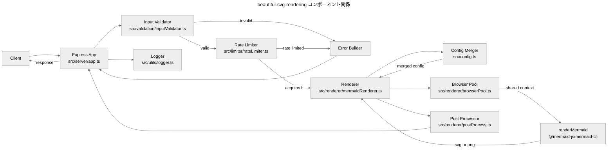
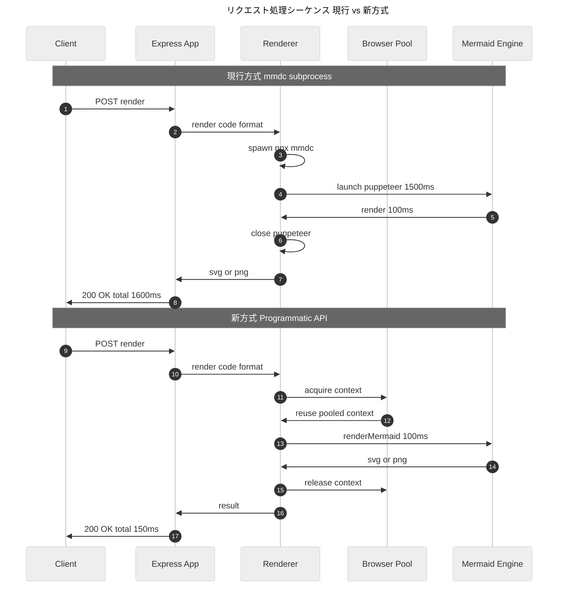
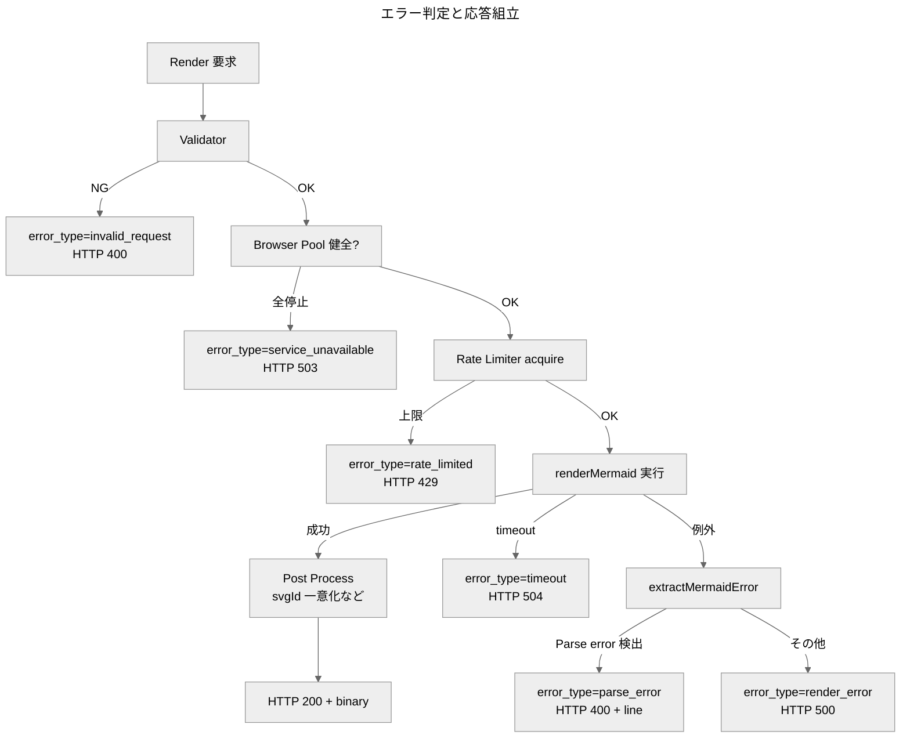
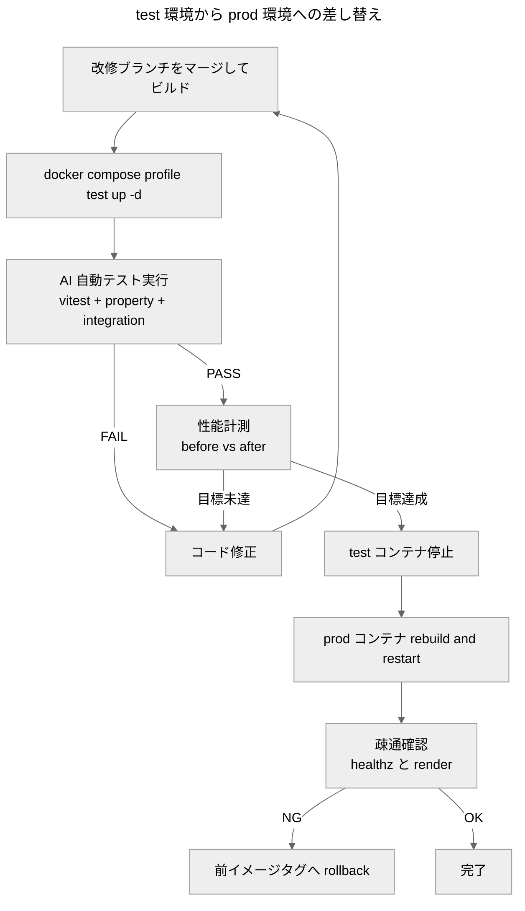

# 設計書: beautiful-svg-rendering

## 1. 概要

### 1.1 設計目標

本改修は要件定義書(`requirements.md`)の REQ-* / US-* を満たす実装方針を定める。中核となる設計目標は次の 4 点である。

| ID | 目標 | 達成手段の概略 | 関連要件 |
|---|---|---|---|
| **G-1** | 配布 HTML 用途で「美しい」既定出力 | Beautiful_Defaults を `src/config.ts` に集約、`themeCSS` で foreignObject クリップ抑制 | REQ-U-01, US-01〜US-03 |
| **G-2** | コンシューマフォント差による視覚的見切れの解消 | `htmlLabels: true` 維持 + `themeCSS: ".label foreignObject { overflow: visible }"`(HTML inline モード用)+ **SVG 後処理で `<foreignObject>` 要素に直接 `style="overflow:visible"` を inline 注入**(standalone SVG / `` / GitHub Markdown 対応、§7.3) | REQ-U-01, **REQ-U-09**, US-02 |
| **G-3** | レイテンシ短縮(req あたり 1〜2 秒 → 0.1〜0.3 秒) | `mmdc` subprocess → `renderMermaid()` Programmatic_API + Browser_Pool 共有 | REQ-U-08, US-07, NFR-01 |
| **G-4** | リクエスト形状の後方互換維持・出力構造の安全性 | 新フィールドは全て optional / Server_Locked_Setting で固定 | REQ-U-02, REQ-UN-01〜04 |

### 1.2 要件参照規約

本設計書は要件定義書の REQ-* / US-* / NFR-* / C-*(技術的制約)を**参照のみ**し、要件本文を再掲しない(DRY)。関連 ID の併記形式は文脈に応じて次のいずれかを採用する:

- **§5「正確性プロパティ」表**: `Validates` 列に REQ-* を明示(自動テストとの紐付けが目的のため形式統一)
- **設計判断・コンポーネント設計テーブル**: 表の「関連要件」「根拠」列に ID を列挙
- **本文段落**: 末尾または該当箇所に括弧書きで `(REQ-X / C-Y)` 形式

いずれの形式でも、関連 ID が必ず 1 つ以上明示されることを要求する。

## 2. アーキテクチャ

### 2.1 現行構造の課題

| 課題 | 出処 | 影響 |
|---|---|---|
| `mmdc` 起動毎に Puppeteer/Chromium をブート | `src/renderer/mermaidRenderer.ts:42-65` の `execFileAsync('npx', ['--yes','mmdc',...])` | リクエストごとに 1〜2 秒固定オーバーヘッド(NFR-01 違反) |
| Mermaid 設定がサーバ起動時の固定ファイル | `src/server/server.ts:30-38` で `mermaid.config.json` を一度だけ書き出し | リクエストごとの設定差替えが原理的に不可能(REQ-U-03 未達) |
| `MERMAID_PADDING` は themeCSS の `svg { padding }` 注入のみ | `src/config.ts:37-50` の `generateMermaidConfig()` | ノード内側余白(rect と foreignObject の差分)に直接介入できない。ただし `flowchart.padding` が `dagre-wrapper` でも実機で効くことを 2026-05-16 検証で確認済(C-M-01)、§3.1 BEAUTIFUL_DEFAULTS で活用する |
| エラー応答は `mmdc` 生 stderr のみ | `src/server/app.ts:43-63` の `sendError()` | 行番号・抽出本文がない(US-05 未達) |

### 2.2 新アーキテクチャ

`mmdc` subprocess 方式を廃し、`@mermaid-js/mermaid-cli` が export する `renderMermaid()` Programmatic_API に切り替える。Puppeteer ブラウザインスタンスは Browser_Pool としてサーバ起動時に常駐させ、リクエスト間で共有する。Mermaid 設定はリクエストごとにオブジェクトを組み立てて `mermaidConfig` として直渡しする(一時ファイル不要)。

#### 図 1: コンポーネント関係(新アーキテクチャ)



#### 図 2: 1 リクエストの処理シーケンス(現行 vs 新方式)



### 2.3 アーキテクチャ判断の根拠

- **Programmatic_API 採用** ← C-M-05(`mmdc` に inline config 渡しフラグが無く、リクエスト毎の設定差替えに毎回ファイル書出しが必要)+ NFR-01(レイテンシ目標) + REQ-U-08(Browser_Pool 常駐) を同時に解決するため。
- **Browser_Pool** ← Puppeteer/Chromium 起動が支配的コストで、リクエスト間で共有可能(`renderMermaid(Browser | BrowserContext, ...)` のシグネチャ、C-M-08 PR #768)。本改修では BrowserContext 単位で pool を構成し、context recycle で長時間稼働時のメモリリークを防ぐ。
- **semver 対象外リスク(C-M-07 / C-M-08 / C-M-09)** ← NFR-02 で `@mermaid-js/mermaid-cli` を **exact version で pin**(Phase 4 baseline は `11.12.0`、Phase 4.5 では security remediation 目的に限り更新可)+ `package-lock.json` コミット + `npm ci`。Renovate 手動承認、通常の更新 PR では画像差分テスト + property test + 性能ベンチ必須。Phase 4.5 MVP では audit high gate、SVG structural safety、diagram regression、既存 property/security test を必須にし、PNG pixel diff と詳細性能ベンチは production rollout 前の推奨検証として扱う。テスト用 Docker で先行検証(NFR-03)してから本番差替えで吸収。緊急時は `RENDERER_MODE=cli` フォールバック(NFR-06)。
- **`htmlLabels: true` 維持** ← C-M-03 で v11.11+ に複数 Approved Bug が open。`themeCSS` の `foreignObject overflow visible` で代替対応(G-2)。

## 3. コンポーネント設計

### 3.1 `src/config.ts` の拡張

#### 既存定数の維持と役割整理

`toPositiveInt()` ユーティリティは継承。既存環境変数 / 定数の役割は以下のとおり再整理する:

| 既存シンボル | 通常経路(Programmatic) | CLI fallback 経路 | 状態 |
|---|---|---|---|
| `DEFAULT_TIMEOUT_MS` | 有効(リクエスト `timeout_ms` の default) | 有効 | 維持 |
| `MAX_CODE_SIZE` | 有効(入力バイト上限、`BODY_LIMIT_BYTES` 導出元) | 有効 | 維持 |
| `SUPPORTED_FORMATS` | 有効 | 有効 | 維持(`['svg', 'png']`) |
| `PNG_RENDER_SCALE` | 有効 | 有効 | 維持 |
| `TEMP_DIR` | **未使用**(一時ファイル不要、Programmatic はオブジェクト直渡し) | 有効(`mmdc --configFile` 出力用) | CLI fallback 専用 |
| `MERMAID_CONFIG_PATH` | **未使用**(リクエスト毎にオブジェクトで直渡し) | 有効(`mmdc -c <path>`) | CLI fallback 専用 |
| `PUPPETEER_CONFIG_PATH` | **未使用**(Browser_Pool が直接 Puppeteer を起動) | 有効(`mmdc -p <path>`) | CLI fallback 専用 |
| `MAX_CONCURRENT_RENDERERS` | **`RATE_LIMIT_MAX_INFLIGHT` に役割移行**(下記新規定数参照)。後方互換のため env 名は継続受理し、`RATE_LIMIT_MAX_INFLIGHT` 未設定時の default として参照 | 同左 | **deprecated alias**(env 名は受理、内部は `RATE_LIMIT_MAX_INFLIGHT` に統一) |

#### 新規追加

| シンボル | 種別 | 役割 |
|---|---|---|
| `DEFAULT_FORMAT` | `'svg'` const | DRY 改善: `inputValidator.ts` ハードコードを集約 |
| `CONTENT_TYPE_MAP` | `Readonly<Record<'svg'\|'png', string>>` | DRY 改善: `server/app.ts` ローカル定義を集約 |
| `BEAUTIFUL_DEFAULTS` | `Readonly<MermaidConfig>` | Beautiful_Defaults の単一情報源 |
| `SERVER_LOCKED_SETTINGS` | `Readonly<MermaidConfig>` | Server_Locked_Setting の単一情報源 |
| `BROWSER_POOL_SIZE` | `number`(env: `BROWSER_POOL_SIZE`、default `4`、BrowserContext 単位) | Browser_Pool のサイズ(同時 render 可能な BrowserContext 数) |
| `RATE_LIMIT_MAX_INFLIGHT` | `number`(env、default `15`) | HTTP 層の同時受付上限。超過は **即時 429** + `Retry-After`(REQ-S-03) |
| `RATE_LIMIT_RETRY_AFTER_MS` | `number`(env、default `3000`) | HTTP 層の即時 429 応答で返す `Retry-After` の基準値 |
| `POOL_QUEUE_MAX` | `number`(env、default `20`) | Pool acquire の wait queue 上限。超過は **503** + `Retry-After`(REQ-S-03) |
| `POOL_WAIT_TIMEOUT_MS` | `number`(env、default `3000`) | Pool acquire の wait timeout。超過は **503** + `Retry-After`(REQ-S-03) |
| `POOL_RETRY_AFTER_MS` | `number`(env、default `5000`) | Browser_Pool 未初期化 / 全停止など、pool 起動・復旧待ち 503 応答で返す `Retry-After` の基準値 |
| `MIN_TIMEOUT_MS` | `number` const = `1000` | リクエスト `timeout_ms` 下限(C-S-06) |
| `MAX_TIMEOUT_MS` | `number`(env、default `30000`) | リクエスト `timeout_ms` 上限(C-S-06) |
| `MAX_RENDERS_PER_CONTEXT` | `number`(env、default `100`) | BrowserContext 単位の recycle 閾値(C-P-02 が page リーク対策として要求するもの。本改修では context を単位として recycle する) |
| `MAX_RENDERS_PER_BROWSER` | `number`(env、default `1000`) | browser 単位の recycle 閾値(C-P-02) |
| `MAX_BROWSER_AGE_MS` | `number`(env、default `3600000`、60 分) | browser 単位の最長存続時間(C-P-02) |
| `RESERVED_BODY_OVERHEAD_BYTES` | `number` const = `16384` | Express body limit 算出時の余裕代(C-S-03) |
| `BODY_LIMIT_BYTES` | 関数導出 = `MAX_CODE_SIZE * 2 + RESERVED_BODY_OVERHEAD_BYTES` | Express `express.json({ limit })` への入力(C-S-03) |
| `RENDERER_MODE` | `'programmatic' \| 'cli'`(env、default `'programmatic'`) | レンダラ実装の切替(NFR-06) |
| `MAX_THEME_CSS_LENGTH` | `number` const = `4096` | `themeCSS` 入力の上限長(REQ-UN-05) |
| `THEME_CSS_FORBIDDEN_PATTERNS` | `readonly string[]` | `themeCSS` 入力の禁止部分文字列リスト(下記 §3.3 参照) |
| `MERMAID_PADDING` | 既存維持、default を `0` に変更 | C-H-02 と整合(SVG ルート CSS padding 廃止) |

#### `BEAUTIFUL_DEFAULTS` の確定値

| キー | 値 | 根拠 |
|---|---|---|
| `theme` | `"base"` | 親システム既定継承 |
| `themeVariables.fontFamily` | `'"Noto Sans CJK JP", "IPAexGothic", sans-serif'` | 親システム既定継承(サーバ側 Noto 同梱) |
| `themeCSS` | `.label foreignObject { overflow: visible; }` | G-2(C-H-03 対応)。ただしこの themeCSS は **HTML inline 描画モード限定**で、`` 経由 / GitHub Markdown 等の **standalone SVG モードでは失効する**(Mermaid 出力時のセレクタ小文字化 + SVG namespace の case-sensitive 判定、`requirements.md` C-H-03 / `docs/expert-reviews/2026-05-16_foreignobject-clip-and-font-metrics-best-practices.md` §4.2)。standalone モードでも見切れを防ぐため、§7.3 の SVG 後処理(`forceForeignObjectOverflowVisible`)で `<foreignObject>` 要素に直接 `style="overflow:visible"` を inline 注入する(REQ-U-09) |
| `htmlLabels` | `true`(root レベル) | C-M-02 / REQ-UN-02 / G-2 |
| `securityLevel` | `"strict"` | C-S-01(Server_Locked_Setting と二重指定) |
| `suppressErrorRendering` | `true` | REQ-U-07 |
| `flowchart.useMaxWidth` | `false` | C-H-02 / US-04 |
| `flowchart.diagramPadding` | `0` | US-03(ダイアグラム外周の余白圧縮) |
| `flowchart.nodeSpacing` | `30` | US-03(ノード**間**スペースのコンパクト化) |
| `flowchart.rankSpacing` | `40` | US-03(ランク間スペースのコンパクト化) |
| `flowchart.padding` | `8` | US-03(ノード**内側**余白の圧縮)。Mermaid schema コメントは「experimental rendering 専用」とするが、実機検証(C-M-01)で `dagre-wrapper` でも効くことを確認済。実測関係 `内側余白(横) = 4 × padding`、`内側余白(縦) = 2 × padding` から、`padding=8 → 32 × 16`(Mermaid デフォルト 15 → `60 × 30` の約半分)を採用 |
| `flowchart.curve` | `"basis"` | Mermaid 既定継承(配布資料に無難) |
| `flowchart.wrappingWidth` | `200` | Mermaid 既定継承 |
| `flowchart.defaultRenderer` | `"dagre-wrapper"` | REQ-UN-03(ELK 既定化禁止) |

#### `SERVER_LOCKED_SETTINGS` の確定値

| キー | 値 | 根拠 |
|---|---|---|
| `securityLevel` | `"strict"` | REQ-UN-01 / C-S-01 |
| `maxTextSize` | `50000` | C-S-02 |
| `maxEdges` | `500` | C-S-02 |
| `startOnLoad` | `false` | サーバサイド render では auto-init 不要、ユーザー上書きを拒否(security-sensitive) |

> 注: `secure` は trusted top-level config キーの allowlist(security-sensitive)だが、Mermaid v11 既定値の追従リスクを避けるため `SERVER_LOCKED_SETTINGS` には含めない。代わりに `LOCKED_SETTING_KEYS`(strip 対象)に列挙し、user override が来た時点で除去 + 警告(`locked_setting_override_ignored`)することで runtime に Mermaid v11 既定値を残す。「上書き不可」の効果は `SERVER_LOCKED_SETTINGS` 経由でも `LOCKED_SETTING_KEYS` 経由でも同等。

#### 関数

```ts
// 旧: generateMermaidConfig(padding: number)
// 新: 引数を取り、Beautiful_Defaults を返すだけの参照関数に簡素化
//     リクエストごとのマージは buildRequestMermaidConfig() で行う
export function getBeautifulDefaults(): Readonly<MermaidConfig>

// リクエスト時マージ(REQ-E-01)
//   merged = deepMerge(BEAUTIFUL_DEFAULTS, userOverride)
//   merged = deepMerge(merged, SERVER_LOCKED_SETTINGS)   // 最後に強制適用
export function buildRequestMermaidConfig(
  userOverride: Partial<MermaidConfig> | undefined,
  warnings: WarningCollector
): MermaidConfig

// 廃止: サーバ起動時の mermaid.config.json 書き出し(server.ts)
// 代わりに renderMermaid() に直接渡す
```

### 3.2 `src/renderer/mermaidRenderer.ts` の刷新

#### レンダラ実装は `MermaidRendererAdapter` で隔離(NFR-06)

```ts
// src/renderer/mermaidRendererAdapter.ts
interface MermaidRendererAdapter {
  render(input: RenderInput): Promise<RenderResult>
  close(): Promise<void>
}

// 主実装: Programmatic API + BrowserPool
class ProgrammaticAdapter implements MermaidRendererAdapter { ... }

// 緊急時 fallback: 従来 mmdc subprocess
class CliFallbackAdapter implements MermaidRendererAdapter { ... }

// env RENDERER_MODE で切替
export function createRenderer(): MermaidRendererAdapter {
  return process.env.RENDERER_MODE === 'cli'
    ? new CliFallbackAdapter()
    : new ProgrammaticAdapter()
}
```

Programmatic 側が壊れた場合(import 失敗、`renderMermaid` signature 変化、`Buffer → Uint8Array` 等の C-M-08 系破壊変更)に、env 変更 + コンテナ再起動だけで `cli` モードへ即時切替可能。アプリ本体は adapter インターフェースだけを参照する。

#### `BrowserPool` クラス(新規 `src/renderer/browserPool.ts`)

```ts
class BrowserPool {
  // BrowserContext 単位の semaphore。
  // Puppeteer browser は少数(1〜2)で、各 browser が複数 BrowserContext を hosting する。
  // BROWSER_POOL_SIZE = 同時 render 可能な BrowserContext 数(default 4)。
  // acquire は POOL_QUEUE_MAX まで wait、POOL_WAIT_TIMEOUT_MS で 503。
  // renderMermaid は Browser | BrowserContext を受理する(C-M-08 PR #768)ため、
  // 取得した BrowserContext をそのまま renderMermaid に渡す。
  async acquire(): Promise<BrowserContext>
  release(ctx: BrowserContext): void   // maxUses 到達時は当該 context を破棄→新規生成
  async close(): Promise<void>
  // ヘルスチェック: ctx.newPage().evaluate('1') で生存確認、失敗 context を除外(REQ-S-02)
}
```

**Context / Browser recycle policy(C-P-02)**:
- 1 BrowserContext あたり `MAX_RENDERS_PER_CONTEXT`(default 100)回 render で context 破棄 → 同 browser 配下に新規 context 生成
- 1 browser あたり `MAX_RENDERS_PER_BROWSER`(default 1000)render または `MAX_BROWSER_AGE_MS`(default 60 分)で browser 全体を recycle(全 context 破棄 → browser 再起動)
- render 失敗 / timeout / navigation error 時は即座に当該 context を破棄

**Puppeteer launch args 標準セット(C-P-01, C-P-04)**:
```ts
{
  headless: 'shell',
  args: [
    '--disable-dev-shm-usage',
    '--disable-gpu',
    '--disable-extensions',
    '--disable-background-timer-throttling',
    '--disable-renderer-backgrounding',
    '--font-render-hinting=none',
    // '--no-sandbox' は付けない(C-P-01)。Docker 側 seccomp/AppArmor で隔離
  ],
  protocolTimeout: 30000,
}
```

**Request interception(C-S-05)**: BrowserContext 生成直後に `context.newPage()` を patch し、`renderMermaid` が内部で生成する全 page に対して interception を有効化する。URL 判定は `classifyRequest(rawUrl): 'intercept' | 'allow' | 'block'` に分離し、unit test で `http:` / `https:` / 許可外 `file:` の block、`data:` / `about:` / `blob:` と `@mermaid-js/mermaid-cli` package 配下 file asset の allow、mermaid-cli 11.14.0+ の pseudo-HTTPS origin の intercept 境界を検証する。実装は以下と等価:
```ts
const originalNewPage = context.newPage.bind(context)
context.newPage = async () => {
  const page = await originalNewPage()
  await page.setRequestInterception(true)
  page.on('request', req => {
    const action = classifyRequest(req.url())
    if (action === 'intercept') return
    if (action === 'allow') return req.continue()
    return req.abort()  // http/https と上記例外外の file を遮断(SSRF 対策)
  })
  return page
}
```

**HTTP 層 RateLimiter との分離(REQ-S-03)**: BrowserPool の上位に `src/limiter/rateLimiter.ts` を独立配置。HTTP 層は `RATE_LIMIT_MAX_INFLIGHT` 超で **即時 429**(`Retry-After` 付与)。BrowserPool は `POOL_QUEUE_MAX` 内なら wait、超過/timeout で **503**(`Retry-After` 付与)。

**Graceful shutdown(C-P-03)**: `SIGTERM` / `SIGINT` 受信時に ① queue の新規 acquire を拒否、② in-flight render の完了待ち(最大 `MAX_TIMEOUT_MS`)、③ 全 page / browser を `close()`。

Browser_Pool は Express アプリ起動時に初期化、シャットダウン時に全インスタンスを `close()`。初期化が完了するまで `/render` は 503 を返す(REQ-S-01)。

#### `MermaidRenderer.render()` の新シグネチャ

```ts
interface RenderInput {
  requestId: string
  code: string
  format: 'svg' | 'png'
  timeoutMs: number
  mermaidConfig: MermaidConfig        // 既にマージ済(buildRequestMermaidConfig の結果)
  postProcess?: PostProcessOption
  svgId?: string                      // rewrite_ids=true 時のみセット。request_id 由来の一意 ID(§7)。false 時は undefined にして Mermaid 既定値に委ねる
}

interface RenderResult {
  success: boolean
  data?: Buffer                        // adapter 内で正規化済(C-M-08 対策、下記)
  rawErrorText?: string                // 内部変数名(API レスポンス上は stderr フィールド)
  exitCode?: number | null
  errorType?: ErrorType
  errorMessage?: string | null         // 新規(REQ-U-05)
  line?: number | null                 // 新規(REQ-E-04)
  errorField?: string | null           // 新規(REQ-U-05、機械可読)
  errorConstraint?: string | null      // 新規(REQ-U-05、機械可読)
}
```

**戻り値型の正規化(C-M-08)**: `renderMermaid` は v11.3.0 (2024-11-01) PR #767 で戻り値 `data` 型を `Buffer → Uint8Array` に変更している。adapter 層(`ProgrammaticAdapter`)で `Uint8Array` を **`Buffer.from(uint8array)`** で `Buffer` に正規化してから `RenderResult` に格納し、上位コードは常に `Buffer` を受け取れることを保証する。Mermaid CLI が将来再度型を変更しても、影響は adapter 内に閉じ込められる(NFR-06)。

実装:
- `BrowserPool.acquire()` で取得した `BrowserContext` をそのまま `renderMermaid(ctx, code, format, { mermaidConfig, svgId, ... })` に渡す。ただし `post_process.rewrite_ids === false` の場合は `svgId` を渡さない(省略して Mermaid 既定の `mermaid-1` 等を使わせる、§7.1.1)
- 例外/エラーは `extractMermaidError()`(下記 §6)で構造化
- 成功時に `postProcess` を適用(§7)
- 一時ファイル不要(`mmdc --configFile` ルート廃止)

### 3.3 `src/validation/inputValidator.ts` の拡張

#### 受理する新フィールド

```ts
interface RenderRequestInput {
  // 既存
  code?: unknown
  format?: unknown
  timeout_ms?: unknown
  // 新規
  mermaid_config?: unknown
  post_process?: unknown
}
```

#### バリデーション規約

- `timeout_ms` の検証(C-S-06): 整数かつ `[MIN_TIMEOUT_MS=1000, MAX_TIMEOUT_MS=30000]` の範囲、それ以外は HTTP 400 / `error_type=invalid_request` / `error_field="timeout_ms"` / `error_constraint="out_of_range"`
- `mermaid_config` は `object` 型のみ受理、それ以外は HTTP 400(REQ-E-07)
- `mermaid_config` は **allowlist 方式**(REQ-E-06):
  - **許可キー(API 層を通過)**: `theme` / `themeVariables` / `themeCSS` / `htmlLabels` / `flowchart` / `sequence` / `gantt` / `er` / `class` / `state` / `mindmap`
  - **明示 reject(警告 `locked_setting_override_ignored`)**: `securityLevel` / `maxTextSize` / `maxEdges` / `secure` / `startOnLoad`(`SERVER_LOCKED_SETTINGS` 全キー)
  - **無視 + 警告 `unknown_key`**: 最上位で上記いずれにも該当しない未知キー
  - allowlist 配下のネストでは、既知キーのみ型検査し、未知 sub-key は Mermaid 公式 schema 追従のため通過させる
  - allowlist 配下のネストでも同様に `SERVER_LOCKED_SETTINGS` キーと prototype pollution 対象キーを再帰的に除去
- `post_process` は `object` 型のみ受理。allowlist は `rewrite_ids` / `strip_max_width` のみ、未知キーは無視 + 警告 `unknown_key`
- validator 通過後の内部 DTO は `NormalizedPostProcess` とし、`post_process` 未指定時も default 値を埋めた `{ rewrite_ids: true, strip_max_width: false }` を保持する
- `post_process.rewrite_ids: boolean` を許可(default は true)
- `post_process.strip_max_width: boolean` を許可(default は false。`useMaxWidth: false` 既定で大半は不要)
- `format=png` と SVG 専用 `post_process.*` の同時指定は無視 + 警告 `svg_only_option_in_png`(REQ-E-05)
- `mermaid_config.themeCSS` の検証(REQ-UN-05):
  - 文字列長 > `MAX_THEME_CSS_LENGTH`(`4096`)→ HTTP 400 / `error_type=invalid_request` / 警告コード `theme_css_rejected`
  - `THEME_CSS_FORBIDDEN_PATTERNS` のいずれかを **case-insensitive substring match** で含む → 同上で拒否
  - 禁止部分文字列リスト: `</style`, `<script`, `javascript:`, `@import`, `expression(`, `url(`, `behavior:`
  - 二段防御の根拠: Mermaid 内 DOMPurify(`securityLevel=strict`)に依存せず、API 入口で粗いブロックを挟むことで、依存ライブラリの挙動変化(C-M-07)に対する追加防御層を設ける

#### `WarningCollector` の導入

```ts
class WarningCollector {
  add(code: string, detail: Record<string, unknown>): void
  drain(): Warning[]   // ログ出力時に消費
}
```

警告コードは enum 化(`unknown_key` / `locked_setting_override_ignored` / `svg_only_option_in_png` 等)し、構造化ログ(`logger.ts`)で `warnings: [...]` として記録(NFR-04)。

### 3.4 `src/server/app.ts` の拡張

- リクエスト boundary でバリデータから返る `RenderInput` を `MermaidRenderer.render()` に渡す
- レスポンス失敗時 JSON 組立に `error_message` / `line` / `error_field` / `error_constraint` の 4 フィールドを追加(`errorResponse.ts` の `buildErrorResponse()` に委譲、§14)
- `Content-Type` 解決は `CONTENT_TYPE_MAP`(§3.1)を参照
- Browser_Pool 未初期化検知時に 503 + `error_type=service_unavailable` を返却(REQ-S-01)

### 3.5 マージロジック(`buildRequestMermaidConfig`)の優先順位と安全性

#### 優先順位

```
1. BEAUTIFUL_DEFAULTS                       (最弱・基底)
2. ユーザー mermaid_config(allowlist + SERVER_LOCKED_SETTINGS キー除外済)
3. SERVER_LOCKED_SETTINGS                   (最強・上書き不可)
```

deep merge は浅い merge ではなく、`flowchart.diagramPadding` 単独指定でも他の `flowchart.*` キーが消えないように再帰的に行う。

#### 実装ステップ(`buildRequestMermaidConfig`)

Phase 2 validator(`inputValidator.ts`)が未到達でも `buildRequestMermaidConfig` 単体で REQ-E-02 / REQ-UN-01 / REQ-E-06 の挙動契約が成立するよう、本関数内で **3 段階** に処理する:

1. `stripLockedSettingsAndWarn(userOverride)` — user override を再帰走査し、`LOCKED_SETTING_KEYS`(`securityLevel` / `maxTextSize` / `maxEdges` / `startOnLoad` / `secure`)に該当するキーを **除去 + 警告 `locked_setting_override_ignored`**。warning だけ記録して merge 後に top-level 強制適用に頼る形は、ネストされた locked key(例 `flowchart.maxEdges`)が結果に残るため不採用
2. `safeDeepMerge(BEAUTIFUL_DEFAULTS, stripped, warnings)` — 既定値の上に sanitized override を再帰マージ
3. `safeDeepMerge(merged, SERVER_LOCKED_SETTINGS, warnings)` — 最終強制適用(strip を通り抜けた万一のケースに対する二重ガード)

#### `safeDeepMerge` の必須要件(C-S-04 / REQ-UN-06)

ユーザー入力 JSON とサーバ既定の deep merge は **Prototype Pollution の典型的入口**(CVE-2019-10744 で `lodash.defaultsDeep` が CVSS 9.1)。`utils/safeDeepMerge.ts` を新規実装し、以下を必須要件とする:

```ts
// src/utils/safeDeepMerge.ts
const FORBIDDEN_KEYS = new Set(['__proto__', 'constructor', 'prototype'])

export function safeDeepMerge<T extends Record<string, unknown>>(
  base: T,
  override: unknown,
  warnings: WarningCollector,
): T {
  if (!isPlainObject(override)) return structuredClone(base)
  const out: Record<string, unknown> = Object.create(null)   // ★ プロトタイプチェーン排除
  for (const [k, v] of Object.entries(base)) out[k] = v       // ★ for...in 禁止
  for (const [key, value] of Object.entries(override)) {      // ★ Object.entries() を使用
    if (FORBIDDEN_KEYS.has(key)) {
      warnings.add('prototype_pollution_attempt', { key })
      continue
    }
    if (isPlainObject(value) && isPlainObject(out[key])) {
      out[key] = safeDeepMerge(out[key] as Record<string, unknown>, value, warnings)
    } else {
      out[key] = value
    }
  }
  return out as T
}
```

**併用要件**:
- Dockerfile に `ENV NODE_OPTIONS="--disable-proto=delete"` を追加(OWASP defense in depth)
- `SERVER_LOCKED_SETTINGS` の最終強制適用(本セクション優先順位 #3)は維持。merge の通り抜けに対する最終ガード
- `isPlainObject` は `Object.prototype.toString.call(v) === '[object Object]'` で判定し、`null` / 配列 / Date / Map / Set / class instance を弾く

### 3.6 可観測性(NFR-05)

性能改善が主目的の改修で、p95/p99/queue 詰まりが見えないと達成判定ができない。最低限の構造化ログとメトリクスを MVP に含める。

#### 構造化ログ(`pino` 推奨)

各リクエストの完了時に以下フィールドを含む JSON 1 行をログ出力:

| フィールド | 型 | 説明 |
|---|---|---|
| `request_id` | string | UUID v4、ヘッダ `X-Request-Id` と同値 |
| `format` | `'svg' \| 'png'` | 出力フォーマット |
| `code_bytes` | number | リクエストの `code` バイト長 |
| `queue_ms` | number | RateLimiter 通過後〜Pool acquire まで |
| `render_ms` | number | `renderMermaid` 呼出時間 |
| `post_process_ms` | number | SVG 後処理時間(rewrite_ids / strip_max_width) |
| `total_ms` | number | リクエスト到達〜レスポンス送信まで |
| `pool_in_use` | number | リクエスト完了時点の使用中 BrowserContext 数 |
| `pool_waiting` | number | リクエスト完了時点の wait queue 長 |
| `result` | string | `ok` / `parse_error` / `render_error` / `timeout` / `rate_limited` / `invalid_request` / `service_unavailable` |
| `warnings` | string[] | 警告コード配列(`unknown_key` / `prototype_pollution_attempt` 等) |

警告のみのイベント(例: `prototype_pollution_attempt` の検出)も、同一リクエストの構造化ログ行の `warnings` に含める。

#### Prometheus メトリクス(`prom-client` 推奨)

`/metrics` エンドポイント(Express ルート)で expose:

| メトリクス | 型 | ラベル |
|---|---|---|
| `render_total` | counter | `result` / `format` |
| `render_duration_ms` | histogram | `format`(buckets: 50, 100, 250, 500, 1000, 2500, 5000, 10000, 30000) |
| `queue_wait_ms` | histogram | (buckets: 0, 10, 50, 100, 250, 500, 1000, 3000, 10000) |
| `browser_pool_in_use` | gauge | - |
| `browser_pool_queue_size` | gauge | - |
| `render_timeout_total` | counter | - |
| `browser_restarts_total` | counter | `reason`(`max_uses` / `max_age` / `crash`) |
| `validation_error_total` | counter | `field` / `constraint` |

#### `/healthz` / `/livez` / `/readyz` の意味整理

- **`/healthz`**(既存維持): **liveness 相当**。プロセスが生きていれば常に 200。Browser_Pool 初期化中でも 200(REQ-S-01 で「コンテナを起動中に kill されない」ためにこの挙動を要求)。後方互換のため応答仕様は変更しない。
- **`/livez`**(新規): `/healthz` のエイリアス兼新規名(Kubernetes 慣行に合わせる)。常に 200。
- **`/readyz`**(新規): **readiness 相当**。BrowserPool が初期化済みで全停止しておらず、1 BrowserContext 以上を保持していることを副作用なしに判定し、かつ直近 5 分のエラー率 < 50% で 200、それ以外 503。ロードバランサが新規トラフィックを送信して良いかの判定用。

## 4. データモデル

### 4.1 API リクエスト型(TypeScript)

```ts
// src/types/api.ts(新規 or app.ts 配下)
interface RenderRequest {
  code: string
  format?: 'svg' | 'png'           // 既存
  timeout_ms?: number              // 既存
  mermaid_config?: Partial<MermaidConfig>  // 新規(REQ-U-03)
  post_process?: {                          // 新規(REQ-U-04)
    rewrite_ids?: boolean
    strip_max_width?: boolean
  }
}

// MermaidConfig は Mermaid 公式型を参照(@mermaid-js/mermaid 由来)
// 本 API では Partial<MermaidConfig> を受理し、サーバ側で deep merge
```

### 4.2 API レスポンス型

```ts
// 成功時はバイナリ(SVG/PNG)+ ヘッダ(変更なし)
// 失敗時 JSON:
interface RenderErrorResponse {
  request_id: string                  // 既存
  error_type: ErrorType               // 既存(+ 'service_unavailable' を追加)
  status_code: number                 // 既存
  stderr: string                      // 既存(raw 保持)
  exit_code: number | null            // 既存
  format: 'svg' | 'png'               // 既存
  error_message: string | null        // 新規(REQ-U-05、人間/LLM 可読)
  line: number | null                 // 新規(REQ-E-04)
  error_field: string | null          // 新規(REQ-U-05、機械可読、例: "timeout_ms")
  error_constraint: string | null     // 新規(REQ-U-05、機械可読、例: "out_of_range")
}

type ErrorType =
  | 'parse_error'
  | 'render_error'
  | 'timeout'
  | 'rate_limited'
  | 'invalid_request'
  | 'service_unavailable'            // 新規(REQ-S-01)
```

### 4.3 内部レンダリングコンテキスト型

```ts
// Validator → Renderer 間の DTO
interface RenderContext {
  requestId: string
  code: string
  format: 'svg' | 'png'
  timeoutMs: number
  mermaidConfig: MermaidConfig         // マージ済(buildRequestMermaidConfig の結果)
  postProcess: NormalizedPostProcess   // default 値が埋まった正規化済
  svgId?: string                       // rewrite_ids=true 時のみセット。request_id 由来の一意 ID(§7.1)。false 時は undefined にして Mermaid 既定値に委ねる
  warnings: WarningCollector
}
```

## 5. 正確性プロパティ(検証可能仕様)

| ID | 内容 | Validates |
|---|---|---|
| **PROP-1** | 既存リクエスト `{code, format}` のみで POST → HTTP 200、Content-Type 一致 | REQ-U-02 |
| **PROP-2** | `mermaid_config.securityLevel = "loose"` を送信 → 実際のレンダリング設定は `"strict"`、警告ログ 1 件 | REQ-E-02, REQ-UN-01 |
| **PROP-3** | `mermaid_config` 未指定リクエストの実際適用設定 = `BEAUTIFUL_DEFAULTS` | REQ-U-01, REQ-E-01 |
| **PROP-4** | `format=png` + `post_process.strip_max_width=true` → PNG 200 + 警告ログ 1 件 | REQ-E-05 |
| **PROP-5** | パース失敗時のレスポンス JSON で `line` が `null` または正の整数 | REQ-E-04 |
| **PROP-6** | 100 連続リクエスト後、Puppeteer **browser プロセス数**が設計上の少数(default 1〜2、`MAX_RENDERS_PER_BROWSER` / `MAX_BROWSER_AGE_MS` での recycle 中の一時的な +1 を含む)を超えない。**リクエスト数に比例して増えない**(BrowserContext 単位の pool により、process は少数で多数の context を hosting する想定) | REQ-U-08 |
| **PROP-7** | Browser_Pool 初期化前にリクエスト → 503 + `error_type=service_unavailable` | REQ-S-01 |
| **PROP-8** | `mermaid_config.flowchart.diagramPadding = 16` を指定 → 単独 `diagramPadding` 変更で他 `flowchart.*` キーが消えない(deep merge 検証) | REQ-E-01 |
| **PROP-9** | `mermaid_config.themeCSS` の文字列長が上限超過 → HTTP 400 | REQ-UN-05 |
| **PROP-10** | 構文エラー入力で SVG ボディ "Syntax error" を含まない | REQ-U-07 |
| **PROP-11** | `mermaid_config.themeCSS` が `THEME_CSS_FORBIDDEN_PATTERNS` のいずれかを含む → HTTP 400 + `error_type=invalid_request` + 警告コード `theme_css_rejected` | REQ-UN-05 |
| **PROP-12** | 既知 Prototype Pollution payload(`{"__proto__":{"polluted":true}}`、`{"constructor":{"prototype":{"polluted":true}}}` 等)送信後に `Object.prototype.polluted` が **未定義のまま**、警告コード `prototype_pollution_attempt` が記録され、リクエストは 200 を返す(または別の正当な error_type を返す)| REQ-UN-06, C-S-04 |
| **PROP-13** | HTTP 層が `RATE_LIMIT_MAX_INFLIGHT` を超えると **即時 429** + `Retry-After` を返し、Pool 層が `POOL_QUEUE_MAX` を超える or `POOL_WAIT_TIMEOUT_MS` 経過で **503** + `Retry-After` を返す | REQ-S-03 |
| **PROP-14** | `timeout_ms=60000`(`MAX_TIMEOUT_MS` 超)を送信 → HTTP 400 / `error_type=invalid_request` / `error_field="timeout_ms"` / `error_constraint="out_of_range"` | C-S-06, REQ-U-05 |
| **PROP-15** | `mermaid_config` に allowlist 外の未知キー(例: `nonexistent_key: 1`、`unsupportedDiagram: {}` 等、`SERVER_LOCKED_SETTINGS` のキーには該当しないもの)を送信 → 値が無視され、警告 `unknown_key` が記録される。`SERVER_LOCKED_SETTINGS` キー(`securityLevel` / `maxTextSize` / `maxEdges` / `startOnLoad` / `secure`)送信時は警告 `locked_setting_override_ignored` を記録する | REQ-E-06 |
| **PROP-16** | `RENDERER_MODE=cli` で起動 → `mmdc` subprocess 経由でレンダリングが成功する(レイテンシは劣化、機能は等価) | NFR-06 |
| **PROP-17** | `/metrics` を GET → Prometheus 形式で必須メトリクス 8 系統が含まれる | NFR-05 |
| **PROP-18** | `format=svg` レスポンスのすべての `<foreignObject>` 要素の `style` 属性に `overflow:visible` が含まれる(冪等; 既に `overflow` 宣言があるノードは触らず、他宣言があるノードには `;overflow:visible` が追記される)。`format=png` レスポンスでは適用されない。Case 10 相当(CJK + 半角混在)の SVG を `` モード描画してもクリップしない(2026-05-16 の 7 パターン × 14 ノード検証で確認済) | REQ-U-09, C-H-03 |

各プロパティは `test/property/*.property.test.ts` に fast-check ベースで実装する(§10)。

## 6. エラーハンドリング

### 6.1 エラー種別マッピング

| 発生源 | 検出方法 | `error_type` | HTTP |
|---|---|---|---|
| 入力バリデーション | validator が return | `invalid_request` | 400 |
| Mermaid パースエラー | 例外メッセージ正規表現 `^Parse error on line` / `^Lexical error on line` | `parse_error` | 400 |
| Mermaid レンダリング失敗(その他) | 例外発生・空 SVG 等 | `render_error` | 500 |
| タイムアウト | `setTimeout` で `renderMermaid()` を競争 → 勝敗 | `timeout` | 504 |
| HTTP 層 同時受付上限超過(即時拒否、REQ-S-03) | RateLimiter が `RATE_LIMIT_MAX_INFLIGHT` 超で拒否 | `rate_limited` | 429 + `Retry-After`(`RATE_LIMIT_RETRY_AFTER_MS`) |
| Pool 層 wait queue 満杯 / wait timeout 超過(REQ-S-03) | BrowserPool が `POOL_QUEUE_MAX` / `POOL_WAIT_TIMEOUT_MS` 超で拒否 | `service_unavailable` | 503 + `Retry-After`(`POOL_WAIT_TIMEOUT_MS`) |
| Browser_Pool 未初期化 / 全停止 | Pool 状態フラグ | `service_unavailable` | 503 + `Retry-After`(`POOL_RETRY_AFTER_MS`、default 5 秒) |

**全エラー種別共通**: `error_message`(人間/LLM 可読)を必ず含める(REQ-U-05、`invalid_request` も含む)。バリデーション系は `error_field` / `error_constraint`(機械可読)を併せて返す。

#### 図 3: エラー判定と応答組立



### 6.2 `extractMermaidError()` 規約

```ts
function extractMermaidError(rawErrorText: string): {
  errorType: 'parse_error' | 'render_error'
  errorMessage: string | null
  line: number | null
}
```

#### 適用する正規表現(順序適用、最初にマッチしたもの)

| 順位 | 正規表現 | 抽出 | 由来 |
|---|---|---|---|
| 1 | `/Parse error on line\s+(\d+):\s*([\s\S]*?)(?=\n\s*at\s|\nError:|\n\n|$)/i` | line, message | 専門家レビュー §3.6 |
| 2 | `/Lexical error on line\s+(\d+)\.?\s*([\s\S]*?)(?=\n\s*at\s|\nError:|\n\n|$)/i` | line, message | 同上 |
| 3 | `/Error:\s*([\s\S]*?)(?=\n\s*at\s|$)/i` | message のみ | 同上 |
| 4 | (どれにもマッチしない) | message=null, line=null | フォールバック |

#### 行番号扱い(C-M-06)

抽出した `line` は応答に整数で含める。**抽出失敗時は `null`**。行番号がずれる可能性は API 仕様(`requirements.md` §5)に明示しており、UI 側で「N 行目付近」と表現する責任は呼出側に委ねる。

#### "Syntax error" 図混入防止(REQ-U-07)

`suppressErrorRendering: true` を `BEAUTIFUL_DEFAULTS` で固定。同設定下では Mermaid が `parse_error` を例外として throw するため、サーバ側で確実に捕捉できる。

## 7. Post Process 設計

本改修で実装する SVG 後処理は次の 3 つ:

| 種別 | キー | 利用者制御 | 適用タイミング |
|---|---|---|---|
| Post_Process_Option(利用者オプション) | `rewrite_ids` | 利用者が指定可能(default `true`) | SVG 生成時(Programmatic)または生成後(CLI) |
| Post_Process_Option(利用者オプション) | `strip_max_width` | 利用者が指定可能(default `false`) | SVG 生成後 |
| サーバ保証(利用者制御不可) | `forceForeignObjectOverflowVisible` | **常時オン**(オプトアウト不可) | SVG 生成後 |

`rewrite_ids` / `strip_max_width` は `mermaid-image-converter/requirements.md` の Post_Process_Option として利用者がリクエストで指定する。`forceForeignObjectOverflowVisible` は REQ-U-09 に基づくサーバ側の不変保証で、API に対応するオプションは公開しない。それぞれの責務と仕様を以下に定義する。

### 7.1 ID 衝突対策(軽量版): `rewrite_ids`

要件定義書 §8 で「同一ページ複数 SVG embed の完全対応は将来別票」と定めた。本改修では次のみ実装する:

- `post_process.rewrite_ids === true`(default)時のみ、Programmatic 経路では `renderMermaid()` 呼出時に `svgId: \`mermaid-\${requestId}\`` を渡す。CLI fallback 経路では `mmdc` に同等の引数が無いため、出力 SVG のルート `id` のみを生成後に `mermaid-<requestId>` へ書き換える
- これにより SVG ルート要素の `id` 属性が `mermaid-<UUID>` となり、最低限の名前空間分離が達成される
- `rewrite_ids === false` 時は `svgId` を渡さず、Mermaid 既定値(`mermaid-1` 等)で出力する
- 適用経路: Programmatic は **SVG 生成時**(`renderMermaid()` 引数経由)、CLI fallback は **SVG 生成後**(`src/renderer/postProcess.ts` のルート ID 書き換え utility 経由)

#### 7.1.1 フェーズ別セマンティクス

| 値 | Phase 1(本改修) | Phase 2(将来別票) |
|---|---|---|
| `true`(default) | SVG ルート要素の `id` 属性を `mermaid-<requestId>` で一意化。SVG 内部 ID(`<marker>` / `<clipPath>` / `<filter>` / `<linearGradient>`)はそのまま | 内部 ID も `mermaid-<requestId>-<original>` 形式で全 rewrite |
| `false` | Mermaid 既定 `svgId`(`mermaid-1` 等)で出力。ID 一意化を行わない | 同左 |

> 注: Phase 1 では `rewrite_ids: true` の効果は **ルート ID 一意化のみ** であり、同一 HTML に複数 SVG embed すると `<marker id="arrowhead">` 等が衝突する(C-H-01 / 要件定義書 §8 Out of Scope)。Phase 2 は Phase 1 利用者の挙動を内包する形(superset)で拡張するため、`true` 指定の API 利用者は後方互換が保たれる。

### 7.2 `max-width` インラインスタイル除去: `strip_max_width`

- 適用経路: **SVG 生成後**(`src/renderer/postProcess.ts` で SVG 文字列を加工)
- 対象: **ルート `<svg>` 要素の `style` 属性のみ**(子要素の `style` には触らない)
- 処理: `style` 属性内の `max-width` CSS 宣言のみを **case-insensitive** で除去。他の宣言(`color`, `background`, `font-family` 等)は保持する
- 例:
  - Before: `<svg ... style="max-width: 300px; color: black;">` → After: `<svg ... style="color: black;">`
  - Before: `<svg ... style="max-width: 300px;">` → After: `<svg ... >`(`style` 属性が空になるため属性ごと削除)
  - Before: `<svg ... style="MAX-WIDTH:300PX">` → After: `<svg ... >`(大小文字無視)
- 既定動作: `Beautiful_Defaults` の `useMaxWidth: false` 下では Mermaid が `style="max-width:..."` を付与しないため、通常は **no-op**。`useMaxWidth: true` をユーザーが Mermaid_Config_Override で上書きした場合や、将来 Mermaid 側挙動が変わった場合の防御として残す
- `format=png` 同時指定時の扱い: REQ-E-05 に従い無視 + 警告ログ(`svg_only_option_in_png`)

### 7.3 foreignObject overflow:visible の強制注入: `forceForeignObjectOverflowVisible`(REQ-U-09)

#### 7.3.1 背景

`docs/expert-reviews/2026-05-16_foreignobject-clip-and-font-metrics-best-practices.md` §4.2 で同定したとおり、Mermaid の出力 SVG 内の `<style>` ブロックには `.label foreignobject { overflow: visible; }`(セレクタは小文字)が焼き込まれる。HTML 文書内に `<svg>` を inline 配置した場合は HTML パーサがタグ名を小文字化するため、case-insensitive 判定でこのセレクタが `<foreignObject>` 要素にマッチして `overflow: visible` が効く。一方、`` 経由・`.svg` 直接・GitHub Markdown 等の **standalone SVG モード**では SVG が XML namespace で解釈され、CSS セレクタはタグ名 case-sensitive となるため、小文字セレクタは camelCase の `<foreignObject>` にマッチせず、SVG 仕様デフォルトの `overflow: hidden` が効いてしまい、コンシューマ側フォント差で生じた `<foreignObject>` 外の文字がクリップされる。

本後処理はこの問題を、CSS セレクタを経由せず**各 `<foreignObject>` 要素の `style` 属性に直接 `overflow:visible` を inline 付与**することで根本回避する。属性レベルの指定は SVG / HTML / XML どのパース経路でも変わらず効くため、レンダリングモードに依らず一貫した挙動を得る。

#### 7.3.2 適用範囲・タイミング

- 適用経路: **SVG 生成後**(`src/renderer/postProcess.ts` 内、`rewrite_ids` / `strip_max_width` 系と同じ後処理パイプライン)
- 適用対象: `format=svg` レスポンスのみ
- 適用範囲: SVG 文字列中の**すべての** `<foreignObject>` 要素(ノードラベル用、edge ラベル用、`width=0` のプレースホルダ含む)
- 利用者制御: なし(常時オン、オプトアウト不可、API に公開する設定キーなし)
- 副作用: `<foreignObject>` の `width` / `height` 属性および `<rect>` の寸法は変更しない。レイアウト計算・edge 接続点・marker 配置に影響なし。`overflow:visible` は SVG 内 foreignObject の clip 挙動のみを変える(2026-05-16 の 7 パターン検証で副作用ゼロ確認、`docs/svg-foreignobject-overflow-fix-verification-2026-05-16.md` §F-1 案の確証された特性)

#### 7.3.3 処理仕様

入力: SVG 文字列 `svg: string`(`renderMermaid()` 戻り値 + 他の後処理適用後)
出力: 同じ SVG 文字列で、すべての `<foreignObject>` 要素の `style` 属性に `overflow:visible` が含まれる文字列

#### 7.3.4 マッチング規則(冪等)

1. **既存 `style` 属性なし**の `<foreignObject>` には `style="overflow:visible"` を先頭属性として新規追加
   - 例: `<foreignObject width="69.80" height="48">` → `<foreignObject style="overflow:visible" width="69.80" height="48">`
2. **既存 `style` 属性あり、CSS プロパティ名 `overflow` の宣言を含まない**場合は既存 `style` の末尾に `;overflow:visible` を追記
   - 例: `<foreignObject style="color:black" ...>` → `<foreignObject style="color:black;overflow:visible" ...>`
   - 注意: `text-overflow:ellipsis` は `overflow` プロパティ名と完全一致しないため「宣言なし」として扱い、`;overflow:visible` を追記する(後述の `styleDeclaresOverflow()` で `;` 分割 + プロパティ名 trim/lowercase 完全一致で判定)
3. **既存 `style` 属性あり、CSS プロパティ名が `overflow` と完全一致する宣言を含む**場合は触らない(冪等性確保、後処理を多重適用しても結果が変わらない)
   - 例: `<foreignObject style="overflow:hidden" ...>` → そのまま(他用途で意図的に hidden を指定しているケースを尊重)
4. `format=png` のときは本後処理をスキップ(SVG 文字列を加工しない、REQ-E-05 と整合)
5. **`data-style` 等の非 `style` 属性は対象外**: 属性検出正規表現 `(^|\s)style=` を使い `data-style=` への誤マッチを防ぐ(単語境界 `\b` は `-` を境界とみなし `data-style` 内の `style` にもマッチするため使用しない)

#### 7.3.5 実装位置

`src/renderer/postProcess.ts` の `applyPostProcess()` パイプラインに、`forceForeignObjectOverflowVisible(svg)` 関数を追加。`format=svg` のときに `rewrite_ids` / `strip_max_width` と同じ後処理ブロック内で必ず呼び出す(順序は問わない、独立した文字列加工)。

実装の主要正規表現 2 パターン:
- **Pattern 1**: `/<foreignObject\b([^>]*)>/gi` — `<foreignObject` 開始タグを全件マッチ(大小文字不問)
- **Pattern 2**: `/(^|\s)style=(["'])([\s\S]*?)\2/i` — タグ内属性列から `style=` を検出(先行が空白または文字列先頭のみ許可し `data-style` を排除)

`overflow` プロパティ名の判定はヘルパー関数 `styleDeclaresOverflow(styleValue: string): boolean` で行う。`styleValue.split(';')` で宣言単位に分解し、各宣言の `:` 左辺を `trim().toLowerCase()` して `'overflow'` と完全一致するものが存在すれば `true` を返す(正規表現ではなく文字列操作で `text-overflow` 等の誤判定を排除)。

#### 7.3.6 検証

- PROP-18(§5 正確性プロパティ)を fast-check で実装、`test/property/prop-18_*.property.test.ts`
- Integration test: Case 10(`整理する<br>(手動 + ✓)`)を `format=svg` で生成し、Node B foreignObject の `style` に `overflow:visible` が含まれることを XML パースで確認
- 視覚回帰: 2026-05-16 検証アーティファクト(`docs/svg-foreignobject-overflow-fix-verification-2026-05-16/patched/p{0..6}.svg`)を NFR-02 画像差分検証の **baseline** として保持する。依存更新 PR(`@mermaid-js/mermaid-cli` 等の exact pin 更新)の際は、当該 baseline SVG との pixelmatch 差分が想定外の増大を示さないことを確認してから production rollout すること(C-M-09 / NFR-02)。

**Phase 4.6 実装完了ステータス(2026-05-16)**:
- 実装: `src/renderer/postProcess.ts` に `forceForeignObjectOverflowVisible()` + `styleDeclaresOverflow()` 追加済 + `applyPostProcess()` で `format=svg` 時に自動呼出
- ユニットテスト: `test/unit/postProcess.foreignObjectOverflow.test.ts` (15 tests, 全 green。`text-overflow` 誤判定防止・`data-style` 誤認防止の回帰ケース含む)
- 統合テスト: `test/integration/foreignObjectOverflow.test.ts` (4 tests, 全 green)
- プロパティテスト: `test/property/prop-18_force_foreignobject_overflow.property.test.ts` (5 tests: 単体 3 + `applyPostProcess` format 境界 2, 200 runs, 全 green)
- Docker 実機確認(2026-05-16): `docker compose -f docker-compose.yml -f docker-compose.dev-sysadmin.yml up -d` 後に `/render` で Case 10 を取得し、全 `<foreignObject>` に `style="overflow:visible"` を確認
- playwright-cli `` モード確認(2026-05-16): Node A「集める ✓(PrimeDrive 自動)」・Node B「整理する(手動 + ✓)」のテキストが完全表示(クリップなし)を確認

### 7.4 foreignObject 内側ラベルのセンタリング強制: `forceForeignObjectInnerCentered`(REQ-U-10)

#### 7.4.1 背景

REQ-U-09(F-1)の `overflow:visible` 注入により、コンシューマ側フォント差で内側 cell が foreignObject より広くなった場合でも文字がクリップされなくなった。しかしフォント差がある場合、内側 `<div style="display:table-cell">` は foreignObject の**左端アンカー**で配置されるため、オーバーフローが右側にのみ発生し、テキストが視覚上右に寄って見える(実測: `ex09-many-checks` で +16.27px / `docs/text-right-shift-investigation-2026-05-17.md`)。

本後処理は内側 cell を **中央アンカー(center-anchored)** にするため、外側に `display:flex` ラッパを 1 段挿入する。これによりオーバーフローが左右均等に分散し、ノードの視覚的重心が rect 中心と一致する。

#### 7.4.2 DOM 変換(Before / After)

修正前(F-1 適用後):
```html
<foreignObject style="overflow:visible" width="141.55" height="48">
  <div xmlns="http://www.w3.org/1999/xhtml"
       style="display: table-cell; white-space: nowrap; line-height: 1.5; max-width: 200px; text-align: center;">
    <span class="nodeLabel"><p>✓ ✓ ✓ ✓ ✓ ✓ ✓ ✓ ✓ ✓</p></span>
  </div>
</foreignObject>
```

修正後(F-2 適用):
```html
<foreignObject style="overflow:visible" width="141.55" height="48">
  <div xmlns="http://www.w3.org/1999/xhtml"
       style="display:flex;justify-content:center;align-items:center;width:100%;height:100%">
    <div xmlns="http://www.w3.org/1999/xhtml"
         style="display: table-cell; white-space: nowrap; line-height: 1.5; max-width: 200px; text-align: center;">
      <span class="nodeLabel"><p>✓ ✓ ✓ ✓ ✓ ✓ ✓ ✓ ✓ ✓</p></span>
    </div>
  </div>
</foreignObject>
```

#### 7.4.3 実装

`src/renderer/postProcess.ts` に `forceForeignObjectInnerCentered(svg: string): string` 関数を追加し、`applyPostProcess()` で `forceForeignObjectOverflowVisible()` (F-1) の直後に呼び出す。

マッチング正規表現: tempered greedy token `(?:(?!<div\b)[\s\S])*?` を使い、内部にネスト `<div>` が存在する場合は no-op(§3.5.1 fallback (a) 採用)。冪等性は適用後の外側 flex div が `table-cell` でなく、かつ内側 `table-cell` div が foreignObject 直下でないためマッチせず二重ラップしない構造で保証。

#### 7.4.4 検証

- PROP-19 (fast-check): P-1 冪等性 / P-2 table-cell 非存在時不変 / P-3 foreignObject 数保存 / P-4 ネスト div no-op — `test/property/prop-19_*.property.test.ts`
- 単体テスト 14 件: `test/unit/postProcess.foreignObjectInnerCenter.test.ts`
- 結合テスト: 12 ケース × 2 ノード = 24 計測で全 `|shift_px|=0`(修正前最大 +16.27px → 修正後 0)
- PNG 不介入: `applyPostProcess({format:'png',...})` でバッファ完全一致(AC-4、unit test #13)
- PNG byte 一致(AC-P-1-Ref): prod(3100) と test(3101) で 12 ケース全て sha256 一致

**Phase 4.6+ 実装完了ステータス(2026-05-17)**:
- 実装: `src/renderer/postProcess.ts` に `forceForeignObjectInnerCentered()` 追加済 + `applyPostProcess()` で F-1 直後に自動呼出
- ユニットテスト: `test/unit/postProcess.foreignObjectInnerCenter.test.ts` (14 tests, 全 green)
- プロパティテスト: `test/property/prop-19_force_foreignobject_inner_center.property.test.ts` (4 tests: P-1〜P-4, 200 runs, 全 green)
- 結合計測: `docs/text-right-shift-investigation-2026-05-17/extreme-after/measurements.json` (24 件全 shift_px=0)
- 視覚比較: `docs/text-right-shift-investigation-2026-05-17/extreme-overview-after.png`
- 回帰確認: `docs/text-right-shift-investigation-2026-05-17/regression-after/` (7 パターン、破綻なし)

## 8. デプロイ戦略(test Docker → prod Docker 差し替え)

NFR-03 に基づき、現行本番 Docker を稼働させたままテスト用 Docker で検証する blue/green 風の差し替え手順を採用する。

### 8.1 `docker-compose.yml` の構成

```yaml
services:
  mermaid-render-api:               # prod(変更なし)
    build: .
    ports: ['3100:3000']
    env_file: .env
    user: '1000:1000'
    read_only: true
    tmpfs:
      - /tmp:rw,noexec,nosuid,nodev,size=256m
      - /tmp/mermaid-render-api:rw,noexec,nosuid,nodev,size=256m
      - /home/node/.cache:rw,noexec,nosuid,nodev,size=128m
    shm_size: '256m'
    pids_limit: 256
    mem_limit: 1g
    cap_drop:
      - ALL
    restart: unless-stopped

  mermaid-render-api-test:          # 新規(本改修用)
    build: .                        # 同じ Dockerfile、ENV のみ差替
    ports: ['3101:3000']            # 別ポートで並走
    env_file: .env.test             # MERMAID_PADDING=0 等の改修側既定
    profiles: ['test']              # `docker compose --profile test up` で個別起動
    restart: 'no'
```

`profiles: ['test']` により、通常の `docker compose up` では起動せず、検証時のみ起動する。

本 API の本番運用環境 = Windows Docker Desktop では Chromium sandbox の namespace / chroot 作成に `SYS_ADMIN` / `SYS_CHROOT` が必要なため、`docker-compose.dev-sysadmin.yml` overlay を **dev / prod 共通で必須適用** する (requirements.md C-P-09 の 2026-05-17 運用注記)。Linux 直接ホスト運用が将来発生した場合は `SYS_ADMIN` なし + custom seccomp / AppArmor / user namespace 構成への移行を再評価し、別途 smoke test を実施する。

#### Dockerfile への init 追加(C-P-03)

Node.js を PID 1 で実行すると Chromium のゾンビプロセスが回収されないため、`tini` または `dumb-init` を `ENTRYPOINT` に挿入する。

```dockerfile
# Dockerfile(抜粋)
RUN apt-get update && apt-get install -y --no-install-recommends tini && rm -rf /var/lib/apt/lists/*
ENV NODE_OPTIONS="--disable-proto=delete"
ENTRYPOINT ["/usr/bin/tini", "--"]
CMD ["node", "dist/server.js"]
```

または `docker-compose.yml` で `init: true` を指定して docker-init を有効化(同等)。ただし Dockerfile `ENTRYPOINT` と compose `init: true` は二重化しない。`NODE_OPTIONS="--disable-proto=delete"` も同 Dockerfile で設定し、Prototype Pollution の defense in depth(C-S-04)を担保する。Puppeteer の Chromium download を抑止するため、`PUPPETEER_SKIP_DOWNLOAD=true` は builder / runtime の `npm ci` より前に定義する。

### 8.2 検証フロー

#### 図 4: テスト Docker → 本番 Docker 差し替えフロー



### 8.3 OK 判定基準(自動)

- `vitest run`(unit + integration + property)が全て通る
- 性能計測スクリプト(`scripts/perf-check.ts` を新規追加)で次を満たす:
  - 単純 flowchart(ノード 5 個以下)のレイテンシ中央値 ≤ **500ms**(NFR-01)
  - 連続 100 リクエストで Puppeteer **browser プロセス数**がリクエスト数に比例せず、設計上の少数(recycle 一時 +1 含む)を超えない(PROP-6)
- 視覚的回帰の人間判定は行わない(要件: AI 駆動)

### 8.4 切替時の安全策

- prod 切替前に最新 prod イメージタグを保持(`docker image tag` で rollback 用)
- prod 切替後、`/healthz` と `POST /render`(最小サンプル)の疎通を自動チェック
- 異常時は即時 rollback

## 9. Phase 4.5 依存脆弱性修復設計

Phase 4.5 は Phase 4 の Docker/API 統合成果を固定した後、Phase 5 のテスト集約へ進む前に実施する。目的は production dependency の critical/high advisory を解消し、Mermaid / DOMPurify / SVG sanitizer 系の XSS リスクを閉じること。`npm audit fix --omit=dev` の一括適用は禁止し、上位 package 更新と必要最小限の `overrides` で段階的に進める。

### 9.1 更新順序

1. baseline 取得: `npm ci`、`npm run build`、`npm test`、`npm audit --omit=dev --json`、`npm ls` で vulnerable package の経路を記録する。
2. Mermaid 系 direct dependency 更新: `@mermaid-js/mermaid-cli` を known advisory 解消に必要な安定版へ exact pin で更新する。Phase 4 baseline は `11.12.0` だが、2026-05-13 時点の Phase 4.5 候補は `11.14.0` とする。実装時は npm registry の package metadata で bundled `mermaid` version と `puppeteer` peerDependency を再確認し、設計上の version set を固定してから lockfile を更新する。
3. Puppeteer 判断: Phase 4.5 MVP では Mermaid CLI peer と Docker sandbox 互換を優先し、Puppeteer major 更新は原則行わない。23 系の patch 更新または transitive override で解消できるものを優先する。
4. transitive dependency 修復: audit に残る critical/high を `overrides` で個別に解消する。第一候補は `basic-ftp`、`path-to-regexp`、`qs`、`postcss`、`picomatch`、`ip-address`。Mermaid sanitizer 系が残る場合のみ `dompurify` 等の scoped override を検討する。
5. moderate/low 評価: `npm audit --omit=dev --audit-level=high` が pass した後、残存 moderate/low は exploit 経路、到達性、緩和策、解除条件を risk acceptance として記録する。

### 9.2 `overrides` 運用ルール

`overrides` は root `package.json` のみに定義し、すべて exact version で固定する。追加時は次を `design.md` 追記または専用ドキュメントに記録する:

- 対象 package と固定 version
- 対応 advisory / CVE URL
- 追加理由(上位 package 未追従、または audit critical/high 解消)
- 想定影響範囲
- 削除条件(上位 package が修正版へ追従し、override 削除後も audit/test が pass)
- 再評価期限

上位 package 更新で同等以上の修正版に到達した場合、override は削除候補とする。`package-lock.json` レビューでは、対象 package が意図した version に解決されていること、想定外の package churn がないことを確認する。

### 9.3 Mermaid / Sanitizer 更新境界

Mermaid / DOMPurify / parser 系はレンダリング結果と SVG 安全性に直結する。したがって、`mermaid` / `@mermaid-js/parser` / `dompurify` の個別 override は、`@mermaid-js/mermaid-cli` 更新だけでは advisory が解消しない場合の第二候補とする。採用時は Programmatic API の import path、戻り値 shape、error shape、CLI fallback の互換性を必ず検証する。

### 9.4 Phase 4.5 必須検証

| 区分 | 必須条件 | 関連要件 |
|---|---|---|
| install / build | `npm ci`、`npm run build` 成功 | C-D-07 |
| test | `npm test` 成功。既存 test 数が意図なく減らない | C-D-07 |
| audit | `npm audit --omit=dev --audit-level=high` 成功 | REQ-D-01, REQ-D-02 |
| Docker | `docker compose build` 成功、Docker Desktop dev overlay 起動成功 | C-D-07 |
| health | `/livez`、`/readyz`、`/healthz` が 200 | C-D-07 |
| render smoke | `/render` SVG / PNG が 200 | C-D-07, REQ-D-08 |
| locked settings | `securityLevel` / `maxTextSize` / `maxEdges` / `startOnLoad` override が無効化され、警告が記録される | REQ-D-04 |
| prototype pollution | `__proto__` / `constructor` / `prototype` payload 後も `Object.prototype` が汚染されない | REQ-D-05 |
| request interception | 外部 `http:` / `https:` / 許可外 `file:` が block される | REQ-D-06 |
| SVG structural safety | `<script>`、`on*=` 属性、`javascript:` URI、想定外外部 URL / file 参照が混入しない | REQ-D-03, REQ-D-07 |
| diagram regression | flowchart / sequence / class / state / gantt / er / pie / mindmap 等の主要図種が描画できる | REQ-D-08 |

PNG pixel diff と p50/p95/p99 性能比較は推奨検証とし、MVP では必須にしない。ただし production rollout 前には Phase 4 baseline 比での性能悪化を確認する。

### 9.5 Rollback 方針

Phase 4.5 は Phase 4 commit とは別コミット列にする。依存更新は可能な限り以下の単位で分け、問題発生時に局所 revert できるようにする。

1. docs / tasks 追加
2. Mermaid CLI 更新
3. Puppeteer patch 判断
4. overrides 追加
5. security / diagram regression test 追加
6. CI / Docker smoke gate 追加

本番 rollout では Phase 4 image tag を保持し、`/render` の SVG/PNG smoke、error rate、p95 が悪化した場合に即時 rollback する。

## 10. テスト戦略(AI 駆動・自動中心)

### 10.1 既存テストの継承

| 種別 | ディレクトリ | 改修方針 |
|---|---|---|
| unit | `test/*.test.ts` | 既存 + 新規(`config.ts` の merge ロジック、`extractMermaidError` 等) |
| integration | `test/integration/*.test.ts` | 既存 `render.test.ts` を新リクエスト形状で拡張 |
| property | `test/property/*.property.test.ts` | §5 の PROP-1〜17 を fast-check ベースで追加 |

### 10.2 新規テスト

- `test/unit/buildRequestMermaidConfig.test.ts`: マージ優先順位(BEAUTIFUL → user → LOCKED)の検証
- `test/unit/extractMermaidError.test.ts`: 正規表現適用順、行番号抽出
- `test/integration/browserPool.test.ts`: Browser_Pool の初期化、acquire/release、ヘルスチェック
- `test/integration/serverLockedSettings.test.ts`: `securityLevel` override が無視されること
- `test/property/*.property.test.ts`: PROP-1〜17

### 10.3 視覚的回帰(必要十分の範囲)

`docs/svg-padding-investigation/cases/*.mmd` の 10 ケースを CI で SVG/PNG として生成し、**生成自体が成功する** ことのみ自動検証(出力バイト一致は要求しない / 人間目視は要求しない)。

### 10.4 性能定量計測

`scripts/perf-check.ts` を新規追加:

- 100 並列リクエストを送信(同一 Mermaid コード)
- レイテンシの p50/p95/p99 を計測
- Puppeteer プロセス数を `pgrep chrome` で計測
- 結果を JSON で出力 → CI ログに残す
- before(現行)/after(改修後)で同条件で実行し比較ログを残す(NFR-01 達成判定)

## 11. 開発手法

### 11.1 TDD 適用範囲

「必要十分に」TDD を適用する箇所:

- `buildRequestMermaidConfig`(マージ優先順位ロジック、エッジケース多い)
- `extractMermaidError`(正規表現の網羅性)
- `BrowserPool` の acquire/release/ヘルスチェック(状態遷移が複雑)

それ以外(`server/app.ts` のルーティング配線、`server.ts` のブートストラップ修正等)はテストファースト不要、後追いで integration test を書く。

### 11.2 DRY / 定数局所化の遵守事項

| 対象 | 現状 | 改善後 |
|---|---|---|
| `DEFAULT_FORMAT='svg'` | `inputValidator.ts` ハードコード | `config.ts` の `DEFAULT_FORMAT` 定数 |
| `CONTENT_TYPE_MAP` | `server/app.ts` ローカル | `config.ts` の `CONTENT_TYPE_MAP` 定数 |
| Mermaid 設定の基底値 | `config.ts` の `generateMermaidConfig()` 内に散在 | `config.ts` の `BEAUTIFUL_DEFAULTS` 単一定数 |
| Server_Locked_Setting | (存在しない) | `config.ts` の `SERVER_LOCKED_SETTINGS` 単一定数 |
| 警告コード文字列 | (存在しない) | `WarningCode` enum で集約 |

実装時にこれらの集約を必ず行う(後付け禁止)。

## 12. リスクと緩和

| リスク | 由来 | 緩和策 |
|---|---|---|
| Programmatic_API が semver 対象外(C-M-07 / C-M-08 / C-M-09) | `@mermaid-js/mermaid-cli` README 明記、過去 12 ヶ月で `renderMermaid` の `Buffer → Uint8Array` 破壊変更実績(v11.3.0 PR #767)、v11.13.0 で出力 SVG の見た目変化 | 依存を **exact pin**(NFR-02)+ Renovate 手動承認 + 通常の更新 PR では画像差分テスト / property test / 性能ベンチを必須化。Phase 4.5 MVP では SVG structural safety / diagram regression / 既存 property・security test を必須化し、`MermaidRendererAdapter` 抽象化(NFR-06)で破壊変更を adapter unit test で即検知、緊急時は `RENDERER_MODE=cli` フォールバック |
| Mermaid 行番号ずれ([#3853](https://github.com/mermaid-js/mermaid/issues/3853)) | C-M-06 | `line` は参考値として返す。UI 側で「N 行目付近」と表現する責任は呼出側 |
| `htmlLabels: false` オプトイン利用時の既知バグ(C-M-03) | 利用者が opt-in した場合 | ドキュメントで既知 Issue を明示、デフォルト化はしない(REQ-UN-02) |
| Browser_Pool の Puppeteer インスタンス障害 | 長時間稼働の Chromium クラッシュ | ヘルスチェック失敗で除外、自動再生成(REQ-S-02) |
| 同一ページ複数 SVG embed の ID 衝突(C-H-01) | 配布側の利用方法依存 | Out of Scope。`svgId` 一意化のみ実装、将来別票 |
| 依存脆弱性修復による描画差分 | Mermaid / parser / sanitizer の更新 | Phase 4.5 で主要 diagram regression、SVG structural safety、CLI fallback、Docker smoke を必須化 |
| `overrides` の長期固定化 | transitive dependency の暫定 pin | advisory / 理由 / 解除条件 / 再評価期限を記録し、上位 package 更新時に削除候補として見直す |

## 13. 実装フェーズ(参考)

詳細は `tasks.md`(別途作成)で扱う。本書では大枠のみ示す。

1. `config.ts` の定数集約(`BEAUTIFUL_DEFAULTS` / `SERVER_LOCKED_SETTINGS` / `CONTENT_TYPE_MAP` / `DEFAULT_FORMAT` / `BODY_LIMIT_BYTES` / `RATE_LIMIT_MAX_INFLIGHT` / `POOL_*` / `MAX_TIMEOUT_MS` / `MAX_RENDERS_*` 等)+ 単体テスト
2. `safeDeepMerge` + `buildRequestMermaidConfig` + `extractMermaidError` の実装 + 単体テスト + Prototype Pollution payload テスト(PROP-12)
3. `MermaidRendererAdapter` interface + `ProgrammaticAdapter` + `CliFallbackAdapter` 実装(NFR-06)
4. `BrowserPool` 実装(maxUses / browser recycle / request interception / launch args)+ integration test
5. `inputValidator.ts` 拡張(allowlist 方式、`timeout_ms` 上限、`themeCSS` 拒否規約)、`WarningCollector` 実装
6. `errorResponse.ts` 新規(`error_message` / `line` / `error_field` / `error_constraint` 統一)、`server/app.ts` 配線変更、429 / 503 + `Retry-After` 対応
7. `observability.ts` 新規(pino 構造化ログ、prom-client メトリクス、`/metrics` / `/livez` / `/readyz`)
8. `limiter/rateLimiter.ts` を HTTP 層即時拒否方式に拡張(REQ-S-03)
9. `server/server.ts` の固定 config 書き出し廃止、Browser_Pool 起動 + graceful shutdown(SIGTERM)
10. `package.json` で `@mermaid-js/mermaid-cli` を exact pin(NFR-02)
11. `Dockerfile` に `tini` + `NODE_OPTIONS="--disable-proto=delete"` 追加(C-P-03 / C-S-04)
12. Phase 4.5 dependency remediation: Mermaid CLI 更新、必要最小限の overrides、audit high gate、SVG structural safety / diagram regression 追加
13. property テスト追加(PROP-1〜17)
14. `docker-compose.yml` に test profile 追加 + `.env.test` 作成
15. `scripts/perf-check.ts` 新規 + before/after 計測 + p50/p95/p99 + queue 状態
16. デプロイフロー(§8)実行

## 14. 関連ファイル(変更/新規)

| パス | 変更種別 |
|---|---|
| `src/config.ts` | 拡張 |
| `src/validation/inputValidator.ts` | 拡張 |
| `src/renderer/mermaidRenderer.ts` | 大幅刷新 |
| `src/renderer/browserPool.ts` | 新規 |
| `src/renderer/postProcess.ts` | 新規 |
| `src/utils/safeDeepMerge.ts` | 新規(Prototype Pollution 対策 / REQ-UN-06 / C-S-04) |
| `src/renderer/mermaidRendererAdapter.ts` | 新規(adapter interface + ProgrammaticAdapter + CliFallbackAdapter / NFR-06) |
| `src/server/errorResponse.ts` | 新規(エラー応答組立、`error_message` / `line` / `error_field` / `error_constraint` 統一) |
| `src/server/observability.ts` | 新規(`/metrics` / `/livez` / `/readyz` / pino logger / prom-client メトリクス / NFR-05) |
| `src/limiter/rateLimiter.ts` | 拡張(HTTP 層即時拒否、`Retry-After` 付与、`RATE_LIMIT_MAX_INFLIGHT` / REQ-S-03) |
| `Dockerfile` | 拡張(`tini` 追加、`NODE_OPTIONS="--disable-proto=delete"` / C-P-03 / C-S-04) |
| `package.json` | 拡張(`@mermaid-js/mermaid-cli` を exact pin、`pino` / `prom-client` 追加 / NFR-02 / NFR-05) |
| `src/utils/warnings.ts` | 新規(WarningCollector / WarningCode) |
| `src/utils/extractMermaidError.ts` | 新規 |
| `src/server/app.ts` | 拡張(配線 + エラー応答) |
| `src/server/server.ts` | 縮減(固定 config 書出し廃止、Browser_Pool 起動追加) |
| `test/unit/*.test.ts` | 新規(merge、extract、warnings) |
| `test/integration/browserPool.test.ts` | 新規 |
| `test/integration/serverLockedSettings.test.ts` | 新規 |
| `test/property/*.property.test.ts` | 追加(PROP-1〜17) |
| `docker-compose.yml` | test profile 追加 |
| `.env.test` | 新規 |
| `scripts/perf-check.ts` | 新規 |
