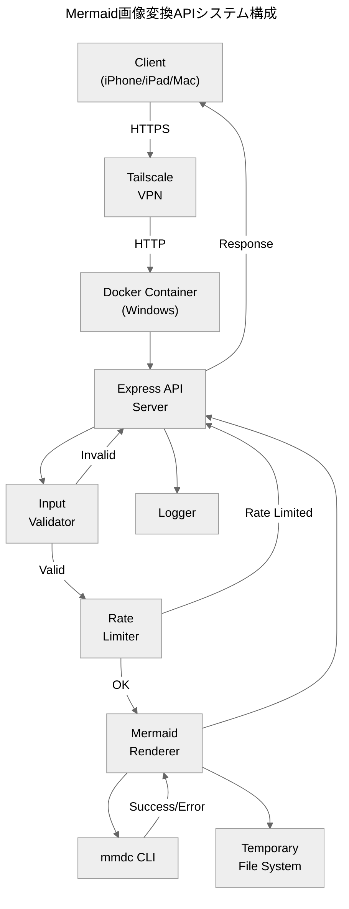
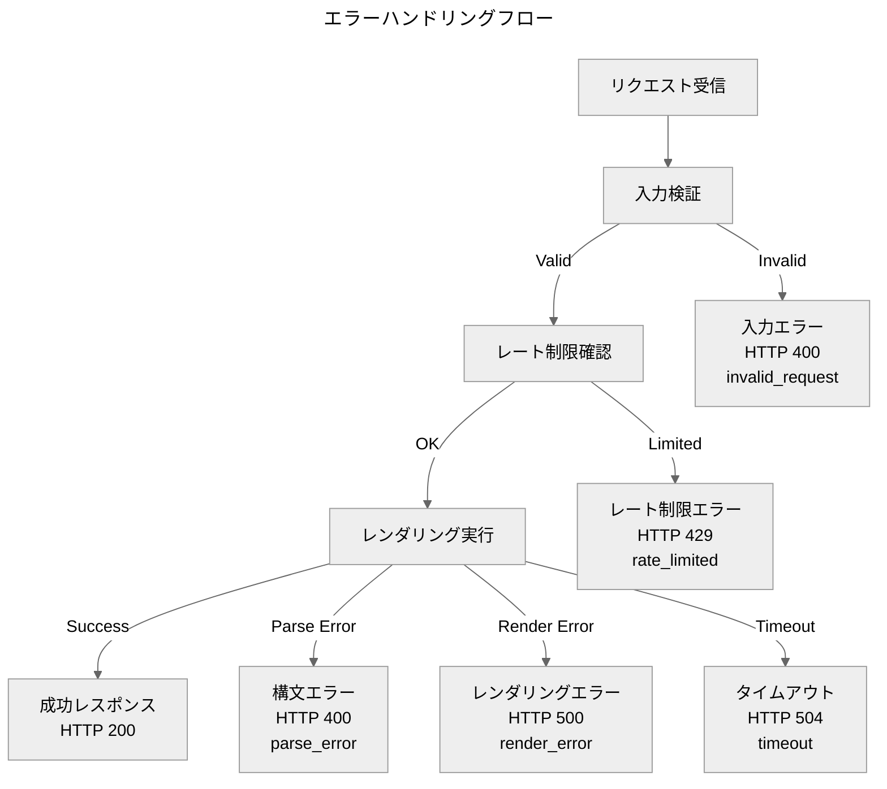

# 設計書

## 概要

本システムは、MermaidコードをHTTP API経由で受け取り、`mmdc`（Mermaid CLI）を使用してSVGまたはPNG画像に変換するNode.js製のWebサービスです。Dockerコンテナとして動作し、Windows環境でTailscale経由でのアクセスを想定しています。

### 設計目標

- **シンプルさ**: MVPとして最小限の機能で動作すること
- **透明性**: エラー情報を加工せず、そのまま返却すること
- **安定性**: タイムアウトと同時実行制御でリソースを保護すること
- **トレーサビリティ**: すべてのリクエストをRequest_IDで追跡可能にすること

## アーキテクチャ

### システム構成図



### レイヤー構成

1. **APIレイヤー**: HTTPリクエストの受付とレスポンス返却
2. **バリデーションレイヤー**: 入力検証とエラーハンドリング
3. **制御レイヤー**: レート制限とタイムアウト管理
4. **レンダリングレイヤー**: `mmdc`の実行と結果処理
5. **ロギングレイヤー**: リクエストとエラーの記録

## コンポーネントとインターフェース

### 1. API Server（Express）

**責務**: HTTPリクエストの受付、ルーティング、レスポンス返却

**インターフェース**:
```typescript
interface APIServer {
  // POST /render - Mermaidコードを画像に変換
  render(req: RenderRequest): Promise<RenderResponse | ErrorResponse>
  
  // GET /healthz - ヘルスチェック
  healthz(): HealthResponse
}

interface RenderRequest {
  code: string           // Mermaidコード（必須）
  format?: 'svg' | 'png' // 出力フォーマット（デフォルト: svg）
  timeout_ms?: number    // タイムアウト時間（デフォルト: サーバ設定値）
}

interface RenderResponse {
  // HTTPヘッダー
  headers: {
    'Content-Type': 'image/svg+xml' | 'image/png'
    'X-Request-Id': string
  }
  // ボディ: 画像データ（バイナリ）
  body: Buffer
}

interface ErrorResponse {
  // HTTPヘッダー
  headers: {
    'Content-Type': 'application/json'
    'X-Request-Id': string
  }
  // ボディ
  body: {
    request_id: string
    error_type: 'parse_error' | 'render_error' | 'timeout' | 'rate_limited' | 'invalid_request'
    status_code: number
    stderr: string
    exit_code: number | null
    format: string
  }
}

interface HealthResponse {
  status: 200
  headers: {
    'Content-Type': 'text/plain'
    'X-Request-Id': string
  }
  body: 'ok'
}
```

### 2. Input Validator

**責務**: リクエストパラメータの検証

**インターフェース**:
```typescript
interface InputValidator {
  validate(req: RenderRequest): ValidationResult
}

interface ValidationResult {
  valid: boolean
  error?: {
    type: 'invalid_request'
    message: string
    status_code: 400
  }
}

// 検証ルール
const VALIDATION_RULES = {
  MAX_CODE_SIZE: 50 * 1024,  // 50KB
  VALID_FORMATS: ['svg', 'png'],
  DEFAULT_FORMAT: 'svg'
}

// 注意: invalid_request エラーの場合
// - stderr: 空文字列 "" を返す（mmdcを実行しないため）
// - exit_code: null を返す（mmdcを実行しないため）
```

### 3. Rate Limiter

**責務**: 同時実行数の制御

**インターフェース**:
```typescript
interface RateLimiter {
  acquire(): Promise<boolean>  // リソース取得（成功: true、失敗: false）
  release(): void              // リソース解放
}

const RATE_LIMIT_CONFIG = {
  MAX_CONCURRENT: 2  // 同時実行上限
}
```

### 4. Mermaid Renderer

**責務**: `mmdc`の実行とレンダリング処理

**インターフェース**:
```typescript
interface MermaidRenderer {
  render(code: string, format: 'svg' | 'png', timeout: number): Promise<RenderResult>
}

interface RenderResult {
  success: boolean
  data?: Buffer           // 成功時: 画像データ
  error?: {
    stderr: string        // 失敗時: エラーメッセージ
    exit_code: number
    error_type: 'parse_error' | 'render_error' | 'timeout'
  }
}

const RENDERER_CONFIG = {
  DEFAULT_TIMEOUT: 8000,  // 8秒
  TEMP_DIR: '/tmp/mermaid'
}
```

### 設定値の局所化方針

設定値・定数は原則として単一箇所に集約し、ハードコードを避ける。実装では`VALIDATION_RULES`、`RATE_LIMIT_CONFIG`、`RENDERER_CONFIG`のような設定集約点または`config`モジュール／環境変数で管理する。

### Chromium実行方針（マルチアーキ対応）

Puppeteerが自動でダウンロードするChromiumはアーキテクチャ差異（arm64/amd64）で不整合が起きやすいため、OS配布のChromiumを使用し、実行バイナリを固定する。

**方針**:
- OS配布の`chromium`をインストールして使用する
- Puppeteerの自動ダウンロードは無効化する

**環境変数（実行時）**:
```bash
PUPPETEER_SKIP_DOWNLOAD=true
PUPPETEER_EXECUTABLE_PATH=/usr/bin/chromium
```

**理由**: Apple Silicon環境で`rosetta error`（x86_64バイナリ起動失敗）が発生しやすいため、マルチアーキで安定動作させる。

**Docker運用の注意**:
- root実行時に`--no-sandbox`が必要なため、Puppeteer設定ファイル（例: `puppeteer.config.json`）で`args`に`--no-sandbox`と`--disable-setuid-sandbox`を指定する。

**処理フロー**:
1. 一時ファイルにMermaidコードを書き込み
2. `mmdc`コマンドを実行（タイムアウト付き）
3. 成功時: 出力ファイルを読み込み、一時ファイルを削除
4. 失敗時: stderrを取得、一時ファイルを削除

### 5. Logger

**責務**: リクエストとエラーのログ記録

**インターフェース**:
```typescript
interface Logger {
  logRequest(requestId: string, method: string, path: string): void
  logResponse(
    requestId: string,
    statusCode: number,
    duration: number,
    outcome: 'success' | 'failure',
    exitCode: number | null
  ): void
  logError(requestId: string, error: Error, exitCode: number | null, context: any): void
  logStartup(mmdcVersion: string): void
}

// ログフォーマット
interface LogEntry {
  timestamp: string
  request_id: string
  level: 'info' | 'warn' | 'error'
  message: string
  status_code: number         // HTTPステータスコード（必須）
  duration_ms: number         // 処理時間（ミリ秒、必須）
  outcome: 'success' | 'failure'  // 成否（必須）
  exit_code: number | null    // 成功時はnull、失敗時は実値（必須フィールド）
  context?: any
}

// ログ出力方針:
// - すべてのリクエストに対して logRequest を呼ぶ
// - すべてのレスポンスに対して logResponse を呼ぶ（成功・失敗問わず）
// - エラー時は logError も追加で呼ぶ（詳細情報のため）
```

## データモデル

### Request ID生成

```typescript
function generateRequestId(): string {
  // UUID v4を使用
  return crypto.randomUUID()
}
```

前提: Node.jsは`crypto.randomUUID()`が利用可能なバージョンを使用する

### 一時ファイル命名規則

```typescript
function getTempFilePath(requestId: string, extension: string): string {
  return `/tmp/mermaid/${requestId}.${extension}`
}

// 例:
// 入力: /tmp/mermaid/550e8400-e29b-41d4-a716-446655440000.mmd
// 出力: /tmp/mermaid/550e8400-e29b-41d4-a716-446655440000.svg
```

### エラー種別マッピング

```typescript
const ERROR_TYPE_MAPPING = {
  // 入力検証エラー
  EMPTY_CODE: 'invalid_request',
  INVALID_FORMAT: 'invalid_request',
  CODE_TOO_LARGE: 'invalid_request',
  
  // レンダリングエラー
  MMDC_PARSE_ERROR: 'parse_error',
  MMDC_RENDER_ERROR: 'render_error',
  MMDC_TIMEOUT: 'timeout',
  
  // システムエラー
  RATE_LIMITED: 'rate_limited',
  MMDC_NOT_FOUND: 'render_error',
  INTERNAL_ERROR: 'render_error'
}
```

## 正確性プロパティ

*プロパティとは、すべての有効な実行において真であるべき特性や振る舞いのことです。プロパティは人間が読める仕様と機械で検証可能な正確性保証の橋渡しをします。*

### プロパティ 1: Request ID の一貫性

*任意の*リクエスト（成功・失敗を問わず）に対して、レスポンスには一意のRequest_IDが含まれ、ログにも同じRequest_IDが記録される

**検証方法**: ランダムなリクエストを生成し、レスポンスヘッダーまたはJSONボディにRequest_IDが含まれることを確認

**Validates: Requirements 1.4, 6.1, 10.3**

### プロパティ 2: フォーマット別Content-Typeの正確性

*任意の*有効なMermaidコードと指定されたフォーマット（svg/png）に対して、レスポンスのContent-Typeは指定されたフォーマットに対応する（svg → image/svg+xml、png → image/png）

**検証方法**: ランダムな有効Mermaidコードとフォーマットの組み合わせを生成し、Content-Typeが正しいことを確認

**Validates: Requirements 1.3, 10.1, 10.2**

### プロパティ 3: エラーレスポンスの完全性

*任意の*エラー条件（無効なコード、タイムアウト、レート制限等）に対して、エラーレスポンスには必須フィールド（request_id、error_type、status_code、stderr、exit_code、format）がすべて含まれる

**検証方法**: ランダムなエラー条件を生成し、JSONレスポンスに必須フィールドがすべて含まれることを確認

**Validates: Requirements 2.3, 10.5**

### プロパティ 4: 不正フォーマットの拒否

*任意の*不正なformat値（svg/png以外）に対して、システムはHTTP 400を返却する

**検証方法**: ランダムな不正format値を生成し、HTTP 400が返されることを確認

**Validates: Requirements 3.4**

### プロパティ 5: エラー時のContent-Type

*任意の*エラー条件に対して、レスポンスのContent-Typeは`application/json`である

**検証方法**: ランダムなエラー条件を生成し、Content-Typeが`application/json`であることを確認

**Validates: Requirements 10.4**

### プロパティ 6: 入力サイズ制限の遵守

*任意の*50KBを超えるコードに対して、システムはHTTP 400を返却する

**検証方法**: ランダムな50KB超のコードを生成し、HTTP 400が返されることを確認

**Validates: Requirements 3.5, 3.6**

### プロパティ 7: タイムアウトの正確性

*任意の*タイムアウトを超える処理に対して、システムはHTTP 504を返却し、error_typeは`timeout`である

**検証方法**: タイムアウトを超える処理を生成し、HTTP 504と`error_type=timeout`を確認

**Validates: Requirements 4.4, 4.5**

### プロパティ 8: レート制限の正確性

*任意の*同時実行上限を超えるリクエストに対して、システムはHTTP 429を返却し、error_typeは`rate_limited`である

**検証方法**: 同時実行上限を超えるリクエストを生成し、HTTP 429と`error_type=rate_limited`を確認

**Validates: Requirements 5.2, 5.3**

## エラーハンドリング

### エラー分類と処理方針



### エラーレスポンス生成

```typescript
function createErrorResponse(
  requestId: string,
  errorType: ErrorType,
  statusCode: number,
  stderr: string,  // invalid_requestの場合は空文字列 ""
  exitCode: number | null,  // invalid_requestの場合は null
  format: string
): ErrorResponse {
  return {
    headers: {
      'Content-Type': 'application/json',
      'X-Request-Id': requestId
    },
    body: {
      request_id: requestId,
      error_type: errorType,
      status_code: statusCode,
      stderr: stderr,  // 加工せずそのまま返却（invalid_requestの場合は ""）
      exit_code: exitCode,  // invalid_requestの場合は null
      format: format
    }
  }
}
```

### エラー処理の原則

1. **透明性**: stderrは加工せず、そのまま返却
2. **一貫性**: すべてのエラーレスポンスは同じ構造
3. **トレーサビリティ**: Request_IDをすべてのエラーに含める
4. **クリーンアップ**: エラー時も一時ファイルを必ず削除

## テスト戦略

### デュアルテストアプローチ

本システムでは、ユニットテストとプロパティベーステストの両方を使用します：

- **ユニットテスト**: 特定の例、エッジケース、エラー条件を検証
- **プロパティベーステスト**: すべての入力に対する普遍的なプロパティを検証

両者は補完的であり、包括的なカバレッジを実現します。

### プロパティベーステスト設定

**使用ライブラリ**: `fast-check`（Node.js用のプロパティベーステストライブラリ）

**設定**:
- 各プロパティテストは最低100回の反復を実行
- 各テストには設計書のプロパティ番号を参照するタグを付与

**タグ形式**:
```typescript
// Feature: mermaid-image-converter, Property 1: Request ID の一貫性
test('任意のリクエストにRequest_IDが含まれる', async () => {
  await fc.assert(
    fc.asyncProperty(
      fc.record({
        code: fc.string(),
        format: fc.constantFrom('svg', 'png', 'invalid')
      }),
      async (req) => {
        const response = await apiClient.render(req)
        expect(response.headers['X-Request-Id'] || response.body.request_id).toBeDefined()
      }
    ),
    { numRuns: 100 }
  )
})
```

### ユニットテスト戦略

**対象**:
- 入力検証ロジック
- エラーレスポンス生成
- Request ID生成
- 一時ファイル管理

**例**:
```typescript
describe('Input Validator', () => {
  test('空のcodeはinvalid_requestエラーを返す', () => {
    const result = validator.validate({ code: '' })
    expect(result.valid).toBe(false)
    expect(result.error?.type).toBe('invalid_request')
  })
  
  test('50KBを超えるcodeはinvalid_requestエラーを返す', () => {
    const largeCode = 'a'.repeat(51 * 1024)
    const result = validator.validate({ code: largeCode })
    expect(result.valid).toBe(false)
  })
})
```

### 統合テスト

**対象**:
- `/render`エンドポイントのエンドツーエンドフロー
- `/healthz`エンドポイント
- タイムアウト処理
- レート制限

**例**:
```typescript
describe('POST /render', () => {
  test('有効なMermaidコードでSVGを返す', async () => {
    const response = await request(app)
      .post('/render')
      .send({ code: 'graph TD\nA-->B', format: 'svg' })
    
    expect(response.status).toBe(200)
    expect(response.headers['content-type']).toBe('image/svg+xml')
    expect(response.headers['x-request-id']).toBeDefined()
  })
  
  test('無効なMermaidコードでエラーを返す', async () => {
    const response = await request(app)
      .post('/render')
      .send({ code: 'invalid mermaid code' })
    
    expect(response.status).toBe(400)
    expect(response.body.error_type).toBe('parse_error')
    expect(response.body.stderr).toBeDefined()
  })
})
```

### テストカバレッジ目標

- **ユニットテスト**: 各コンポーネントの主要ロジックをカバー
- **プロパティベーステスト**: 8つの正確性プロパティをすべて検証
- **統合テスト**: すべてのAPIエンドポイントとエラーパスをカバー

### テスト実行環境

- **ローカル**: `npm test`でユニットテストとプロパティテストを実行
- **CI/CD**: Dockerコンテナ内でテストを実行し、環境の一貫性を保証
- **プロパティテスト**: 失敗時は反例（counterexample）を保存し、再現可能にする
