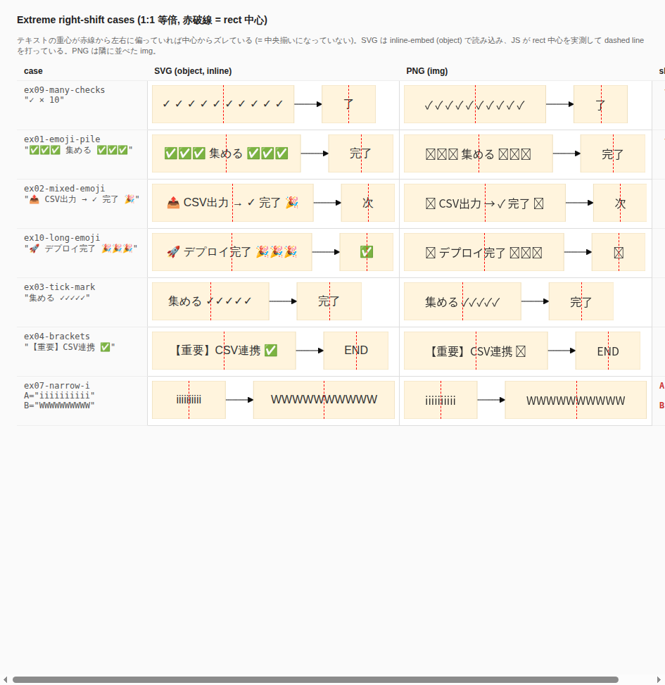

# Mermaid Render API

[日本語版 README はこちら / Japanese README](./README.ja.md)

An HTTP API that converts Mermaid source code into SVG / PNG images. Built with TypeScript + Express, exposing `/render`, `/healthz`, `/livez`, `/readyz`, and `/metrics`. By default it uses the `@mermaid-js/mermaid-cli` Programmatic API together with a long-lived BrowserPool.

## Highlights

### Fixes Mermaid's foreignObject text-centering bug

In upstream Mermaid 11.15.0, text inside a node is rendered via a `<foreignObject>` whose inner `<div>` uses `display: table-cell`. When the text contains narrow glyphs (`i`), wide glyphs (`W`), emoji, or CJK punctuation, the rendered glyphs drift to the right of the rectangle's geometric center. This API post-processes the SVG to wrap that inner `<div>` in a flex container (`display: flex; justify-content: center; align-items: center`), restoring true centering for both SVG and PNG output.

| Without the fix (raw Mermaid 11.15.0) | With this API |
|---|---|
|  |  |

The dashed red line is the measured center of the node's `rect`. In the "before" image text drifts noticeably right of the line; in the "after" image text sits on the line. See `docs/foreignobject-inner-centering-verification-2026-05-17.md` for the 14-diagram regression breakdown.

### Other notable features

- **Per-request PNG resolution**: `scale: 1..4` (default `3`), specified at request time — no env var needed.
- **Mermaid-default-compatible defaults**: `flowchart.useMaxWidth=true`, `diagramPadding=8`, `nodeSpacing=rankSpacing=50`. The SVG fits its parent element naturally when embedded in HTML.
- **Chromium sandbox enabled**: no `--no-sandbox`. Hardened container with non-root execution, read-only filesystem, tmpfs, capability drop, and PID / memory limits.
- **Long-lived BrowserPool**: low-latency rendering via persistent Chromium contexts.
- **Defensive validation**: per-request `mermaid_config` override is validated against a server-side schema with prototype-pollution protection.

## Prerequisites

- Node.js 20
- Docker Desktop (WSL supported)

## Local execution

```bash
npm install
npm run build
npm run start
```

## Docker execution

The standard Docker setup assumes a working Chromium sandbox. Mermaid renders through Chromium internally, so by default we do **not** use `--no-sandbox`. The container runs as non-root with a read-only filesystem, tmpfs, and capability drop.

This API is intended for local use or use inside a VPN (e.g. Tailscale). **Do not expose it directly to the public internet.**

1) Create `.env`

```bash
cp .env.example .env
```

2) Standard startup (Windows Docker Desktop, both production and development)

```bash
docker compose -f docker-compose.yml -f docker-compose.dev-sysadmin.yml up --build -d
```

Production is assumed to run on Windows Docker Desktop (`requirements.md` C-P-09). Because Docker Desktop runs through a LinuxKit VM, Chromium needs `SYS_ADMIN` / `SYS_CHROOT` capabilities (added by the `docker-compose.dev-sysadmin.yml` overlay) to create the namespace / chroot for its sandbox. Without the overlay the container enters a restart loop (`Failed to move to new namespace ... Operation not permitted`).

3) Linux bare-metal hosts (only, not Docker Desktop on Linux)

```bash
docker compose up --build -d
```

On a bare-metal Linux host the user namespace is available, so the overlay is not required. The production support scope of this repository is Windows Docker Desktop only — we do not ship seccomp / AppArmor profiles for bare-metal Linux. If you intend to run on Linux directly, validate that the Chromium sandbox works on your infrastructure separately.

4) Sanity check

```bash
curl -i http://localhost:3100/healthz
curl -i http://localhost:3100/readyz
curl -i http://localhost:3100/livez
curl -i -X POST http://localhost:3100/render \
  -H "Content-Type: application/json" \
  -d '{"code":"graph TD\nA-->B","format":"svg"}'
```

## Starting from WSL

Enable Docker Desktop on Windows and run the following inside your WSL distribution. WSL invocations are still backed by Windows Docker Desktop (LinuxKit VM), so the overlay is required.

```bash
cp .env.example .env
docker compose -f docker-compose.yml -f docker-compose.dev-sysadmin.yml up --build -d
```

## `/render` API

`POST /render` accepts a JSON body and returns binary image data (`image/svg+xml` or `image/png`).

### Request body

| Field | Type | Required | Description |
|---|---|---|---|
| `code` | string | ✓ | Mermaid source. Up to `MAX_CODE_SIZE` bytes (default 51200). |
| `format` | `"svg"` \| `"png"` | optional | Output format. Defaults to `svg`. |
| `timeout_ms` | integer | optional | Render timeout in ms. Server default when omitted. |
| `scale` | integer | optional | PNG resolution multiplier (`deviceScaleFactor`). Integer in **1..4**, server default **3**. Ignored for `format=svg` (responds 200 with the same SVG, logs `scale_ignored_for_svg` warning in the structured log). Out-of-range / non-integer → `400 invalid_request` (`error_field: "scale"`). |
| `mermaid_config` | object | optional | Per-request Mermaid configuration override (subject to server-side schema validation). |
| `post_process` | object | optional | SVG post-processing options (e.g. `strip_max_width`, `rewrite_ids`). |

### Examples

```bash
# SVG (default)
curl -X POST http://localhost:3100/render \
  -H "Content-Type: application/json" \
  -d '{"code":"flowchart LR\n A-->B","format":"svg"}' \
  > out.svg

# PNG at server default scale (3x)
curl -X POST http://localhost:3100/render \
  -H "Content-Type: application/json" \
  -d '{"code":"flowchart LR\n A-->B","format":"png"}' \
  > out.png

# PNG high-DPI (4x)
curl -X POST http://localhost:3100/render \
  -H "Content-Type: application/json" \
  -d '{"code":"flowchart LR\n A-->B","format":"png","scale":4}' \
  > out_hidpi.png

# PNG lightweight (1x)
curl -X POST http://localhost:3100/render \
  -H "Content-Type: application/json" \
  -d '{"code":"flowchart LR\n A-->B","format":"png","scale":1}' \
  > out_small.png
```

### Error responses

`400 invalid_request` is returned for invalid `code` / `format` / `timeout_ms` / `scale` / `mermaid_config` etc. The JSON body includes `error_type`, `error_field`, and `error_constraint`.

```json
{
  "request_id": "...",
  "error_type": "invalid_request",
  "status_code": 400,
  "format": "png",
  "error_message": "scale must be between 1 and 4",
  "error_field": "scale",
  "error_constraint": "out_of_range"
}
```

## Environment variables

Configurable through `.env` (loaded by Docker at startup).

- `DEFAULT_TIMEOUT_MS`: Mermaid CLI timeout in ms (default 8000)
- `RATE_LIMIT_MAX_INFLIGHT`: HTTP-layer concurrent-request cap (default 15)
- `BROWSER_POOL_SIZE`: BrowserContext pool size (default 4)
- `POOL_QUEUE_MAX`: BrowserPool queue cap (default 20)
- `MAX_CODE_SIZE`: maximum byte size of `code` (default 51200)
- `RENDERER_MODE`: `programmatic` or `cli` (default `programmatic`)

> PNG scale and SVG padding are no longer environment variables — PNG `scale` is now a request-time API parameter (`1..4`, default `3`). The previous `PNG_RENDER_SCALE` / `MERMAID_PADDING` variables have been removed.

## Dependency update policy

The Programmatic API of `@mermaid-js/mermaid-cli` is out of semver scope, so we exact-pin it. After updates, sync `npm ci`, then run property tests, integration tests, image-diff verification, and performance checks before merging.

As of Phase 4.5, the policy is zero critical / high advisories on production dependencies. Remaining moderate / low advisories are tracked in `docs/dependency-overrides.md` with reachability, mitigation, exit criteria, and re-evaluation date.

## Chromium sandbox operation

In production (Windows Docker Desktop) we do **not** use `--no-sandbox`. Instead we add `SYS_ADMIN` / `SYS_CHROOT` via `docker-compose.dev-sysadmin.yml` so that Chromium can use its own Linux-namespace sandbox. Non-root execution, `chromium-sandbox`, `tini`, read-only filesystem, tmpfs, and PID / memory limits are fixed in the base `docker-compose.yml`. The overlay only adds the minimum capabilities needed to enable the sandbox (see `requirements.md` C-P-09, `design.md` §8.1).

In plain words: Windows Docker Desktop is "Docker on top of a Linux VM," and that VM restricts the permissions Chromium needs to create its isolated room. We hand Chromium a narrow permission slip (`SYS_ADMIN` / `SYS_CHROOT`) instead of disabling the sandbox with `--no-sandbox` — running with the sandbox enabled is safer than disabling it.

`--no-sandbox` is not part of the standard configuration. Even for local / Tailscale-only use, please keep the sandbox enabled — external Mermaid input is still processed through Chromium.

## Fonts

To keep Japanese rendering attractive, the container ships with `fonts-noto-cjk` and the Mermaid configuration prefers `Noto Sans CJK JP`.

## Docker E2E helper

`scripts/docker-e2e.sh` is a small probe that hits `/healthz` and `/render`.

```bash
chmod +x scripts/docker-e2e.sh
scripts/docker-e2e.sh
```

## Common problems

### Port already in use

If `Bind for 0.0.0.0:3100 failed` appears, change the port in `docker-compose.yml`:

```yaml
ports:
  - "3100:3000"
```

Then the check URL becomes `http://localhost:3100/healthz`.

### Container goes into Restarting on Docker Desktop

This should not happen when you use the overlay command above. If you accidentally start with only `docker compose up`, `docker compose ps` will show `Restarting` and the logs will show:

```text
Failed to move to new namespace ... Operation not permitted
FATAL:zygote_host_impl_linux.cc
```

That means Chromium could not get permission from Docker Desktop to create the namespace for its sandbox. Restart with the standard overlay command:

```bash
docker compose -f docker-compose.yml -f docker-compose.dev-sysadmin.yml up --build -d
```

Then verify:

```bash
curl -i http://localhost:3100/healthz
curl -i http://localhost:3100/readyz
curl -i -X POST http://localhost:3100/render \
  -H "Content-Type: application/json" \
  -d '{"code":"graph TD\nA-->B","format":"svg"}'
```

## Current verified status

As of REQ-U-11 (2026-05-18):

- `npm run build`: pass
- `npm test`: 58 files / 245 tests pass
- `npm audit --omit=dev --audit-level=high`: pass
- `docker compose build`: pass
- On Windows Docker Desktop with `docker-compose.dev-sysadmin.yml` overlay: `/healthz` / `/readyz` / `/livez` / `/render` SVG and PNG smoke all return 200
- Performance NFR-01 (simple flowchart p50 ≤ 500ms): PASS (see `docs/perf/2026-05-16_compare.md`)
- Post-deploy 5-min monitoring (Phase 6): PASS (see `docs/phase6-deployment-verification/5min-monitoring-2026-05-16.md`)

## Tests

```bash
npm run test
```

## Externally referenced files (do not delete / rename / force-push)

The following files and directories are **permalinked from public Issues and public documents at fixed commit hashes**. Do not delete, rename, or force-push history that removes the referenced commits — that would break Mermaid's maintainer investigations and community references.

### Files referenced from Mermaid upstream issues

Source: a Mermaid bug issue against `mermaid-js/mermaid` (themeCSS `foreignObject` selector silently lowercased, filed 2026-05-16)

Pinned commit: `75bcb4d`

| Path | Role |
|---|---|
| `docs/svg-themecss-lowercase-verification-2026-05-16/output-with-themeCSS.svg` | Generated SVG with themeCSS on 11.15.0 (evidence) |
| `docs/svg-themecss-lowercase-verification-2026-05-16/output-no-themeCSS.svg` | Control SVG without themeCSS on 11.15.0 |
| `docs/svg-themecss-lowercase-verification-2026-05-16/output-with-themeCSS-mermaid11140.svg` | Comparison SVG on 11.14.0 (pre PR #7737) |
| `docs/svg-themecss-lowercase-verification-2026-05-16/output-no-themeCSS-mermaid11140.svg` | Control SVG on 11.14.0 |
| `docs/svg-themecss-lowercase-verification-2026-05-16/output-with-themeCSS-develop-2026-05-16.svg` | Reproduction SVG on Mermaid develop (`v11.15.0+2a51ae4`) |

Mermaid maintainers open these SVGs directly in a browser to inspect `<style>` element selectors.

### Operational rules

1. **No delete or rename**: do not change file paths, filenames, or directory names.
2. **No force-push**: do not rewrite history that contains commit `75bcb4d` (`git push -f`, `git reset --hard` followed by push, etc.). Permalinks from the filed issue would break.
3. **Do not make the repository private**: external links would all break.
4. **Do not delete the repository**: same as above.
5. **Plan large-scale restructuring carefully**: if a repository-wide restructure becomes necessary, consider alternatives first — (a) keep the original commits and split a new structure into a separate branch, (b) archive ahead of time on the Wayback Machine / Software Heritage, etc.

### Filed Issue

- [mermaid-js/mermaid#7759](https://github.com/mermaid-js/mermaid/issues/7759) — `[Bug] themeCSS lowercases foreignObject selector, breaking SVG workaround in standalone mode` (filed 2026-05-16, initial label `Status: Triage`)

See `docs/issue-drafts/2026-05-16_mermaid-themecss-lowercase-bug.md` for the draft body and posting history.
