# Mermaid foreignObject クリップとフォントメトリクスのベストプラクティス確認(実測ベース)

- 作成日: 2026-05-16
- 対象: `mermaid-render-api` の SVG 出力時のラベル文字クリップ問題
- 性質: 専門家レビューではなく、**自リポジトリ上での実機計測ベースの一次調査**(信頼性 = 実機再現可能)
- 関連: `docs/expert-reviews/2026-05-10_mermaid-svg-rendering-best-practices.md`(§3.7 の `themeCSS` クリップ回避策を本書で部分否定)
- エビデンス: `./2026-05-16-foreignobject-clip/` 配下の SVG 13 件、計測 JSON 2 ファイル、img-vs-inline 比較スクリーンショット

---

## 0. このドキュメントの位置づけ

`2026-05-10` のエキスパートレビュー §3.7 で「`themeCSS: '.label foreignObject { overflow: visible; }'` を当てれば foreignObject 境界クリップは抑制できる」と結論していたが、**配布 HTML embed が想定する standalone SVG モード**(`` 経由、GitHub Markdown 上の SVG 表示、`.svg` 直接、`object`/`embed`)で **実際には効かない**ことを 2026-05-16 の実機検証で確認した。

加えて、Mermaid サーバ側の `foreignObject` 幅予測には、特定の文字種で**最大 +14.63px の過小評価**が発生することが分かった。これは「日本語/全角の問題」ではなく「**半角 ASCII / Unicode 記号のフォント間メトリクス差**」が真の原因。

本書は要件定義書(`requirements.md`)の技術的制約 §2 と、設計書(`design.md`)の `themeCSS` クリップ対策節を再評価するためのファクト集。

---

## 1. 計測手順

### 1.1 環境

| 項目 | 値 |
|---|---|
| 検証日 | 2026-05-16 |
| API | `http://127.0.0.1:3100/render`(Programmatic mode、本リポジトリの dev コンテナ) |
| Mermaid | `11.15.0`(`@mermaid-js/mermaid-cli` バンドル) |
| デフォルトレンダラ | `dagre-wrapper` |
| ラベル方式 | `htmlLabels: true` |
| サーバ側フォント | `Noto Sans CJK JP`(Dockerfile で `fonts-noto-cjk` インストール) |
| コンシューマ側ブラウザ | playwright-cli の Chromium、macOS、`Hiragino Sans` 等にフォールバック |
| BEAUTIFUL_DEFAULTS で `flowchart.padding` | 未指定(Mermaid 既定 15) |

### 1.2 計測ロジック

各 SVG をブラウザに inline 配置(HTML ドキュメント内に `<svg>` 直接展開、`DOMParser('image/svg+xml')` 経由で innerHTML 由来の untrusted 警告を回避)し、JavaScript で以下を測る:

- `foW`: SVG 上の `<foreignObject>` 要素の `width` 属性値(= Mermaid 予測幅)
- `actualW`: 同 `<foreignObject>` 内の `<p>` 要素の `getBoundingClientRect().width`(= ブラウザ実描画幅)
- `overflow = actualW − foW`

```js
const foW = parseFloat(fo.getAttribute('width'));
const pBox = p.getBoundingClientRect();
const overflow = pBox.width - foW;
```

> ソース: `./2026-05-16-foreignobject-clip/measurements.json`(13 サンプル)、`./2026-05-16-foreignobject-clip/padding-measurements.json`(padding 値別 8 サンプル)

### 1.3 同一 SVG を `` モードと inline モードで並列描画

`themeCSS overflow:visible` が standalone SVG で効くかを判定するため、同一の `case-10-padding-15.svg` を以下 2 通りで描画して比較:

- A) ``(GitHub Markdown の SVG 表示と同じモード)
- B) HTML 内に `<svg>...</svg>` を直接展開(inline)

スクリーンショット: [`./2026-05-16-foreignobject-clip/img-vs-inline-screenshot.png`](./2026-05-16-foreignobject-clip/img-vs-inline-screenshot.png)

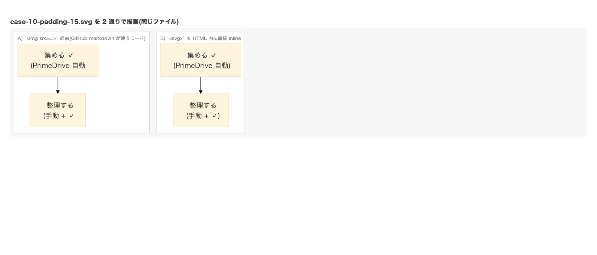

**左(`` モード)では Node A の `)` と Node B の `)` が見切れ、右(inline モード)では見切れない。** 同じ SVG ファイルから。

---

## 2. 計測結果

### 2.1 13 サンプルの幅予測精度

> 各行の SVG ファイルは `./2026-05-16-foreignobject-clip/exp-N.svg` に保存。後段 §2.2 でインライン表示。

| Exp | Mermaid 入力 | 文字構成 | Mermaid 予測 foW (px) | 実描画 actualW (px) | overflow (px) | 評価 |
|---:|---|---|---:|---:|---:|---|
| 1 | `(手動 + ✓)`(単行) | CJK + 半角() + 半角空白 + `+` + ✓ | 69.80 | 80.55 | **+10.75** | NG 大 |
| 2 | `整理する`(単行) | 純 CJK 単行 | 64.02 | 64.00 | **0.00** | OK ✓ |
| 3 | `整理する<br>整理する整理する` | 純 CJK 多行 | 128.02 | 128.00 | **0.00** | OK ✓ |
| 4 | `(手動 + ✓)<br>整理する` | Exp 1 を多行化 | 69.80 | 80.55 | +10.75 | NG 大(1 と一致) |
| 5 | `整理する<br>(手動 + ✓)` | Case 10 Node B 現状 | 69.80 | 80.55 | +10.75 | NG 大(1, 4 と一致) |
| 6 | `(整理する)`(単行) | CJK + 半角() のみ | 74.83 | 75.40 | +0.57 | わずか |
| 7 | `整理 + 整理`(単行) | CJK + 半角空白 + `+` | 80.06 | 85.16 | **+5.09** | NG 中 |
| 8 | `整理する ✓`(単行) | CJK + 半角空白 + ✓ | 78.52 | 85.33 | **+6.81** | NG 中 |
| 9 | `(test + ok)`(単行) | **純 ASCII**、CJK 一切無し | 73.22 | 82.29 | **+9.07** | NG 大 |
| 10 | `PrimeDrive auto + check` | 純 ASCII、空白多め | 180.70 | 195.33 | **+14.63** | NG 最大 |
| 11 | `整理する(全角１)` | CJK + 半角() + 全角１ | 122.83 | 123.40 | +0.57 | わずか |
| 12 | `整理する（手動＋✓）` | **括弧と `+` を全角化**(半角は ✓ 周辺空白だけ) | 154.94 | 160.00 | +5.06 | NG 中(✓ 単独相当) |
| 13 | `✓` 単独 | U+2713 のみ | 10.94 | 16.00 | +5.06 | NG 中 |

### 2.2 実例 SVG(インライン)

> 以下は **GitHub Markdown / VS Code プレビューで standalone SVG モード** として描画されるため、`themeCSS overflow:visible` が効かない状況での実機の見え方になる。foreignObject 境界で文字が切れている SVG はそのまま見切れて表示される(=エビデンスそのもの)。

#### Exp 2: 純 CJK「整理する」(overflow = 0、ベースライン)


#### Exp 3: 純 CJK 多行「整理する / 整理する整理する」(overflow = 0、改行は無影響)


#### Exp 5: Case 10 Node B 現状(+10.75 overflow、見切れあり)


#### Exp 9: 純 ASCII「(test + ok)」(+9.07 overflow、日本語不要)


#### Exp 10: 純 ASCII「PrimeDrive auto + check」(+14.63 overflow、最大)


#### Exp 12: Exp 5 の括弧と `+` を全角化(+5.06 overflow、✓ だけ残る)


#### Exp 13: ✓ 単独(+5.06 overflow、`✓` だけで約 5px ズレる)


#### Exp 1, 4(参考、Exp 5 と同 overflow)



#### Exp 6, 7, 8(部分要素のクロス確認)


#### Exp 11(半角() のみ追加、わずかな overflow)


---

## 3. 観測された事実

### 3.1 Mermaid 幅予測の精度パターン

| 文字種 | Mermaid 予測差(コンシューマ側との) |
|---|---|
| CJK 全角文字 / 全角記号 / 全角数字 | **完全一致**(両フォントで 1em = 16px 揃う) |
| 半角 ASCII 英字 | コンシューマ側が **約 0.5〜1px 広く描画**(各文字あたり) |
| 半角空白 ` ` | コンシューマ側が **1〜2px 広く描画** |
| 半角 `+` | コンシューマ側が **1〜2px 広く描画** |
| 半角括弧 `(` `)` | わずか(各 0.3px 程度) |
| Unicode dingbat / 絵文字 `✓` (U+2713) | コンシューマ側が **約 5px 広く描画**(フォント依存) |

### 3.2 改行 `<br>` は無関係

Exp 1(単行)、Exp 4(行順逆転 2 行)、Exp 5(現状 2 行)で **overflow が全て +10.75 で完全一致**。Mermaid の foreignObject 幅は「行ごとの幅の最大値」を採用しているため、改行を追加しても 1 行版の最大幅と同じ値になる。改行は予測精度にも実描画幅にも影響しない。

### 3.3 themeCSS overflow:visible は standalone SVG で効かない

§1.3 のスクリーンショット参照。同じ SVG ファイルを `` モードで描画すると見切れ、inline モードで描画すると見切れない。**根本原因は CSS セレクタの大小文字判定の差**(後述 §4.2)。

---

## 4. 根本原因の特定

### 4.1 Mermaid サーバ側の幅算出ロジックとフォント依存

Mermaid は `themeVariables.fontFamily` の先頭(本リポジトリでは `Noto Sans CJK JP`)で `canvas.measureText()` 系のフォントメトリクス計算を行い、ラベルの予測幅を出す。SVG 出力上は `foreignObject` の `width` 属性として焼き込まれる。

一方コンシューマ側ブラウザは、SVG 内 `font-family` の宣言を順番に評価し、最初に**インストール済**のフォントで描画する。`Noto Sans CJK JP` がインストールされていない環境(macOS の Chromium、Windows 標準セットアップ、Linux の多くなど)では `Hiragino Sans` / `Meiryo` / `Yu Gothic` / `DejaVu Sans` などにフォールバックする。

この 2 つのフォントは:

- **全角文字**(CJK、全角括弧、全角数字、全角記号): どちらも `1em = 16px` で完全に揃う
- **半角 ASCII / 半角記号 / Unicode dingbat**: 字形ごとのアドバンス幅が異なる(`✓` は特に大、フォントによって半角 / 全角 / 絵文字フォント参照の揺れがある)

結果として **半角文字を含むラベル** で予測と実描画にズレが生じ、`+0.57` 〜 `+14.63` の幅 overflow が発生する。

### 4.2 themeCSS overflow:visible が standalone SVG で効かない理由

本リポジトリの `themeCSS` 設定(`src/config.ts:139`):

```ts
themeCSS: '.label foreignObject { overflow: visible; }'
```

生成 SVG 内 `<style>` 抜粋:

```css
#mermaid-XXX .label foreignobject { overflow: visible; }
```

セレクタが **`foreignobject`(小文字)** に変換されている。Mermaid の CSS 処理(または依存先 CSSOM)が要素名を小文字化する。

CSS セレクタの大小文字判定(W3C CSS spec):

- **HTML 文書内**(`<svg>` を HTML に inline 配置時): タグ名は HTML パーサで小文字化され、CSS セレクタもタグ名は case-insensitive で判定 → `foreignobject` セレクタが `<foreignObject>` 要素にマッチ → `overflow: visible` 適用 → クリップ回避成功
- **Standalone SVG 文書**(``、`.svg` 直接、`object`/`embed`、Markdown ビュアの SVG 表示): SVG は XML namespace、タグ名は case-**sensitive** → 小文字セレクタは camelCase 要素 `<foreignObject>` にマッチ**しない** → `overflow: visible` が**適用されない** → SVG 仕様のデフォルト `overflow: hidden` が効く → foreignObject 境界で文字がクリップ

§1.3 のスクリーンショット(`img-vs-inline-screenshot.png`)が、同一 SVG ファイルでの両モードの違いを直接示している。

### 4.3 「Padding を上げれば解決」が成立しない理由

`flowchart.padding` は **rect の幅** だけを動かす:

```
rect.width = foreignObject.width + 4 × flowchart.padding
```

`foreignObject.width` は padding と無関係に Mermaid 予測値で固定。クリップは foreignObject 境界で発生しているため、**padding を上げても rect が大きくなるだけで、foreignObject 境界の位置は変わらず、クリップは消えない**。

> ただし `themeCSS overflow:visible` が効く inline モードでは話が逆になる: padding が大きいほど rect 内のバッファが増え、文字が rect 線にぶつかりにくくなる。が、standalone SVG モードでは foreignObject 自体でクリップされるので、padding の効果は限定的。

### 4.4 「日本語 / 全角だから」という仮説の否定

| 観察 | 含意 |
|---|---|
| Exp 2, 3(純 CJK): overflow = 0 | 全角だけでは問題が起きない |
| Exp 9, 10(純 ASCII): overflow +9.07 / +14.63 | CJK 不要、ASCII だけで発生 |
| Exp 11 → 12(半角() → 全角() に置換): overflow +0.57 → +5.06 に変化(✓ 単独分は残る) | 半角文字を全角化すれば改善できる |
| Exp 13(✓ 単独): +5.06 | ✓ は単独で約 5px のズレ要因 |

**結論**: 「日本語 / 全角」 ではなく、**「半角 ASCII / 半角記号 / Unicode dingbat(✓ 等)」が原因**。日本語環境で目立つのは、日本語ラベルでこれら半角文字(括弧・空白・`+`・`✓`)が混在する慣習があるため。

---

## 5. 影響と運用上の制約

### 5.1 配布 HTML embed 用途(本 API の主目的)

- 配布 HTML が SVG を `` で参照するか、GitHub README に Markdown で SVG を貼る場合 → standalone SVG モード → **themeCSS overflow:visible が効かない** → 半角文字を含むラベルは foreignObject 境界でクリップ
- 配布 HTML が SVG を inline 展開(`<svg>...</svg>` を HTML に直接書く)する場合 → themeCSS が効く → クリップ回避成功
- **AI 生成 Mermaid → 配布 HTML embed** のシナリオでは、コンシューマ側がどちらのモードで埋め込むか不定。**両モードで安全に動作するための追加対策が必要**。

### 5.2 Mermaid v11.15.0 の挙動として固定

- 本問題は Mermaid 内部の CSS 処理が themeCSS を小文字化することに起因。Mermaid v11.15.0 で再現確認済。
- 上流修正待ちは現実的ではない(Mermaid の lookAndFeel リファクタが進行中、優先度未知)。

### 5.3 padding 調整単体では解決しない

- §4.3 の通り、padding はクリップの本質的対策にならない。
- ただし、後述する後処理対策と組み合わせると「予測 overflow があってもバッファで吸収される」という二段構えになるため、`flowchart.padding: 8` のような余白圧縮設定とは併存可能。

---

## 6. 対策候補の列挙(選定は別票)

本書は原因特定の事実集約まで。具体的対策の採用は別票で行う。候補のみ列挙:

| ID | 対策 | 効果範囲 | コスト |
|---|---|---|---|
| F-1 | **SVG 後処理で `<foreignObject>` 要素に直接 `style="overflow:visible"` を打ち込む** | 全モードで overflow visible 強制 | 軽(`src/renderer/postProcess.ts` 拡張) |
| F-2 | SVG 後処理で `<style>` 内の `foreignobject` を `foreignObject` に書き換える | 同上、ただし将来 Mermaid が他要素も小文字化したら脆い | 軽だがメンテ性低 |
| F-3 | サーバ側で Web フォント(Noto Sans CJK JP)を `themeCSS @font-face` で SVG に焼き込む | overflow 量を `0` に近づける、配布 SVG が肥大化 | 中(SVG サイズが数百 KB 増) |
| F-4 | `htmlLabels: false` で SVG `<text>` を使う | foreignObject 自体を回避、ただし v11.11+ で既知バグ(`2026-05-10` レビュー §3.4) | 大 |
| F-5 | SVG 後処理で `<foreignObject>` の `width` 属性を実描画幅まで広げる(JSDom や headless browser で再計測) | 完全解決、ただし render に第二段階が必要 | 大 |
| F-6 | コンシューマ側へ「inline 展開してください」と仕様で明記 | 仕様で逃げる、ユーザビリティ低下 | 仕様変更 |

最有力候補は **F-1**(後処理で各 foreignObject に直接 inline style 付与)。理由:
- SVG 仕様の case-sensitivity 問題を完全に回避(セレクタ不要、属性で直接指定)
- 既存の `src/renderer/postProcess.ts`(`tasks.md` H-6 / Phase 1 で確立済)に乗せられる
- パフォーマンス影響なし(正規表現 1 回)
- 副作用なし(`overflow:visible` は他の描画に影響しない)

---

## 7. 関連ドキュメントとアクション項目

### 7.1 既存ドキュメントへの影響

- **`docs/expert-reviews/2026-05-10_mermaid-svg-rendering-best-practices.md` §3.7**: 「`themeCSS overflow:visible` で clip 抑制できる」結論は **inline モード限定**で、本書 §1.3 / §4.2 により standalone モードでの不成立を確認。2026-05-10 レビュー §3.7 に簡潔な参照注記を追加済。
- **`requirements.md` C-H-03**: 「foreignObject 境界クリップ」の説明はそのまま維持できるが、回避策の効果範囲を**モード依存**と明記する追補を推奨。
- **`design.md` §3.1 BEAUTIFUL_DEFAULTS の `themeCSS`**: 値そのものは維持(inline モードでは効くため)。ただし「standalone モードでは別途 SVG 後処理が必要」というコメントを併記すべき。
- **Phase 4.6** (`tasks.md` §7): `flowchart.padding: 8` の採用は別目的(US-03 余白圧縮)で本問題とは独立。本書のクリップ問題は Phase 4.7 などで別票化が妥当。

### 7.2 推奨アクション

- 本書 §6 F-1(SVG 後処理で `<foreignObject>` に `style="overflow:visible"` 打ち込み)を新規 Phase として `tasks.md` に追加
- `requirements.md` C-H-03 にモード依存性の補足を追加
- `design.md` §3.1 / §7.2(`postProcess` 仕様)に F-1 の処理仕様を追記

---

## 8. 参照ソース

### 一次資料(本書のエビデンス)

- 13 サンプル SVG: `./2026-05-16-foreignobject-clip/exp-{1..13}.svg`
- 計測結果 JSON: `./2026-05-16-foreignobject-clip/measurements.json`、`padding-measurements.json`
- img vs inline 比較スクリーンショット: `./2026-05-16-foreignobject-clip/img-vs-inline-screenshot.png`
- padding 値別 8 サンプル: `../svg-node-padding-tuning-verification-2026-05-16/case-{02,10}-padding-{4,8,15,30}.svg`

### Mermaid 仕様

- Mermaid `themeCSS` schema: https://raw.githubusercontent.com/mermaid-js/mermaid/develop/packages/mermaid/src/schemas/config.schema.yaml
- Mermaid `htmlLabels` deprecation: 同 schema 内 `flowchart.htmlLabels`

### CSS / SVG 仕様

- CSS Selectors Level 4「Case Sensitivity」: https://www.w3.org/TR/selectors-4/#case-sensitive
- SVG2 / `<foreignObject>` element: https://www.w3.org/TR/SVG2/embedded.html#ForeignObjectElement
- SVG2 / `overflow` property: https://www.w3.org/TR/SVG2/render.html#OverflowAndClipProperties

### 既存リポジトリ内ドキュメント

- 当初の clip 投影: [`docs/svg-padding-investigation/REPORT.md`](../svg-padding-investigation/REPORT.md) §2.0(Case 10 Node B の `+4.2px` overflow 報告)
- Padding 検証: [`docs/svg-node-padding-tuning-verification-2026-05-16.md`](../svg-node-padding-tuning-verification-2026-05-16.md)
- Padding 関連 C-M-01 改訂: `requirements.md` C-M-01
