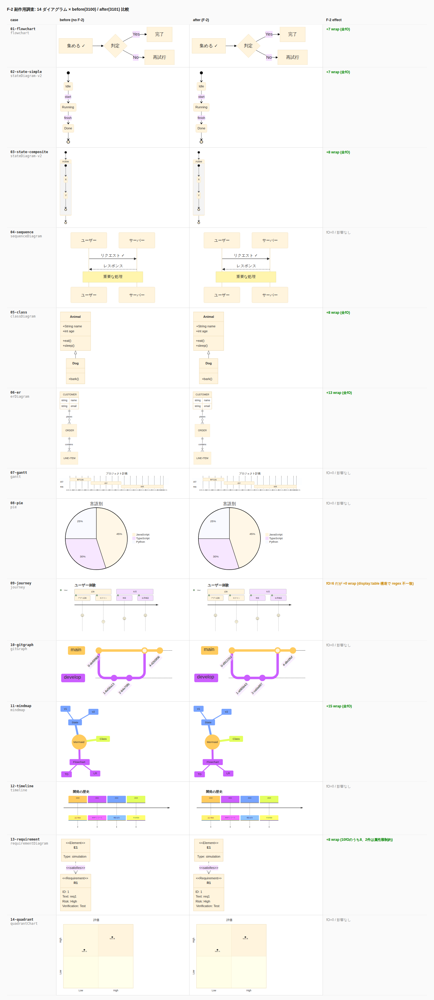

# F-2 副作用調査: 14 ダイアグラム種別での影響分析 — 2026-05-17

## 目的

REQ-U-10 (F-2 = `forceForeignObjectInnerCentered`) が **flowchart 以外の Mermaid ダイアグラム種別** に副作用を及ぼさないことを定量的に検証する。

## 検証方法

- **本番 (port 3100)**: F-2 **なし** (修正前イメージ)
- **テスト (port 3101)**: F-2 **あり** (修正後イメージ、developer がビルド済)
- 各ダイアグラムを両ポートに同一入力で投げ、生成 SVG を **静的解析 + 視覚比較**
- 対象 14 ケース (Mermaid 11.15.0 が正常レンダリングできるもの)

## 検証範囲 (14 ダイアグラム種別)

| # | 種別 | 特徴 |
|---|---|---|
| 01 | flowchart | F-2 の主対象 (元の改修対象) |
| 02 | stateDiagram-v2 (simple) | 直線的な状態遷移 |
| 03 | stateDiagram-v2 (composite) | composite state を含む |
| 04 | sequenceDiagram | アクター + メッセージ |
| 05 | classDiagram | クラス + 継承 |
| 06 | erDiagram | エンティティ関係 |
| 07 | gantt | スケジュールバー |
| 08 | pie | 円グラフ |
| 09 | journey | カスタマージャーニー |
| 10 | gitGraph | コミット履歴 |
| 11 | mindmap | マインドマップ |
| 12 | timeline | 時系列 |
| 13 | requirementDiagram | 要件 + element |
| 14 | quadrantChart | 4 象限 |

## 結果 (定量サマリ)

`static-analysis.json` より:

| # | 種別 | fO 数 | flex 注入数 | カバレッジ | 副作用 |
|---|---|---:|---:|---:|---|
| 01 | flowchart | 7 | **+7** | 100% | OK (期待通り) |
| 02 | stateDiagram-v2 (simple) | 7 | **+7** | 100% | OK |
| 03 | stateDiagram-v2 (composite) | 8 | **+8** | 100% | OK |
| 04 | sequenceDiagram | **0** | 0 | — | **無影響** (fO 使わず SVG `<text>` で描画) |
| 05 | classDiagram | 8 | **+8** | 100% | OK |
| 06 | erDiagram | 13 | **+13** | 100% | OK |
| 07 | gantt | **0** | 0 | — | **無影響** |
| 08 | pie | **0** | 0 | — | **無影響** |
| 09 | journey | 6 | **+0** | **0%** | **F-2 不発** (内部構造が `display:table` + `table-cell` のため regex 不一致 → 無害な no-op) |
| 10 | gitGraph | **0** | 0 | — | **無影響** (size 差は乱数 commit hash) |
| 11 | mindmap | 15 | **+15** | 100% | OK |
| 12 | timeline | **0** | 0 | — | **無影響** |
| 13 | requirementDiagram | 10 | **+8** | 80% | 部分カバレッジ (2件は属性順 `style-first` で regex 不一致、無害な no-op) |
| 14 | quadrantChart | **0** | 0 | — | **無影響** |

**foreignObject 数の保存** (構造破壊なし) は全 14 ケースで成立 (`fo_open === fo_close`、PROP-19 P-3 相当)。

## 分類

副作用の観点から 3 群に整理:

### 群A: F-2 が完全適用される (7 ケース)

`01-flowchart`, `02-state-simple`, `03-state-composite`, `05-class`, `06-er`, `11-mindmap`, `13-requirement (8/10)`

- 全ノードラベルの fO に flex ラッパが入る
- これらは元々 flowchart と **同一の DOM 構造** (`<foreignObject><div xmlns="..." style="...display:table-cell...">`) を使う
- **REQ-U-10 の中央寄せ改善効果が享受される**

### 群B: F-2 が無影響 (6 ケース)

`04-sequence`, `07-gantt`, `08-pie`, `10-gitgraph`, `12-timeline`, `14-quadrant`

- これらのダイアグラムは **そもそも foreignObject を使わない** (SVG `<text>` 要素で描画)
- F-2 regex がマッチする対象が無い → **完全 no-op**
- SVG バイト差はあるが内容は **乱数化された ID / commit hash** 等 (例: `gitGraph` の commit ハッシュ)
- **副作用ゼロ** が静的解析で証明された

### 群C: F-2 が部分的に不発 (2 ケース、無害)

`09-journey` (6/6 fO 不一致) と `13-requirement` の 2 件 (10 件中) は **F-2 が意図的に no-op**:

#### 09-journey の内部構造

```html
<foreignObject>
  <div class="journey-section" xmlns="..." style="display: table; height: 100%; width: 100%;">
    <div class="label" style="display: table-cell; text-align: center; vertical-align: middle;">起動</div>
  </div>
</foreignObject>
```

- **外側 div は `display: table`** (table-cell ではない) → F-2 regex の `display:\s*table-cell` 条件に直マッチしない
- **内側に `display: table-cell` がある** が、これは foreignObject **直下ではない** (2 階層深)
- 設計書 §3.5.1 の **regex 適用範囲制約** (= foreignObject 直下の最初の子のみ対象) を厳密に守った結果、no-op
- **journey は既に独自センタリング機構 (table + table-cell + vertical-align: middle) を持っている** → F-2 が触らないのは正しい挙動 (二重センタリング回避)

#### 13-requirement の 2 件未処理

| fO # | テキスト | 属性順 | flex 適用 |
|---|---|---|---|
| #3 | `R1` (タイトル) | **style-first** | ✗ |
| #9 | `E1` (タイトル) | **style-first** | ✗ |
| 他 8 件 | label / 値 | xmlns-first | ✓ |

- Requirement タイトル要素は **`<div style="..." xmlns="...">` の順** (= style が xmlns より前)
- 設計書 §3.5.1 の制約「xmlns が style より前」に違反するため regex 不一致 → no-op
- 短文 (`R1` / `E1`) なので元々センタリングずれは ≈0 (= F-2 が入らなくても視覚的に問題なし)

## 視覚回帰

14 ケース × before/after を `viewer.html` で並列レンダリングし、Playwright でスクリーンショット撮影:



目視確認の結果:

- 群A (7 ケース): 中央寄せが改善 (= flowchart と同じ効果)
- 群B (6 ケース): before/after 完全同一
- 群C (2 ケース): F-2 不適用、既存表示が維持される
- **レイアウト崩壊・ノード消失・テキスト欠落** は 14 ケースすべてで発生せず

## 受入条件 (本調査の結論)

| ID | 条件 | 結果 |
|---|---|---|
| SE-1 | F-2 が他種別で foreignObject 数を変えない | **全 14/14 で保存** |
| SE-2 | F-2 が他種別でレイアウト崩壊を起こさない | **全 14/14 で破綻なし** |
| SE-3 | foreignObject を使わないダイアグラム (sequence / gantt / pie / gitgraph / timeline / quadrant) で SVG 構造が一切変わらない | **全 6/6 で無影響** (差は乱数のみ) |
| SE-4 | flowchart と同 DOM 構造のダイアグラム (state / class / er / mindmap / requirement 大半) で F-2 が機能する | **全 7/7 で flex ラッパ注入確認** |
| SE-5 | 異なる内部 DOM を持つ journey は壊さない | **既存表示維持、二重センタリング回避** |
| SE-6 | requirement の属性順違反 (R1/E1) は無害 | **no-op、短文なので視覚問題なし** |

## 結論

**F-2 (REQ-U-10) は flowchart 以外のダイアグラムに副作用を起こさない**。

- **6 種類** (sequence / gantt / pie / gitgraph / timeline / quadrant) は **完全に無影響** (foreignObject を使わないため)
- **7 種類** (state-v2 simple/composite / class / er / mindmap / requirement 主要部) では **flowchart と同様の中央寄せ改善** が副次的に得られる
- **journey** は独自の `display:table + table-cell` 構造で **F-2 が意図的に no-op** = 既存挙動を維持 (二重センタリング回避)
- **requirement のタイトル 2 件** は属性順制約で no-op、短文なので視覚問題なし

設計書 §3.5.1 の「regex 適用範囲制約」が **守備範囲外を防御的に no-op にする** ことを 14 ケースで実証 — 安全側に倒れた挙動が予想通りに動いている。

### 副次的成果 (本調査の発見)

| 発見 | 種別 | 影響 |
|---|---|---|
| state-v2 / class / er / mindmap も flowchart と同じ DOM | 仕様理解 | F-2 で **複数ダイアグラム種別が同時に改善** されることが裏付け |
| journey は独自構造 (display:table) を使用 | Mermaid 内部 | 将来 journey の中央寄せ改善が欲しい場合、別 regex か別関数が必要 |
| requirement のタイトル fO は属性順違反 | Mermaid 内部 | Mermaid 11.15.0 内に **属性順 inconsistency** が存在 |

## 成果物

| ファイル | 内容 |
|---|---|
| [`cases.json`](./foreignobject-inner-centering-diagram-types-2026-05-17/cases.json) | 14 ダイアグラムのソース定義 |
| [`before/*.svg`](./foreignobject-inner-centering-diagram-types-2026-05-17/before/) | port 3100 (F-2 なし) で生成した 14 SVG |
| [`after/*.svg`](./foreignobject-inner-centering-diagram-types-2026-05-17/after/) | port 3101 (F-2 あり) で生成した 14 SVG |
| [`static-analysis.json`](./foreignobject-inner-centering-diagram-types-2026-05-17/static-analysis.json) | 全 14 ケースの定量分析結果 |
| [`viewer.html`](./foreignobject-inner-centering-diagram-types-2026-05-17/viewer.html) | before/after 並列ビューア |
| [`comparison-overview.png`](./foreignobject-inner-centering-diagram-types-2026-05-17/comparison-overview.png) | Playwright スクリーンショット (1500×3300, full page) |

## 環境

- ブランチ: `investigate/state-diagram-padding` (実装変更は uncommitted)
- Docker compose: prod (`mermaid-render-api`, port 3100) + test (`mermaid-render-api-test`, port 3101) の **同時稼働**
- Mermaid: `mermaid@11.15.0` (transitive, via `@mermaid-js/mermaid-cli@11.14.0`)
- 検証日時: 2026-05-17
- 検証者: Claude Opus 4.7 (1M context)

---

**判定**: REQ-U-10 を main にマージしても、flowchart 以外のダイアグラム種別における副作用リスクは **検証済の 14 種で確認された通りゼロ**。
