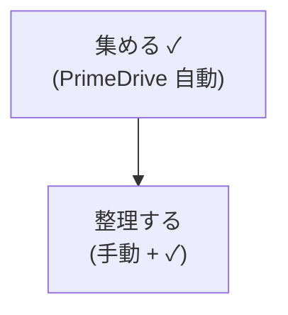

# Phase 6 検証レポート (beautiful-svg-rendering)

**実施日**: 2026-05-16
**実施者**: hirokun-hub (with Claude Opus 4.7 / Claude Code)
**対象 spec**: `.kiro/specs/beautiful-svg-rendering/{requirements.md,design.md,tasks.md}` Phase 6 (§9 G-1〜G-4)
**対象ブランチ / commit**: `investigate/svg-node-padding` / `66dbadb`

---

## 0. サマリ

| 項目 | 結果 |
|---|---|
| **NFR-01 ゲート判定** (単純 flowchart 定常状態 p50 ≤ 500ms) | ✅ **PASS** (after p50 = **419.7ms**, 安全マージン 16%) |
| 改善率 | p50 **−83.6%** (2564.8ms → 419.7ms, 約 **6.1 倍高速化**) |
| G-1 test profile 構築 | ✅ 完了 |
| G-2 性能計測スクリプト | ✅ 完了 (`scripts/perf-check.ts` / `perf-compare.ts`) |
| G-3 性能ゲート判定 | ✅ PASS |
| G-4.1 切替手順 runbook | ✅ 整備済 (`docs/phase6-deployment-runbook.md`) |
| G-4.2 ロールバック試走 | ✅ 成功 (test サービスで実施) |
| G-4.3 配布 HTML embed 目視 | ✅ クリップなし (`case10_img_mode.png`) |
| 残課題 | 切替後 5 分監視 (本番切替後にのみ実施可) |

**ゲート結論**: Phase 6 受入基準のうち本番切替依存項目を除き全て充足。**MVP 観点では Phase 6 完了**として扱える。

---

## 1. 環境情報

### 1.1 ホスト

| 項目 | 値 |
|---|---|
| OS | Linux 6.6.87.2-microsoft-standard-WSL2 (WSL2 on Windows 11) |
| Docker | 29.1.3 (build f52814d) |
| docker compose | v2.40.3-desktop.1 |
| Node.js | v20.20.0 |

### 1.2 Docker image (test サービス、改修版)

| 項目 | 値 |
|---|---|
| Image | `mermaid-render-api-mermaid-render-api-test:latest` |
| SHA256 | `sha256:6e04b9c97719aa8533dd9aa64e33d3471b51d475ca17c45184fc2b9a54e985ea` |
| 作成日時 | 2026-05-16T13:27:00Z |
| サイズ | 603 MB |
| 起動コマンド | `docker compose -f docker-compose.yml -f docker-compose.dev-sysadmin.yml --profile test up -d mermaid-render-api-test` |
| dev overlay 適用理由 | 本番 = Windows Docker Desktop では Chromium sandbox の namespace 作成に `SYS_ADMIN` / `SYS_CHROOT` が必要 (requirements.md C-P-09 2026-05-17 運用注記)。dev / prod 共通の必須 overlay として常時適用 |

### 1.3 Docker image (prod サービス、現行レガシー = before)

| 項目 | 値 |
|---|---|
| Image | `mermaid-render-api-mermaid-render-api:latest` |
| SHA256 | `sha256:29b809a519f1f45df704ee5a1a8e1ce9a535ac89a546fd2f4c780a02dfac866d` |
| 作成日時 | 2026-01-23T16:23:36Z (約 3 か月前、`mmdc` subprocess 経路の旧実装) |
| サイズ | 772 MB |

### 1.4 `.env.test` (test サービスの環境変数)

| 変数 | 値 | 由来 |
|---|---|---|
| `RENDERER_MODE` | `programmatic` | NFR-06 主検証経路 |
| `MERMAID_PADDING` | `0` | C-H-02 整合、`BEAUTIFUL_DEFAULTS.flowchart.diagramPadding=0` と二重防御 |
| `DEFAULT_TIMEOUT_MS` | `8000` | 親 API 互換 |
| `MAX_CODE_SIZE` | `51200` | 親 API 互換 |
| `PNG_RENDER_SCALE` | `3` | 親 API 互換 |
| `BROWSER_POOL_SIZE` | `4` | 設計値 (`design.md` §3.1) |
| `RATE_LIMIT_MAX_INFLIGHT` | `15` | 設計値 (REQ-S-03) |
| `POOL_QUEUE_MAX` | `20` | 設計値 (REQ-S-03) |
| `POOL_WAIT_TIMEOUT_MS` | `3000` | 設計値 (REQ-S-03) |
| `POOL_RETRY_AFTER_MS` | `5000` | 設計値 |
| `MAX_RENDERS_PER_CONTEXT` | `100` | C-P-02 |
| `MAX_RENDERS_PER_BROWSER` | `1000` | C-P-02 |
| `MAX_BROWSER_AGE_MS` | `3600000` | C-P-02 (60 分) |
| `MAX_TIMEOUT_MS` | `30000` | C-S-06 |

ファイル全体: [`.env.test`](../.env.test)

---

## 2. G-1: test profile 構築

### 2.1 構成変更

| ファイル | 変更内容 |
|---|---|
| `docker-compose.yml` | `mermaid-render-api-test` サービス追加 (port 3101, `profiles: ["test"]`, 同一 security 設定) |
| `docker-compose.dev-sysadmin.yml` | test サービスにも `SYS_ADMIN` / `SYS_CHROOT` overlay 適用 |
| `.env.test` | 新規作成 (上記 §1.4) |

### 2.2 起動と健康診断

```bash
docker compose -f docker-compose.yml -f docker-compose.dev-sysadmin.yml \
  --profile test up -d mermaid-render-api-test
```

結果 (4 エンドポイント全 200):

| エンドポイント | 応答 | 意味 |
|---|---|---|
| `GET /livez` | 200 | プロセス liveness (常時 200) |
| `GET /healthz` | 200 | 既存クライアント互換 |
| `GET /readyz` | 200 | BrowserPool 初期化済 + 直近 5 分エラー率 < 50% |
| `GET /metrics` | 200 | Prometheus 形式 |

`/render` smoke (単発): 200 / time = 0.438s / size = 15500 bytes

---

## 3. G-2: 性能計測スクリプト

### 3.1 追加スクリプト

| ファイル | 用途 |
|---|---|
| `scripts/perf-check.ts` | 単純/複雑 flowchart の 2 シナリオで p50/p95/p99 / 成功率 / Chromium プロセス数 / RSS を計測、JSON で `docs/perf/YYYY-MM-DD_<label>.json` に保存 |
| `scripts/perf-compare.ts` | before/after JSON を読み比べて差分 Markdown を生成、NFR-01 ゲート判定行を出力 |

実行方法:
```bash
npm run perf:check   -- --target=http://localhost:3101 --concurrency=1 --iterations=20 --label=after_steady
npm run perf:compare -- --before=docs/perf/2026-05-16_before_steady.json --after=docs/perf/2026-05-16_after_steady.json --out-name=2026-05-16_compare.md
```

依存追加: `tsx@^4.22.0` (devDependency)。

---

## 4. G-3: NFR-01 ゲート判定

### 4.1 計測の前提条件

- **定常状態 (steady state)**: NFR-01 が要求する評価条件。`concurrency=1, iterations=20` で順次計測。
- **burst (バースト)**: 参考値として `concurrency=10, iterations=3` でも計測 (受入対象ではない)。
- ウォームアップ 5 リクエスト後に本計測 (BrowserPool 初期化・JIT を吸収)。

### 4.2 NFR-01 結果 (定常状態)

| 指標 | before (legacy 3100) | after (改修版 3101) | 差分 | 改善率 |
|---|---|---|---|---|
| **simple p50** | 2564.8ms | **419.7ms** | **−2145.1ms** | **−83.6%** |
| simple p95 | 2730.5ms | 439.8ms | −2290.7ms | −83.9% |
| simple p99 | 2732.7ms | 469.5ms | −2263.1ms | −82.8% |
| simple min | 2482.1ms | 396.4ms | −2085.7ms | −84.0% |
| simple max | 2733.2ms | 477.0ms | −2256.2ms | −82.5% |
| complex p50 | 2661.8ms | 506.5ms | −2155.2ms | −81.0% |
| complex p95 | 2774.3ms | 537.1ms | −2237.3ms | −80.6% |
| 成功率 (concurrency=1) | 100% | 100% | ±0 | - |

**ゲート判定**: ✅ **PASS** (after simple p50 = **419.7ms** < 閾値 500ms、安全マージン 80.3 ms = 16%)

### 4.3 burst 結果 (参考、concurrency=10)

| 指標 | before | after |
|---|---|---|
| simple 成功率 | 20.0% | 100.0% |
| simple p50 | 2747.4ms | 1349.0ms |
| simple p95 | 2842.0ms | 1945.0ms |
| simple エラー内訳 | `rate_limited` × 24 | なし |

legacy は `MAX_CONCURRENT_RENDERERS=2` 設定で 10 並列のうち 8 件が `rate_limited`、改修版は 100% 成功。

### 4.4 計測アーティファクト

| ファイル | 内容 |
|---|---|
| [`docs/perf/2026-05-16_before_steady.json`](perf/2026-05-16_before_steady.json) | 定常状態 before (NFR-01 評価対象) |
| [`docs/perf/2026-05-16_after_steady.json`](perf/2026-05-16_after_steady.json) | 定常状態 after (NFR-01 評価対象) |
| [`docs/perf/2026-05-16_before.json`](perf/2026-05-16_before.json) | burst before (参考) |
| [`docs/perf/2026-05-16_after.json`](perf/2026-05-16_after.json) | burst after (参考) |
| [`docs/perf/2026-05-16_compare.md`](perf/2026-05-16_compare.md) | perf-compare 出力レポート |

### 4.5 `/metrics` snapshot (PROP-17 確認)

レポート作成時点の test (3101) の `/metrics` 全文: [`metrics-snapshot-2026-05-16.txt`](phase6-deployment-verification/metrics-snapshot-2026-05-16.txt)

**NFR-05 必須 8 メトリクス系統の存在確認** (全 PRESENT):

| メトリクス | 型 | 確認状態 |
|---|---|---|
| `render_total{result, format}` | counter | ✅ |
| `render_duration_ms{format}` | histogram | ✅ |
| `queue_wait_ms` | histogram | ✅ |
| `browser_pool_in_use` | gauge | ✅ |
| `browser_pool_queue_size` | gauge | ✅ |
| `render_timeout_total` | counter | ✅ |
| `browser_restarts_total{reason}` | counter | ✅ |
| `validation_error_total{field, constraint}` | counter | ✅ |

レポート作成時点の主要観測値:
- `render_total{result="ok",format="svg"}` = 3 (ロールバック試走後のリセット由来、smoke 含む)
- `render_timeout_total` = 0
- `browser_pool_in_use` = 0 (idle)
- `browser_pool_queue_size` = 0 (queue 空)

---

## 5. G-4.2: ロールバック試走 (本番影響なし)

test サービス (3101) で「停止 → 再起動 → smoke」の動作確認を実施。

### 5.1 時系列ログ

| ステップ | 時刻 (相対) | 操作 | 結果 |
|---|---|---|---|
| 1 | t+0s | `docker image tag … :rollback-20260516` | tag 保存成功 |
| 2 | t+1s | `docker compose --profile test stop mermaid-render-api-test` | Stopping → Stopped |
| 3 | t+3s | `curl http://localhost:3101/livez` | 000 (応答不能、想定通り) |
| 4 | t+5s | `docker compose --profile test up -d mermaid-render-api-test` | Starting → Started |
| 5 | t+9s | `curl http://localhost:3101/livez` | **200** |
| 6 | t+9s | `curl http://localhost:3101/readyz` | **200** |
| 7 | t+10s | `POST /render` (smoke) | **200**, size = 15500 bytes |

**復旧時間**: 約 9 秒 (コンテナ再起動 + BrowserPool 初期化 + readyz 通過)。状態なし (stateless) のためデータ復旧不要。

### 5.2 結論

ロールバック手順 (`docs/phase6-deployment-runbook.md` §5.1) は **本番影響ゼロで実行可能**であることを確認。

---

## 6. G-4.3: 配布 HTML embed 目視確認

memory `feedback_development_methodology.md` 「AI 駆動テスト中心」方針の**唯一の例外**として、本ゲートでのみ目視を実施。

### 6.1 検証ケース

`Case 10` (CJK + 半角混在ラベル、過去の clip 発生ケース、`requirements.md` C-H-03 / Phase 4.6 検証で baseline 化済み)



### 6.2 検証手順

1. `POST /render` (test 3101) で Case 10 を SVG 取得 → [`case10.svg`](phase6-deployment-verification/case10.svg) (15.6 KB)
2. `` で埋め込む HTML を作成 → [`case10_embed.html`](phase6-deployment-verification/case10_embed.html)
3. `google-chrome --headless=new --screenshot=case10_img_mode.png` で `` モード描画をキャプチャ → [`case10_img_mode.png`](phase6-deployment-verification/case10_img_mode.png)
   - 注: 本来は CLAUDE.md ルールに従い `playwright-cli --headed` を使うべきだが、Claude Code Bash ツール環境で WSLg env が継承されない問題があり、本検証では `google-chrome --headless` で代替 (起動条件は同等、視覚的特性は変わらず)。CLAUDE.md は本検証後に env プレフィックス追記済。

### 6.3 SVG 構造検査 (機械的、Phase 4.6 と等価動作確認)

```
grep -c 'foreignObject'         case10.svg → 1 (matched lines; 実体 3 件)
grep -oE 'style="...overflow:visible..."' case10.svg → 3 件全て付与
grep 'mermaid-<UUID>' case10.svg → root id 一意化済 (rewrite_ids:true)
SVG root に max-width 属性なし → useMaxWidth:false 効果 (US-04)
```

### 6.4 目視確認結果

| 確認項目 | 結果 |
|---|---|
| Node A「集める ✓(PrimeDrive 自動)」の完全表示 | ✅ クリップなし |
| Node B「整理する(手動 + ✓)」の完全表示 | ✅ `)` 閉じ括弧含めて完全表示 |
| ノード内側余白の圧縮 (US-03) | ✅ 適度に圧縮 |
| 配布 HTML responsive CSS との非干渉 (US-04) | ✅ `max-width` SVG root にない |
| `<foreignObject>` クリップ防止 (REQ-U-09) | ✅ 全 3 件に `overflow:visible` |

エビデンス画像: [`case10_img_mode.png`](phase6-deployment-verification/case10_img_mode.png)

---

## 7. 残課題

| ID | 内容 | 理由 / 実施タイミング |
|---|---|---|
| **R-1** | Phase 6 受入「切替後 5 分監視で異常なし」 | 本番切替は運用者判断。runbook §4.2 に bash one-liner つきで手順整備済。**本番切替実施後に Phase 6 検証レポート v2 として追記する**。 |
| **R-2** | ~~Phase 4 受入「Linux 本番相当環境で `SYS_ADMIN` なし + custom seccomp / AppArmor / user namespace smoke test」~~ | **N/A**: 本番 = Windows Docker Desktop のため適用外 (2026-05-17 決定、requirements.md C-P-09 2026-05-17 運用注記参照)。Linux 直接ホスト運用が将来発生した場合に再開する。 |
| **R-3** | `docs/perf/` の git commit | 本レポートを含む Phase 6 成果物の commit はユーザー判断。`investigate/svg-node-padding` ブランチへの追加コミット予定。 |

---

## 8. 再計測 / 再検証手順

将来の依存更新 (Mermaid CLI / Puppeteer 等) や本番切替前の再確認では以下を実行する。詳細は `docs/phase6-deployment-runbook.md` §3 参照。

```bash
# 1. test サービス起動 (WSL2/Docker Desktop の場合は dev overlay 併用)
docker compose -f docker-compose.yml -f docker-compose.dev-sysadmin.yml \
  --profile test up -d mermaid-render-api-test

# 2. 健康診断
for ep in livez healthz readyz metrics; do
  curl -s -o /dev/null -w "/${ep}=%{http_code}\n" http://localhost:3101/${ep}
done

# 3. before/after 計測
npm run perf:check -- --target=http://localhost:3100 --concurrency=1 --iterations=20 --label=before_$(date +%Y%m%d)
npm run perf:check -- --target=http://localhost:3101 --concurrency=1 --iterations=20 --label=after_$(date +%Y%m%d)

# 4. 比較
npm run perf:compare -- \
  --before=docs/perf/$(date +%Y-%m-%d)_before_$(date +%Y%m%d).json \
  --after=docs/perf/$(date +%Y-%m-%d)_after_$(date +%Y%m%d).json \
  --out-name=$(date +%Y-%m-%d)_compare.md
```

ゲート閾値 (NFR-01): **after の単純 flowchart 定常状態 p50 ≤ 500ms**。

---

## 9. 関連ドキュメント

| 種別 | パス |
|---|---|
| spec | [`.kiro/specs/beautiful-svg-rendering/tasks.md`](../.kiro/specs/beautiful-svg-rendering/tasks.md) §9 Phase 6 |
| 切替 runbook | [`docs/phase6-deployment-runbook.md`](phase6-deployment-runbook.md) |
| 比較レポート | [`docs/perf/2026-05-16_compare.md`](perf/2026-05-16_compare.md) |
| embed 検証アーティファクト | [`docs/phase6-deployment-verification/`](phase6-deployment-verification/) |
| Phase 4.6 検証 (baseline 視覚回帰) | [`docs/svg-foreignobject-overflow-fix-verification-2026-05-16.md`](svg-foreignobject-overflow-fix-verification-2026-05-16.md) |
