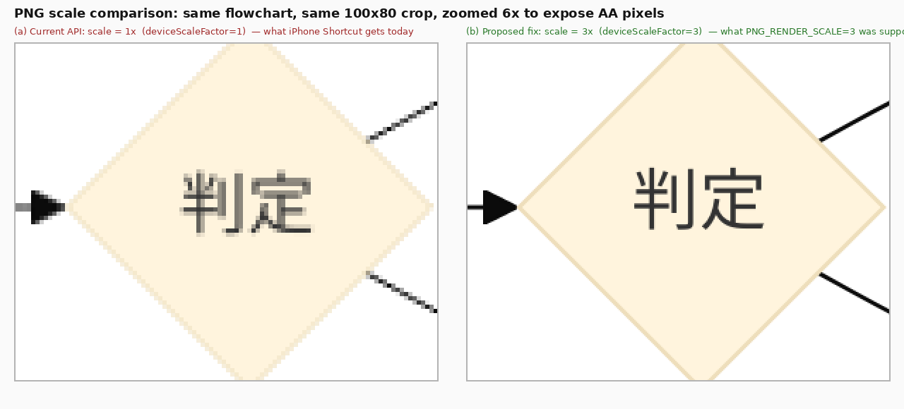
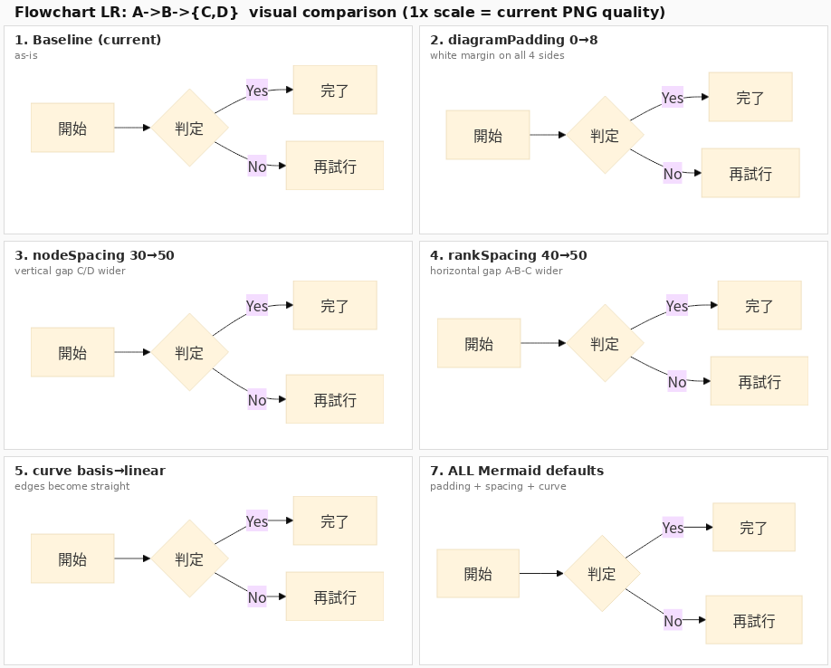
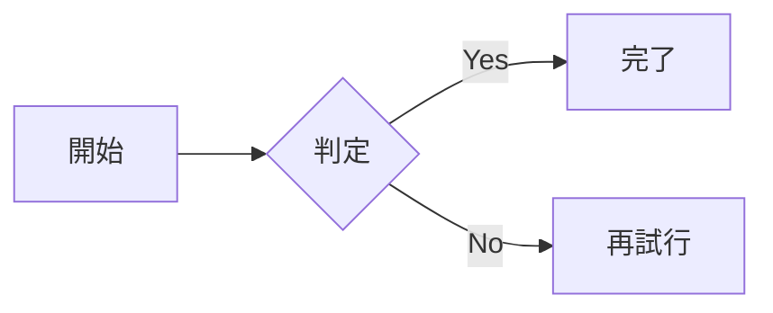

# PNG 画質と余白の調査 — 2026-05-17

## 概要

本 API (`mermaid-render-api`) が返す PNG について、ユーザから次の 2 点の指摘を受けた:

1. **PNG の余白が小さすぎる** (画像の四隅にゆとりが無く、ノードが縁ギリギリで終わる)
2. **PNG の画質が悪い** (拡大表示や iPhone Shortcut から保存して見るとフォントがぼやけて見える)

両方とも実機で再現を確認し、それぞれ独立した原因に切り分けた。本ドキュメントは原因の特定と、各設定項目を **日常語と専門用語の両方** で解説して修正方針を決めるためのリファレンスである。

> 本調査は実装にはまだ入っていない。コード変更前に方針合意するためのドキュメント。

## 1. 結論 (TL;DR)

| 観点 | 体感 | 実機の値 | 原因 |
|---|---|---|---|
| 余白が小さい | はい | viewBox の内部余白 8px のみ、PNG は外接矩形ピッタリ | `flowchart.diagramPadding = 0` がサーバ既定値 (本家は 8) |
| 画質が悪い | はい | **deviceScaleFactor = 1×** で出力 (環境変数 `PNG_RENDER_SCALE=3` が無視) | `programmaticAdapter.ts` が `renderMermaid()` に `viewport` を渡していない |

両方とも F-2 (2026-05-17 マージ) 以前から存在していた問題で、F-2 は無関係。今まで目立たなかっただけ。

## 2. 再現確認

### 2.1 余白

```bash
curl -s -X POST http://localhost:3100/render \
  -H "Content-Type: application/json" \
  -d '{"code":"flowchart LR\n A[集める ✓] --> B{判定} -->|Yes| C[完了]\n B -->|No| D[再試行]","format":"svg"}' \
  | grep -oE 'viewBox="[^"]*"'
```

結果: `viewBox="8 8 420.67 138"`

- viewBox の `x=8 y=8 width=420.67 height=138` は、Mermaid 内部の固定 8px 補正のみで、`diagramPadding` 由来の追加余白はゼロ
- PNG はこの viewBox に外接する矩形 (421×138 px) にピッタリ切り出される (`@mermaid-js/mermaid-cli/src/index.js:363-371`)

### 2.2 画質

同じ入力を PNG で取ると **421×138 px**。`PNG_RENDER_SCALE=3` を意図しているなら 1263×414 px になるはずだが、3倍の解像度が出ていない。

本番コンテナの環境変数を確認すると確かに `PNG_RENDER_SCALE=3` が設定されている:

```bash
$ docker exec mermaid-render-api-mermaid-render-api-1 env | grep PNG_RENDER_SCALE
PNG_RENDER_SCALE=3
```

しかし生 PNG は 1×。

## 3. 原因解析

### 3.1 余白がゼロな理由

`src/config.ts:134-152` の `BEAUTIFUL_DEFAULTS`:

```ts
export const BEAUTIFUL_DEFAULTS: Readonly<MermaidConfig> = {
  ...
  flowchart: {
    useMaxWidth: false,
    diagramPadding: 0,   // ← 四隅余白ゼロ
    nodeSpacing: 30,
    rankSpacing: 40,
    curve: 'basis',
    wrappingWidth: 200,
    defaultRenderer: 'dagre-wrapper'
  }
}
```

Mermaid 本家 (v11.15.0) の flowchart デフォルトでは `diagramPadding: 8`。本 API が独自に 0 に上書きしている。

`src/config.ts:46-47` の `MERMAID_PADDING` env (デフォルト 0) も同じ流れ。コメントに「**SVG root padding is disabled by default**」と書かれており、設計判断としてゼロ化されたと見られる。

### 3.2 画質が 1× な理由

PNG レンダリング経路は 2 系統ある:

- **CLI 経路** (`src/renderer/mermaidRenderer.ts`): `RENDERER_MODE=cli` のときのフォールバック。`--scale ${PNG_RENDER_SCALE}` を `mmdc` に渡すので 3× が効く
- **Programmatic 経路** (`src/renderer/programmaticAdapter.ts`): デフォルト経路。`renderMermaid()` を直接呼ぶが **`viewport` も `scale` も渡していない**

`src/renderer/programmaticAdapter.ts:37-41`:

```ts
const renderPromise = renderMermaid(context, input.code, input.format, {
  backgroundColor: 'transparent',
  mermaidConfig: input.mermaidConfig as never,
  svgId: input.svgId ?? buildSvgId(...)
})
```

`PNG_RENDER_SCALE` をインポートすらしていない。`renderMermaid()` 内部 (`@mermaid-js/mermaid-cli/src/index.js:255-371`) では:

1. `if (viewport) await page.setViewport(viewport)` — undefined なのでスキップ → Puppeteer 既定 (deviceScaleFactor=1)
2. PNG 経路で `setViewport({ ...viewport, width: clip.x+clip.width, height: clip.y+clip.height })` — `...undefined` は no-op、deviceScaleFactor 未指定 → **1× のまま**
3. `page.screenshot({ clip })` → CSS px そのままの解像度で PNG 化

つまり Programmatic 経路では `PNG_RENDER_SCALE` が完全に未配線。Phase 1 (`ccd2765`) でプログラマティック化したときに失われたサイレントなリグレッション。

### 3.3 スケール差の視覚化

実機で `mmdc --scale 1` と `mmdc --scale 3` を打ち分け、同じ flowchart を生成して同じ 100×80 px の領域を 6 倍拡大して比較:



- (a) **1× 出力 (現状)**: 「判」のような漢字エッジが太いブロック (1 ピクセルあたり 1 グレー階調) でモザイク化
- (b) **3× 出力 (修正後)**: 同じ箇所が 9 倍のサブピクセル予算で滑らかに

iPhone Shortcut で API から取った PNG を Apple Notes / Slack の画像ビューアに貼ると、ビューア側が表示時に 2-3× 程度に拡大表示することが多く、その時 (a) のモザイク感が顕在化する。

## 4. 各 flowchart 設定項目の解説

`BEAUTIFUL_DEFAULTS.flowchart` には Mermaid 本家と異なる値が複数ある。修正方針を決めるため、各項目を日常語と専門用語の両方で解説する。

実機比較画像 (同じ flowchart で 1 項目ずつ変えた 6 枚):



入力 (全タイル共通):



### 4.1 `diagramPadding` — 図の四隅余白

| 観点 | 値 |
|---|---|
| 日常語の例え | 写真の周りに付ける「白い額縁の太さ」 |
| 専門用語 | flowchart diagram padding (SVG viewBox の四方向余白、CSS px 単位) |
| 現在のサーバ既定 | `0` (四隅ゼロ余白) |
| Mermaid 本家既定 | `8` (全方向 8px の白マージン → 画像が縦横 16px ずつ大きくなる) |
| 推奨 | **8 に戻す** (本家準拠) |
| 体感 | Slack/Notion で他テキストと密着する圧迫感を解消 |

タイル 1 (現在) と タイル 2 (8) を見比べると、後者は上下左右に白い余白が入る。寸法差: 391×138 → 407×154 (= +16, +16)。

### 4.2 `nodeSpacing` — 同じ段にいるノード同士の間隔

| 観点 | 値 |
|---|---|
| 日常語の例え | 棚の中で本と本の「並びの隙間」 |
| 専門用語 | rank-internal node spacing (同一 rank 内のノード間隔、CSS px) |
| 方向別の意味 | LR/RL 図 = 縦方向の隙間、TD/BT 図 = 横方向の隙間 |
| 現在のサーバ既定 | `30` (詰め気味) |
| Mermaid 本家既定 | `50` |
| 推奨 | **現状維持 (30)** |
| 推奨理由 | 「完了」と「再試行」が C/D で枝分かれする LR 図でやや詰まる程度。今回の不満点とは無関係 |

タイル 1 (30) vs タイル 3 (50): 後者は C と D が縦に 20px 離れる (画像高さ 138→158)。

### 4.3 `rankSpacing` — 段と段の間隔

| 観点 | 値 |
|---|---|
| 日常語の例え | 本棚の「棚と棚の縦間隔」 |
| 専門用語 | inter-rank spacing (rank 間の進行方向距離、CSS px) |
| 方向別の意味 | LR/RL 図 = 横方向の段間、TD/BT 図 = 縦方向の段間 |
| 現在のサーバ既定 | `40` (詰め気味) |
| Mermaid 本家既定 | `50` |
| 推奨 | **現状維持 (40)** |
| 推奨理由 | 矢印が短くなりすぎず、かつ画像も冗長に幅広くならないバランス。今回の不満点とは無関係 |

タイル 1 (40) vs タイル 4 (50): 後者は A→B→C/D が横に伸びる (画像幅 391→411)。

### 4.4 `curve` — 線の形

| 観点 | 値 |
|---|---|
| 日常語の例え | 矢印を「定規で書くか、フリーハンドで書くか」 |
| 専門用語 | edge interpolation curve (D3 のカーブ補間関数名) |
| 主な選択肢 | `linear` (直線+角)、`basis` (滑らかな B-spline)、`stepBefore` (階段) など 12 種類 |
| 現在のサーバ既定 | `basis` (滑らかな曲線、現代的・親しみ易い) |
| Mermaid 本家既定 | `linear` (直線とカクッとした角、工学設計図的) |
| 推奨 | **現状維持 (`basis`)** |
| 推奨理由 | basis のほうがビジュアルが柔らかく、Notion / Slack で見る業務フロー図として違和感が少ない。本家 default の linear は CAD 図面っぽくなる |

タイル 1 (basis) vs タイル 5 (linear): 後者は B から C/D への線が折れ線に見える。

### 4.5 `useMaxWidth` — 親要素にフィットさせるか

| 観点 | 値 |
|---|---|
| 日常語の例え | 「画像をピン留め固定サイズで表示するか、親フレームに合わせて伸縮するか」 |
| 専門用語 | SVG root `width` attribute mode (`"100%"` + `max-width` か、固定 px か) |
| 影響範囲 | **SVG 出力のみ**。PNG は常にピクセル固定なので影響なし |
| 現在のサーバ既定 | `false` (`width="390"` のような固定 px) |
| Mermaid 本家既定 | `true` (`width="100%"` + `style="max-width: 390px"`) |
| 推奨 | **現状維持 (`false`)** |
| 推奨理由 | iPhone Shortcut / Notion 埋め込み等で SVG を「原寸大」で見る用途に依存している可能性が高い。`true` にすると狭い親要素では縮小される |

実機差分:

```svg
<!-- useMaxWidth=false (今) -->
<svg width="390.171875" height="138" ...>

<!-- useMaxWidth=true (本家) -->
<svg width="100%" style="max-width: 390.172px;" ...>
```

## 5. 修正方針 (推奨)

| 種類 | 内容 | 影響 |
|---|---|---|
| **デフォルト変更** | `BEAUTIFUL_DEFAULTS.flowchart.diagramPadding` を `0 → 8` | 全 PNG/SVG が縦横 +16px、四隅 8px の余白 |
| **バグ修正** | `ProgrammaticAdapter.render` で PNG 時のみ `viewport: { width: 800, height: 600, deviceScaleFactor: PNG_RENDER_SCALE }` を `renderMermaid()` に渡す | PNG が 1× → 3× (env 値) になり、ピクセル数 9倍・フォントエッジ解像度 3 倍 |
| やらない (1) | `nodeSpacing` / `rankSpacing` を本家準拠 | 画像が一回り大きくなり、密度感が変わる。不満点と無関係 |
| やらない (2) | `curve` を本家準拠 (`linear`) | 線が固い印象になる。不満点と無関係 |
| やらない (3) | `useMaxWidth` を本家準拠 (`true`) | 固定サイズ表示に依存している既存利用に影響 |
| やらない (4) | API 表面に `scale` パラメータ追加 | 後方互換の懸念 (cf. `timeout_ms` の件)。env 固定で当面十分 |

## 6. API パラメータでの上書き可能性

現状の API スキーマ (`src/validation/inputValidator.ts:68-98`) で上書き可能/不可能な項目:

| 項目 | API 上書き | 補足 |
|---|---|---|
| `diagramPadding` | ✅ 可 | `mermaid_config.flowchart.diagramPadding` (型: number) |
| `nodeSpacing` | ✅ 可 | 同上 |
| `rankSpacing` | ✅ 可 | 同上 |
| `curve` | ✅ 可 | 同上 (型: string) |
| `useMaxWidth` | ✅ 可 | 同上 (型: boolean) |
| `wrappingWidth` / `defaultRenderer` | ✅ 可 | 同上 |
| `sequence` / `gantt` / `er` / `class` / `state` / `mindmap` 配下の各 padding 系 | ✅ 可 | `passThroughChildren: true` で任意 sub-key 透過 |
| **PNG scale** (deviceScaleFactor) | ❌ 不可 | API スキーマに該当キー無し。env `PNG_RENDER_SCALE` のみ。修正後も env 固定の方針 |

つまり **個別ユーザは padding を含むほぼ全ての見た目を任意上書きできる**。サーバ既定はあくまで「明示指定が無いときの値」なので、今回 padding=8 に戻しても困るユーザはいない (現在 0 を期待しているユーザは明示的に `diagramPadding: 0` を送れば済む)。

## 7. 工数感

| フェーズ | 内容 | 想定時間 |
|---|---|---|
| 実装 (1) | `BEAUTIFUL_DEFAULTS.flowchart.diagramPadding` を 8 に変更 | 5 分 |
| 実装 (2) | `ProgrammaticAdapter.render` で PNG 時のみ viewport を渡す | 15 分 |
| 実装 (3) | `PNG_RENDER_SCALE` を `programmaticAdapter.ts` でインポート | 1 分 |
| テスト | unit (config の値変更を検証) + integration (PNG サイズが 3× になることを検証) | 30 分 |
| 動作確認 | 本番 (3100) を blue-green で置換、12 ケース回帰 | 30 分 |
| ドキュメント | 検証レポート (本ファイル + 結果報告) | 20 分 |
| **合計** | | **約 90 分** |

## 8. 環境

- ブランチ: `investigate/state-diagram-padding` → 改善用は別途 main から切る
- Docker: `mermaid-render-api` (port 3100、production blue) のみ稼働
- Mermaid: `mermaid@11.15.0` (transitive)
- 検証日: 2026-05-17
- 検証者: Claude Opus 4.7 (1M context)

## 9. 成果物

| ファイル | 内容 |
|---|---|
| `aesthetic-comparison.png` | 1 項目ずつ変えた 6 タイルの並列比較 (本ドキュメント §4) |
| `scale-comparison.png` | 1× と 3× の同領域 6 倍拡大比較 (本ドキュメント §3.3) |
| `samples/1-baseline.png` | 現在の API 既定での PNG (391×138, 1×) |
| `samples/2-pad8.png` | `diagramPadding=8` のみ変更 (407×154, 1×) |
| `samples/3-nodespacing50.png` | `nodeSpacing=50` のみ変更 |
| `samples/4-rankspacing50.png` | `rankSpacing=50` のみ変更 |
| `samples/5-curve-linear.png` | `curve=linear` のみ変更 |
| `samples/6-usemaxwidth-false.svg` | 現在の API 既定 SVG (`width="390"`) |
| `samples/6-usemaxwidth-true.svg` | `useMaxWidth=true` SVG (`width="100%"`) |
| `samples/7-all-mermaid.png` | flowchart 設定を全部本家既定にした PNG (427×174) |
| `samples/scale-1x-true-render.png` | `mmdc --scale 1` で出した参照 PNG (393×138) |
| `samples/scale-3x-true-render.png` | `mmdc --scale 3` で出した参照 PNG (1179×414) |
| `samples/png-scale-baseline-1x.png` | 本番 3100 のレスポンス例 (421×138) |
| `samples/scale-1x-then-zoomed-3x.png` | 1× を nearest-neighbor で 3× 拡大 (現状 PNG をズームしたときの印象) |
| `samples/scale-1x-zoomed-3x-bicubic.png` | 1× を bicubic で 3× 拡大 (ブラウザ拡大時の印象) |
