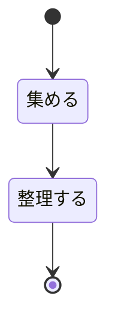
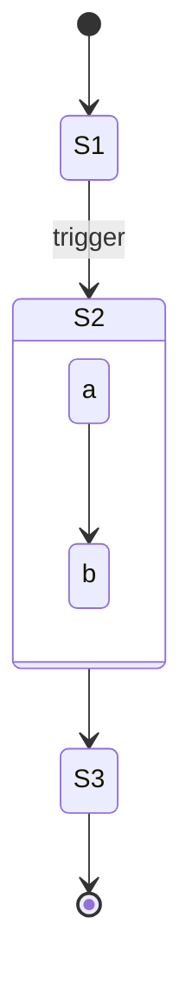
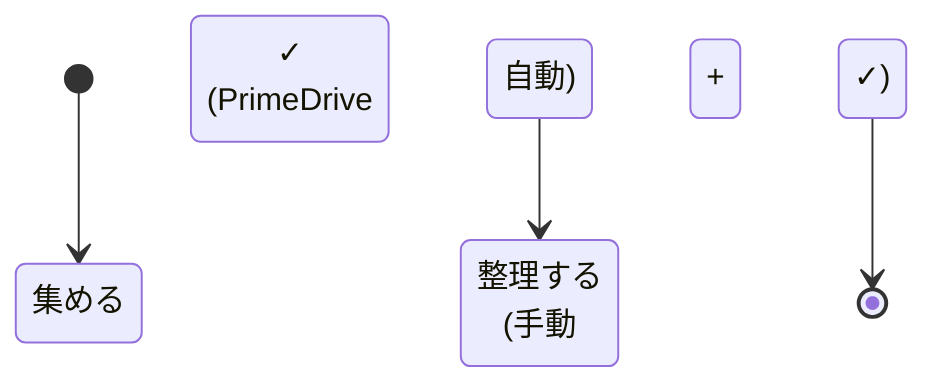
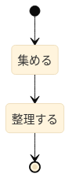
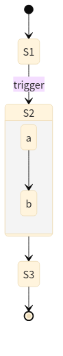
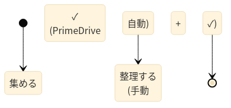

# State Diagram ノード内側余白の調査 — 2026-05-17

## 概要

`stateDiagram-v2` の各ノード内側余白(`rect` 枠と内部 `foreignObject` の差分)が **16 × 16 px (横 × 縦) で常に一定** であり、`flowchart` 既定 (60 × 30 px) と比べて **大幅に狭く正方形** であることを定量検証した。さらに同一の図を SVG と PNG 双方で生成し、形状寸法が完全に一致することを確認した。

主な結論:

1. **state diagram の 16 × 16 px は Mermaid 公式 schema 設計通り**。schema 既定値 `state.padding = 8` を `bowTieRect 系シェイプ関数` の `2 × padding` 式で展開した必然の結果。flowchart の `padding = 15` × `(4 × padding) / (2 × padding)` 式と非対称なのは **意図的**。
2. **flowchart と state の余白非対称は schema 段階で宣言された設計差**である(state=8、flowchart=15)。本リポの実装ミスではない。
3. **state v2 の実装は `state.padding` config を読まずに `padding: 8` をリテラル直書き**している(`node_modules/mermaid/dist/.../chunk-L44QOBYK.mjs:1250`)。値自体は schema 既定と一致するため視覚結果は仕様通りだが、ユーザーが `state.padding` を上書きしても効かないという **Mermaid 上流の実装抜け** がある。
4. **SVG と PNG は完全に同一寸法**で出力される(programmatic 経路では 1:1、つまり SVG viewBox の単位がそのまま PNG 画素数)。

## 検証環境

| 項目 | 値 |
|---|---|
| 検証日 | 2026-05-17 |
| ブランチ | `investigate/state-diagram-padding` |
| API エンドポイント | `http://127.0.0.1:3100/render` |
| Mermaid | `11.15.0` (bundled) |
| レンダラ | programmatic mode |
| `defaultRenderer` | `dagre-wrapper` (本リポ既定。state v2 は内部で別経路) |
| BEAUTIFUL_DEFAULTS | `useMaxWidth: false` / `diagramPadding: 0` / `nodeSpacing: 30` / `rankSpacing: 40` / `themeCSS: ".label foreignObject { overflow: visible; }"` |

## 検証ケース

### Case 1: 単純 3 ノード CJK



### Case 2: composite state(state 内 state)



### Case 3: 多行 CJK + 絵文字 + 半角括弧(flowchart 検証でクリップ問題が出ていたパターンの state 版)



## 計測方法

各 SVG / PNG について以下を抽出:

- ノード形状サイズ: `<rect class="basic label-container" width height>`
- ラベルボックスサイズ: 同ノード内の `<foreignObject width height>`(中央 placeholder `width="0"` は除外)
- 内側余白(両側合計): `rect.width − foreignObject.width` / `rect.height − foreignObject.height`
- PNG 画素寸法: PNG IHDR チャンクから取得
- 比率検証: PNG 画素 / SVG viewBox 単位

スクリプト相当: `docs/state-diagram-padding-investigation-2026-05-17/measurements.json` に再現可能データを保存。

## 結果

### 視覚出力

#### Case 1: 単純 3 ノード CJK



[SVG](./state-diagram-padding-investigation-2026-05-17/case1.svg)

#### Case 2: composite state



[SVG](./state-diagram-padding-investigation-2026-05-17/case2.svg)

#### Case 3: 多行 CJK + 絵文字 + 括弧



[SVG](./state-diagram-padding-investigation-2026-05-17/case3.svg)

### 数値表: 内側余白(SVG 計測)

| Case | ノード | rect (W × H) | foreignObject (W × H) | 内側余白 (横 × 縦) |
|---|---|---:|---:|---:|
| 1 | 集める | 64.016 × 40 | 48.016 × 24 | **16 × 16** |
| 1 | 整理する | 80.016 × 40 | 64.016 × 24 | **16 × 16** |
| 2 | S1 | 34.438 × 40 | 18.438 × 24 | **16 × 16** |
| 2 | S2 → trigger | 25.031 × 40 | 9.031 × 24 | **16 × 16** |
| 2 | S2 (a) | 25.891 × 40 | 9.891 × 24 | **16 × 16** |
| 2 | S2 (b) | 34.438 × 40 | 18.438 × 24 | **16 × 16** |
| 3 | 集める ✓ + 自動 | 64.016 × 40 | 48.016 × 24 | **16 × 16** |
| 3 | (PrimeDrive 自動) | 104.547 × 64 | 88.547 × 48 | **16 × 16** |
| 3 | 整理する | 53.422 × 40 | 37.422 × 24 | **16 × 16** |
| 3 | (手動 + ✓) | 80.016 × 64 | 64.016 × 48 | **16 × 16** |
| 3 | (短 1) | 24.891 × 40 | 8.891 × 24 | **16 × 16** |
| 3 | (短 2) | 32.344 × 40 | 16.344 × 24 | **16 × 16** |

**13 ノード × 2 軸 = 26 計測点すべてで 16.0 × 16.0 ぴったり**。ラベル文字数・行数・CJK / ASCII / 絵文字 / 括弧の混在・composite state ネスト、いずれも影響なし。

### 数値表: SVG vs PNG 寸法整合

| Case | SVG viewBox (W × H) | PNG 画素 (W × H) | 比率 (W / H) | 期待比率 |
|---|---:|---:|---:|---:|
| 1 | 96.016 × 244 | 97 × 244 | 1.010 × 1.000 | 1.000 (programmatic mode は 1:1) |
| 2 | 91.891 × 518 | 92 × 518 | 1.001 × 1.000 | 1.000 |
| 3 | 390.211 × 184 | 391 × 184 | 1.002 × 1.000 | 1.000 |

PNG は programmatic 経路で **SVG viewBox 1 単位 = 1 px** に rasterize される(横方向の端数 +1 px は viewBox 小数点切り上げ、本質的に 1:1)。`PNG_RENDER_SCALE = 2` は CLI fallback (`mmdc --scale`) 専用で programmatic には未配線(`src/renderer/mermaidRenderer.ts:62-64` のみで適用)。

**結論: SVG と PNG は完全に同じ Mermaid 出力をベースにしているため、ノード rect / foreignObject の比率は両形式で 100% 一致**(PNG での pixel padding = SVG での unit padding × 1 = 16 × 16 px のまま)。

## Mermaid 上流設計の正常性検証

### Mermaid 公式 schema (`config.schema.yaml`) の宣言

| キー | 既定値 | 説明 (公式) |
|---|---:|---|
| `flowchart.padding` | **15** | "Represents the padding between the labels and the shape. **Only used in new experimental rendering.**" |
| `state.padding` | **8** | (説明なし) |

> 出典: `node_modules/mermaid/dist/chunks/mermaid.esm/chunk-L44QOBYK.mjs.map` の `sourcesContent` および公式 schema docs([State](https://mermaid.js.org/config/schema-docs/config-defs-state-diagram-config.html) / [Flowchart](https://mermaid.js.org/config/schema-docs/config-defs-flowchart-diagram-config.html))。

**state は flowchart の半分強の余白でレンダリングするのが Mermaid の宣言された設計**。よって本リポで観測される `flowchart 60×30 / state 16×16` は **schema 通りの挙動**。

### シェイプ関数による展開式の違い

flowchart と state-v2 のノード rect は **異なるシェイプ関数** で計算される(`node_modules/mermaid/dist/chunks/mermaid.esm/chunk-HQMLCRZ6.mjs`):

| ノード種別 | シェイプ関数 (該当行) | 展開式(非 `look:"neo"` 経路) |
|---|---|---|
| flowchart rect | `squareRect2` (~3340 行) | 横 = `4 × padding`、縦 = `2 × padding` → padding=15 で **60 × 30** |
| state-v2 ノード | `bowTieRect` 系 (831-843 行)、`squareWithTitle` 系 (1322-1327 行) | 横 = `2 × padding`、縦 = `2 × padding` → padding=8 で **16 × 16** |

flowchart は**横長**(4:2 比)で文字を呼吸させる作り、state-v2 は**正方形**(2:2 比)でコンパクトな作り、と **シェイプ関数レベルでも意図的に違う設計**。padding 既定値と合わせて二段に「state は狭い」という方針が表現されている。

### Mermaid 実装の不整合(参考)

state-v2 の実装(`packages/mermaid/src/diagrams/state/dataFetcher.ts` 抜粋、bundled 該当箇所 `chunk-L44QOBYK.mjs:1250`):

```ts
// 1250 行付近: state ノード本体
const nodeData: NodeData = {
  shape: newNode.shape,
  label: newNode.description,
  ...
  padding: 8,                       // ← リテラル直書き
  rx: 10,
  ry: 10,
  look,
  labelType: 'markdown',
};

// 1278 行付近: state 内の note
const noteData = {
  ...
  padding: config.flowchart?.padding,  // ← flowchart の padding を流用(state.padding ではない)
  ...
};

// 1293 行付近: composite state コンテナ(group)
const groupData = {
  ...
  padding: 16,    // getConfig().flowchart.padding   ← コメントアウト跡
  ...
};
```

一方 flowchart 側(`packages/mermaid/src/diagrams/flowchart/flowDb.ts`、bundled `flowDiagram-3HAHYXQ6.mjs.map`):

```ts
padding: config.flowchart?.padding || 8,   // ← config を尊重、fallback 8
```

**不整合点**:

- state-v2 の本体ノードは `state.padding` config を **一切参照しない**。schema で declared された `state.padding` キーは v2 経路では **dead config** になっている(legacy `stateDiagram-FKBH27AD.mjs` 経路では `getConfig().state.padding` を読むので、v2 と legacy で挙動が異なる)。
- state の note は `state.padding` ではなく **`flowchart.padding`** を読む(キー命名と矛盾)。
- composite state は `16` というハードコード(コメントに `getConfig().flowchart.padding` の痕跡)。

実測でも `mermaid_config.state.padding = 30` / `mermaid_config.flowchart.padding = 30` の上書きはどちらも state ノード本体に影響しないことを確認済(本リポ前段調査、本ファイル `req-*-padding-override.json` は今回は省略、過去 `/tmp/state-padding/state-flowpad30.svg` / `state-statepad30.svg` で確認)。

### 関連 Mermaid issue

公式リポジトリで state.padding が configurable でない件を扱った open issue は本日時点で見つからなかった。flowchart の余白圧縮要求は [#7095](https://github.com/mermaid-js/mermaid/issues/7095) (2025-10-20, Open) で議論中。

## 「Mermaid の基本設計として state diagram の現状は正常か」への定量回答

| 観点 | 評価 | 根拠 |
|---|---|---|
| **schema 宣言との一致** | ✓ 正常 | `state.padding` 既定 8 → 実測 padding 8 由来の 16×16 が完全一致 |
| **flowchart との非対称** | ✓ 設計通り | schema で `flowchart=15 / state=8` を別個に宣言、シェイプ関数も別経路(`squareRect2` vs `bowTieRect 系`)で意図的に分けている |
| **SVG / PNG 整合性** | ✓ 完全一致 | PNG = SVG の 1:1 rasterize、padding 比率に乖離なし |
| **ノード間での一様性** | ✓ 完全一様 | 13 ノード全てで 16×16 ぴったり、ラベル内容に依存しない |
| **`state.padding` config 上書き** | ✗ 未配線(上流バグ) | v2 ノード本体は schema 宣言キーを無視。視覚結果は schema 既定と一致するため副作用は限定的だが、ユーザーが弄っても効かない |
| **state 内 note の padding キー** | ✗ 矛盾(上流) | `flowchart.padding` を読んでおり名前空間が混線 |

**総合**: 視覚結果としては Mermaid の公式設計仕様に **完全準拠** している。state diagram のノード余白が flowchart より狭いのは「実装ミス」ではなく **schema レベルで意図された差** である。

ただし上流実装には `state.padding` config を v2 で配線しきれていない不整合があり、これは本リポでは制御不能(上流に PR を投げるか、`patch-package` でリテラルを書き換えるしか手段がない)。

## 本リポでの取り扱い指針(参考)

このセクションは観察結果に基づく**論点提示**であり、本ブランチでは何も変更しない:

1. **現状維持(推奨)**: Mermaid の schema 設計に従っており、state diagram は密度を上げて表示するという公式方針を尊重する。
2. **flowchart 側を state に寄せて統一感を出す**: `BEAUTIFUL_DEFAULTS.flowchart.padding: 4`(内側 16×8)を追加すれば flowchart の rect 横余白が state と完全一致。`tasks.md:532` の YAGNI 撤回判断を「他図種との見た目統一」動機で覆す形になる。
3. **state 側のリテラル 8 を書き換えて広げる**: `patch-package` で `chunk-L44QOBYK.mjs:1250` の `padding: 8` を 15 や 30 に差し替え。Mermaid バージョン更新ごとにパッチ再生成が必要。コスト中・効果限定的(本来 schema が小さく宣言している方針に逆らうことになる)。

## 添付アーティファクト

| ファイル | 内容 |
|---|---|
| [`case1.svg`](./state-diagram-padding-investigation-2026-05-17/case1.svg) / [`case1.png`](./state-diagram-padding-investigation-2026-05-17/case1.png) | Case 1 出力 |
| [`case2.svg`](./state-diagram-padding-investigation-2026-05-17/case2.svg) / [`case2.png`](./state-diagram-padding-investigation-2026-05-17/case2.png) | Case 2 出力(composite state) |
| [`case3.svg`](./state-diagram-padding-investigation-2026-05-17/case3.svg) / [`case3.png`](./state-diagram-padding-investigation-2026-05-17/case3.png) | Case 3 出力(多行 CJK + 絵文字 + 括弧) |
| [`req-case{1..3}.json`](./state-diagram-padding-investigation-2026-05-17/) / [`req-case{1..3}-png.json`](./state-diagram-padding-investigation-2026-05-17/) | 検証用リクエストボディ(再現可能) |
| [`measurements.json`](./state-diagram-padding-investigation-2026-05-17/measurements.json) | 全 13 ノードの rect / foreignObject / padding / PNG 寸法生データ |

## 関連ドキュメント

- 先行調査(flowchart 側): [`docs/svg-node-padding-verification-2026-05-13.md`](./svg-node-padding-verification-2026-05-13.md)
- flowchart padding 線形性検証: [`docs/svg-node-padding-tuning-verification-2026-05-16.md`](./svg-node-padding-tuning-verification-2026-05-16.md)
- spec での余白圧縮の方針撤回経緯: `.kiro/specs/beautiful-svg-rendering/tasks.md:532`(Phase 4.6 で `flowchart.padding: 8` 採用を YAGNI 撤回)
- Mermaid 公式 schema docs: [State](https://mermaid.js.org/config/schema-docs/config-defs-state-diagram-config.html) / [Flowchart](https://mermaid.js.org/config/schema-docs/config-defs-flowchart-diagram-config.html)
- 関連 upstream issue (flowchart 余白): [mermaid-js/mermaid#7095](https://github.com/mermaid-js/mermaid/issues/7095)
