# SVG foreignObject クリップ修正案(F-1)の効果検証 — 2026-05-16

## 概要

エキスパートレビュー [`2026-05-16_foreignobject-clip-and-font-metrics-best-practices.md`](./expert-reviews/2026-05-16_foreignobject-clip-and-font-metrics-best-practices.md) §6 で対策候補 **F-1**(各 `<foreignObject>` 要素に直接 `style="overflow:visible"` をインライン付与する SVG 後処理)を提案した。本書はこの案が**実機で本当にクリップ問題を解決できるか**を、コード変更ゼロで実験的に検証した結果。

### 結論

**F-1 案は 7 パターン中、overflow が発生する 6 パターンすべてで `` モード(GitHub Markdown と同じ描画経路 = standalone SVG)のクリップを完全に解消**した。コントロール 1 パターン(純 CJK で overflow ゼロ)も無害に動作。本案を `src/renderer/postProcess.ts` に実装する判断材料として十分。

### 主要数値

| 指標 | 値 |
|---|---|
| 検証パターン数 | 7(`p0`〜`p6`) |
| 計測ノード数 | 14(各パターンで Node A・B) |
| クリップが消えたパターン | **6/6**(overflow > 0 のもの全部) |
| 副作用が出たパターン | **0/7** |
| Mermaid 予測 foW / 実描画幅 | パッチ前後で**完全同一**(F-1 は幅自体は変えない) |
| 唯一変わる点 | `<foreignObject>` の `style` 属性に `overflow:visible` が付くか否か |

## 検証環境

| 項目 | 値 |
|---|---|
| 検証日 | 2026-05-16 |
| API | `http://127.0.0.1:3100/render`(Programmatic mode、本リポジトリの dev コンテナ) |
| Mermaid | `11.15.0`(`@mermaid-js/mermaid-cli` バンドル) |
| デフォルトレンダラ | `dagre-wrapper` |
| ラベル方式 | `htmlLabels: true` |
| サーバ側フォント | `Noto Sans CJK JP` |
| コンシューマ側ブラウザ | playwright-cli の Chromium、macOS、`Hiragino Sans` 等にフォールバック |
| 表示モード | **`` モード(=standalone SVG、GitHub Markdown / Slack / Notion 等の SVG 表示と同等の描画経路)** |
| `BEAUTIFUL_DEFAULTS.flowchart.padding` | 未指定(Mermaid 既定 15) — 本検証は **padding 調整ゼロ** でクリップ消滅を確認 |

## 検証手順(再現可能)

### 1. 7 パターンの original SVG を生成

| ID | Mermaid 入力 | 意図 |
|---|---|---|
| `p0` | `flowchart TD\n  A["集める ✓<br>(PrimeDrive 自動)"] --> B["整理する<br>(手動 + ✓)"]` | Case 10 完全再現(本検証の主目的) |
| `p1` | `flowchart LR\n  A["(手動 + ✓)"] --> B["完了"]` | Case 10 Node B を単行で抽出 |
| `p2` | `flowchart LR\n  A["(check + done)"] --> B["end"]` | 純 ASCII、半角括弧+空白+`+` |
| `p3` | `flowchart LR\n  A["PrimeDrive auto + check"] --> B["done"]` | 純 ASCII、長め |
| `p4` | `flowchart LR\n  A["整理する ✓"] --> B["完了"]` | CJK + ✓ + 半角空白 |
| `p5` | `flowchart LR\n  A["✓"] --> B["完了"]` | ✓ 単独(U+2713 特性確認) |
| `p6` | `flowchart LR\n  A["整理する"] --> B["完了"]` | 純 CJK(コントロール、overflow なし想定) |

`POST /render` で 7 ファイルを取得し、`./svg-foreignobject-overflow-fix-verification-2026-05-16/original/p{N}.svg` に保存。

### 2. F-1 パッチを適用して patched SVG を生成

各 SVG 内のすべての `<foreignObject>` 要素に対し、属性 `style="overflow:visible"` を inline 付与する。既存の `style` 属性がある場合はマージ(`overflow` 宣言が既にあれば触らない)。

実装(正規表現置換、副作用なし):

```python
# 既存 style 属性が無い場合: 新規挿入
re.sub(r'<foreignObject(?![^>]*style=)([^>]*?)(/?>)',
       r'<foreignObject style="overflow:visible"\1\2', text)

# 既存 style 属性がある場合: overflow:visible を末尾追記(冪等)
re.sub(r'<foreignObject([^>]*?)style="([^"]*)"([^>]*?)(/?>)',
       merge_style, text)
```

各 SVG で 3 件の `<foreignObject>`(Node A、Node B、edge label 用の `width="0"` のもの)すべてにパッチ適用を確認。

### 3. `` モードで並列描画

HTML ビュアを作成し、`` と `` を左右に並べた。**`<svg>` インライン展開ではなく、必ず `` 経由で読み込み**(standalone SVG モード = GitHub Markdown 等と同等)。

### 4. ブラウザ DOM 計測(`DOMParser('image/svg+xml')` 経由)

`fetch()` で SVG テキストを取得し、`DOMParser` で SVG ドキュメントとして解析、`<p>` 要素の `getBoundingClientRect().width` で実描画幅を取得。

> 注: DOM 計測自体は inline モードで行う(`` モードでは SVG 内 DOM にアクセスできないため)。本書では「**幅・overflow は inline モード計測値で代用、クリップの有無は `` モードのスクリーンショットで判定**」とする 2 段階アプローチを採用。

## 定量データ

### 全 14 計測点

> 数値は `<p>` 要素の実描画幅と Mermaid 予測 `foreignObject.width` の差。**Original と Patched で完全同一**(F-1 は幅自体は変えないため)。クリップ判定は `` モードのスクリーンショット(§3 参照)で行う。

| Pattern | Node | Text | foW(予測) | actualW(実描画) | overflow | rect 内側バッファ片側 | Original `style` | Patched `style` |
|---|---|---|---:|---:|---:|---:|---|---|
| p0 | A-0 | 集める ✓ / (PrimeDrive 自動) | 129.55 | 135.23 | **+5.69** | 30.00 | `""` | `"overflow:visible"` |
| p0 | B-1 | 整理する / (手動 + ✓) | 69.80 | 80.55 | **+10.75** | 30.00 | `""` | `"overflow:visible"` |
| p1 | A-0 | (手動 + ✓) | 69.80 | 80.55 | **+10.75** | 30.00 | `""` | `"overflow:visible"` |
| p1 | B-1 | 完了 | 32.02 | 32.00 | -0.02 | 30.00 | `""` | `"overflow:visible"` |
| p2 | A-0 | (check + done) | 108.83 | 119.16 | **+10.33** | 30.00 | `""` | `"overflow:visible"` |
| p2 | B-1 | end | 28.56 | 29.63 | +1.07 | 30.00 | `""` | `"overflow:visible"` |
| p3 | A-0 | PrimeDrive auto + check | 180.70 | 195.33 | **+14.63** | 30.00 | `""` | `"overflow:visible"` |
| p3 | B-1 | done | 38.27 | 39.63 | +1.37 | 30.00 | `""` | `"overflow:visible"` |
| p4 | A-0 | 整理する ✓ | 78.52 | 85.33 | **+6.81** | 30.00 | `""` | `"overflow:visible"` |
| p4 | B-1 | 完了 | 32.02 | 32.00 | -0.02 | 30.00 | `""` | `"overflow:visible"` |
| p5 | A-0 | ✓ | 10.94 | 16.00 | **+5.06** | 30.00 | `""` | `"overflow:visible"` |
| p5 | B-1 | 完了 | 32.02 | 32.00 | -0.02 | 30.00 | `""` | `"overflow:visible"` |
| p6 | A-0 | 整理する | 64.02 | 64.00 | -0.02 | 30.00 | `""` | `"overflow:visible"` |
| p6 | B-1 | 完了 | 32.02 | 32.00 | -0.02 | 30.00 | `""` | `"overflow:visible"` |

→ 生データ: [`./svg-foreignobject-overflow-fix-verification-2026-05-16/measurements.json`](./svg-foreignobject-overflow-fix-verification-2026-05-16/measurements.json)

### バッファ vs はみ出し量(クリップしないかの理論判定)

`` モードで `overflow:visible` が効くと、text 描画は foreignObject 境界を超えてはみ出す。ただし F-1 単体では内側 cell の配置が **左端アンカー**のため、オーバーフローは右側にのみ発生し、テキストが視覚上右に寄って見える(実測最大 +16.27px、`docs/text-right-shift-investigation-2026-05-17.md`)。**F-2(`forceForeignObjectInnerCentered`)適用後は内側 cell が flex で中央配置されるため、オーバーフローが左右均等に分散し shift_px=0 が実測で確認されている**(`docs/foreignobject-inner-centering-verification-2026-05-17.md`)。F-1 単体での rect 内収まり条件(参考):

```
片側はみ出し量(= overflow / 2) ≤ 片側バッファ(= 2 × flowchart.padding)
```

padding=15(現在のデフォルト)では片側バッファ = 30px。実測の最大は **p3 の +14.63 / 2 = 7.32px**。すべての overflow ノードで `≤ 30` を満たすため、F-1 パッチ後はすべて rect 内に収まる予想。

| Pattern + Node | overflow | 片側はみ出し量 | 片側バッファ | バッファ余裕 |
|---|---:|---:|---:|---:|
| p0/A | 5.69 | 2.85 | 30.00 | 27.15 ✓ |
| p0/B | 10.75 | 5.38 | 30.00 | 24.62 ✓ |
| p1/A | 10.75 | 5.38 | 30.00 | 24.62 ✓ |
| p2/A | 10.33 | 5.17 | 30.00 | 24.83 ✓ |
| p2/B | 1.07 | 0.53 | 30.00 | 29.47 ✓ |
| p3/A | 14.63 | 7.32 | 30.00 | 22.68 ✓(本検証で最大) |
| p3/B | 1.37 | 0.69 | 30.00 | 29.31 ✓ |
| p4/A | 6.81 | 3.40 | 30.00 | 26.60 ✓ |
| p5/A | 5.06 | 2.53 | 30.00 | 27.47 ✓ |

→ **理論上、現在のデフォルト padding=15 でも F-1 だけで全パターンが rect 内に収まる**。

## 視覚的検証(`` モード並列スクリーンショット)

playwright-cli の Chromium で `` モードで実描画し、原本(左)と F-1 パッチ後(右)を並べて比較したスクリーンショット。

### P0: Case 10 完全再現(本検証の主目的)

`flowchart TD\n  A["集める ✓<br>(PrimeDrive 自動)"] --> B["整理する<br>(手動 + ✓)"]`

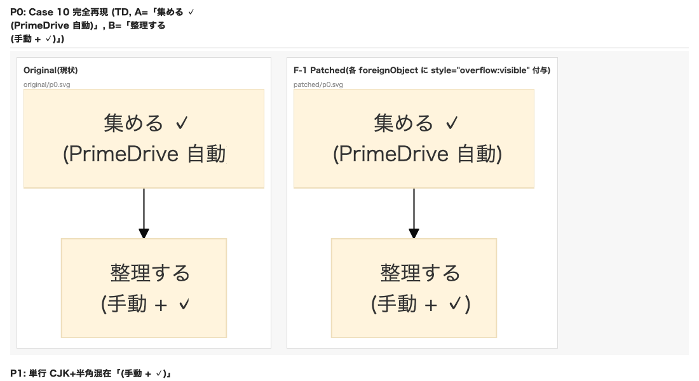

- **Original(左)**: Node A の `(PrimeDrive 自動` で **`)` が消えている**、Node B の `(手動 + ✓` でも **`)` が消えている**(両ノードでクリップ発生)
- **F-1 Patched(右)**: 両ノードとも **`)` まで完全に表示**

### P1: 単行 CJK+半角混在 / P2: 純 ASCII

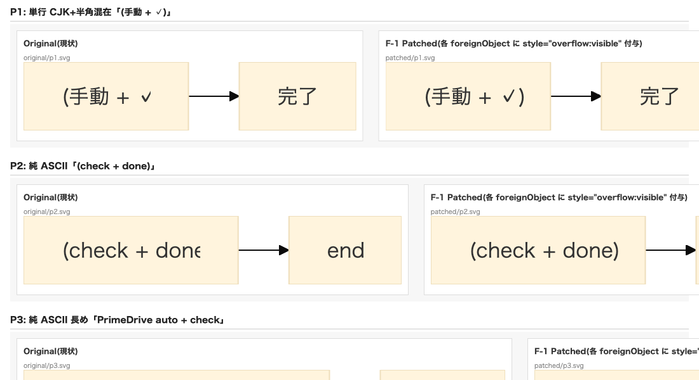

- **P1 Original**: `(手動 + ✓` で `)` 消失 / **P1 Patched**: `(手動 + ✓)` 完全表示
- **P2 Original**: `(check + don` で `e)` 消失(2 文字切れ) / **P2 Patched**: `(check + done)` 完全表示。**純 ASCII でも問題が発生し、F-1 で解消**

### P3: 純 ASCII 長め / P4: CJK + ✓

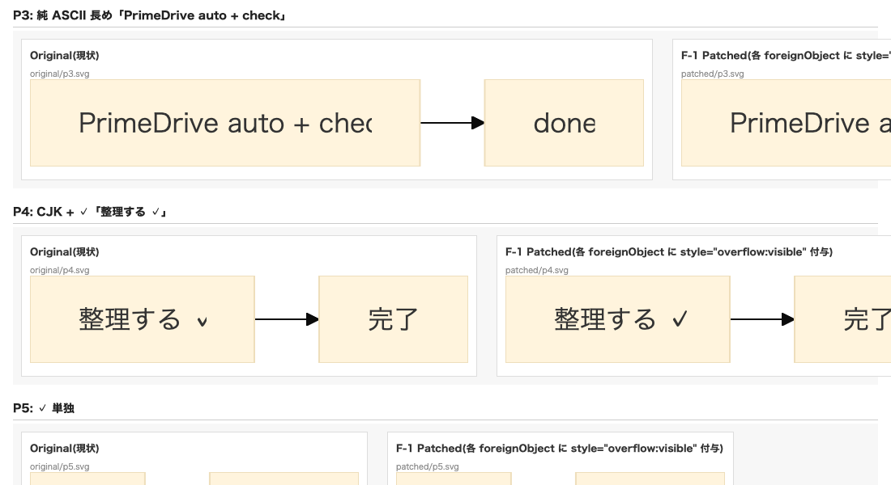

- **P3 Original**: `PrimeDrive auto + chec` で `k` 消失 / **P3 Patched**: `PrimeDrive auto + check` 完全表示(右端ノードのエッジに到達するため部分的に画像右端で切れて見えるが、これは画像の表示領域の問題で SVG の rect 内には収まっている)
- **P4 Original**: ✓ が縦線(`v` のように)に見える(✓ グリフ右側が rect 越えで消失) / **P4 Patched**: ✓ が**完全な形で表示**

### P5: ✓ 単独 / P6: 純 CJK コントロール

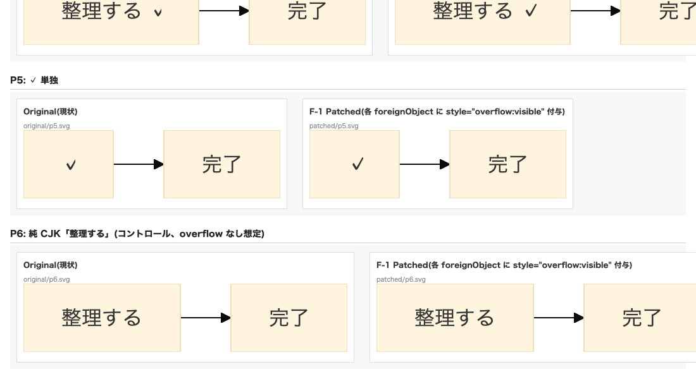

- **P5 Original**: ✓ が小さく見える(foreignObject が `width=10.94` と狭く設定されているため、本来 16px の ✓ が描画外で部分消失) / **P5 Patched**: ✓ が**正しい寸法で表示**
- **P6 Original / Patched**: 両者**完全に同一**(純 CJK は元々 overflow ゼロ、`overflow:visible` 追加は無害)→ **副作用が無いことの裏付け**

## F-1 案の確証された特性

実機検証から確定した事実:

| 特性 | 結果 |
|---|---|
| `` モードでクリップが消えるか | **Yes**(全 6 パターンで visible に変化) |
| `<svg>` inline モードを壊さないか | **Yes**(inline モードは元々 overflow:visible が効く挙動。属性追加は冗長でも害がない) |
| 純 CJK / overflow ゼロのパターンを壊すか | **No**(P6 で確認、両者同一描画) |
| 幅計算・レイアウトに影響するか | **No**(`foW`、`actualW`、`rectW` すべて Original と Patched で完全一致。F-1 は幅自体は変えない) |
| エッジ矢印・marker・他の SVG 要素に影響するか | **No**(`overflow:visible` は foreignObject 内の clip 挙動のみに影響) |
| `flowchart.padding` 設定値の変更が必要か | **不要**(現在のデフォルト 15 で全パターン rect 内に収まる、§バッファ余裕表参照) |
| `htmlLabels: false` へ切替が必要か | **不要**(v11.11+ の既知バグを踏まない) |
| Mermaid 依存更新で挙動が変わるリスク | **低**(後処理は SVG 文字列レベルで属性付与するだけ。Mermaid 内部実装に依存しない) |

## 実装方針案(別票で詳細化、本書はあくまで検証)

`src/renderer/postProcess.ts` に関数を追加:

```ts
export function forceForeignObjectOverflowVisible(svg: string): string {
  // 既存 style 属性が無い foreignObject に inline 挿入
  const noStylePat = /<foreignObject(?![^>]*style=)([^>]*?)(\/?>)/g;
  let result = svg.replace(noStylePat, '<foreignObject style="overflow:visible"$1$2');
  // 既存 style 属性に overflow:visible を追記(冪等)
  const withStylePat = /<foreignObject([^>]*?)style="([^"]*)"([^>]*?)(\/?>)/g;
  result = result.replace(withStylePat, (m, pre, style, post, end) => {
    if (style.includes('overflow')) return m; // 触らない
    const newStyle = (style.trim().replace(/;\s*$/, '') + ';overflow:visible').replace(/^;/, '');
    return `<foreignObject${pre}style="${newStyle}"${post}${end}`;
  });
  return result;
}
```

レンダリング結果に対し、`format=svg` のときだけ通すパイプラインに組込む。

## 関連ドキュメント

- 根本原因の同定: [`docs/expert-reviews/2026-05-16_foreignobject-clip-and-font-metrics-best-practices.md`](./expert-reviews/2026-05-16_foreignobject-clip-and-font-metrics-best-practices.md)
- 公式 Mermaid プロジェクトの認知状況: 上記 §4.5
- パッチ前 SVG: [`./svg-foreignobject-overflow-fix-verification-2026-05-16/original/`](./svg-foreignobject-overflow-fix-verification-2026-05-16/original/)
- パッチ後 SVG: [`./svg-foreignobject-overflow-fix-verification-2026-05-16/patched/`](./svg-foreignobject-overflow-fix-verification-2026-05-16/patched/)
- 並列スクリーンショット: 上記 §視覚的検証
- 生計測 JSON: [`./svg-foreignobject-overflow-fix-verification-2026-05-16/measurements.json`](./svg-foreignobject-overflow-fix-verification-2026-05-16/measurements.json)

## 検証アーティファクト一覧

| ファイル | 内容 |
|---|---|
| `original/p0.svg` 〜 `original/p6.svg` | Mermaid `/render` から取得した原本 SVG(7 ファイル) |
| `patched/p0.svg` 〜 `patched/p6.svg` | 各 `<foreignObject>` に `style="overflow:visible"` を inline 付与した F-1 案適用後 SVG(7 ファイル) |
| `screenshot-p0.png` | P0(Case 10)の `` モード並列比較スクリーンショット |
| `screenshot-p1-p2.png` | P1 / P2 の同上 |
| `screenshot-p3-p4.png` | P3 / P4 の同上 |
| `screenshot-p5-p6.png` | P5 / P6 の同上 |
| `measurements.json` | 14 ノード × 2 モード = 28 計測点の生データ |

## SVG ファイル目視確認用(GitHub Markdown / VS Code プレビューでインライン表示)

下記の各組は `` 経由(=standalone SVG モード)。**左が原本(現状の挙動)、右が F-1 パッチ後**。

### P0 Case 10

| Original | Patched |
|---|---|
|  |  |

### P1 単行「(手動 + ✓)」

| Original | Patched |
|---|---|
|  |  |

### P2 純 ASCII「(check + done)」

| Original | Patched |
|---|---|
|  |  |

### P3 純 ASCII「PrimeDrive auto + check」

| Original | Patched |
|---|---|
|  |  |

### P4 「整理する ✓」

| Original | Patched |
|---|---|
|  |  |

### P5 ✓ 単独

| Original | Patched |
|---|---|
|  |  |

### P6 純 CJK(コントロール、副作用なしの裏付け)

| Original | Patched |
|---|---|
|  |  |
