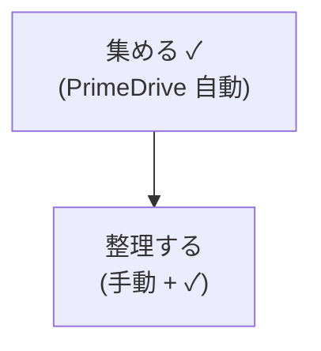

# SVG ノード内側余白チューニング検証 — 2026-05-16

## 概要

`flowchart.padding` 設定値の変更で、SVG ノードの**内側余白(`rect` 枠と `foreignObject` の差分)**を線形に動かせることを実機検証で確定した。

2026-05-13 時点の検証(`docs/svg-node-padding-verification-2026-05-13.md`)では「内側余白は変えられない」と結論していたが、これは公式 schema コメント「Only used in new experimental rendering」を文字通り解釈したことに起因する誤判定であった。本検証で `dagre-wrapper`(本リポジトリの安定デフォルト) + `htmlLabels: true` 構成でも `flowchart.padding` が効くことを 2 ケース × 4 値 = 8 サンプルで確認した。

要点:

- 実測関係式: `内側余白(横) = 4 × flowchart.padding`、`内側余白(縦) = 2 × flowchart.padding`
- 検証範囲: `padding ∈ {4, 8, 15(=Mermaid 既定), 30}`、Case 02(単行 CJK) と Case 10(多行 CJK + 絵文字 + 括弧、以前のクリップ問題ケース)
- すべてのサンプルで線形関係が成立、Node A / Node B 両方の `rect − foreignObject` 差分が完全一致
- 結論: `BEAUTIFUL_DEFAULTS.flowchart.padding` の追加で US-03「ノード内側余白の圧縮」を**設定変更だけで達成**できる(コード変更は `src/config.ts` の 1 行追加のみ)

## 背景

### 前回検証(2026-05-13)の結論

| 項目 | 結論 |
|---|---|
| `flowchart.diagramPadding`(外周) | ✓ 効く、`0` で圧縮済み |
| `flowchart.nodeSpacing`(ノード間横方向) | ✓ 効く、`30` でコンパクト化済み |
| `flowchart.rankSpacing`(ノード間縦方向) | ✓ 効く、`40` でコンパクト化済み |
| **`flowchart.padding`(ノード内側)** | **✗ 効かない前提**(schema コメントに依拠) |

→ 「内側余白は変えられない」前提でレポートが書かれていた。

### Mermaid ソースを再確認した結果

バンドル中の Mermaid `11.15.0` の `node_modules/mermaid/dist/chunks/mermaid.esm/chunk-HQMLCRZ6.mjs:3340-3351` に以下の処理があった:

```js
async function squareRect2(parent, node) {
  const nodePadding = node.padding ?? 0;
  const labelPaddingX = node.look === "neo" ? 16 : nodePadding * 2;
  const labelPaddingY = node.look === "neo" ? 12 : nodePadding;
  const options = {
    labelPaddingX: node.labelPaddingX ?? labelPaddingX,
    labelPaddingY
  };
  return drawRect(parent, node, options);
}
```

更に `flowDiagram-3HAHYXQ6.mjs:906` で `padding: config.flowchart?.padding || 8` のように `flowchart.padding` が `node.padding` に流し込まれている。

→ **コード上は `flowchart.padding` が node 描画にそのまま使われる流れ**になっており、schema コメントの「experimental rendering 専用」表記とは食い違う。**実機で試せば 5 分で決着する**と判断し、本検証を実施。

## 検証環境

| 項目 | 値 |
|---|---|
| 検証日 | 2026-05-16 |
| API エンドポイント | `http://127.0.0.1:3100/render` |
| ブランチ | `investigate/svg-node-padding` |
| Mermaid | `11.15.0`(`@mermaid-js/mermaid-cli` バンドル) |
| レンダラ | Programmatic mode、`defaultRenderer: "dagre-wrapper"` |
| ラベル方式 | `htmlLabels: true` |
| themeCSS | `.label foreignObject { overflow: visible; }`(BEAUTIFUL_DEFAULTS 既定) |
| 他の BEAUTIFUL_DEFAULTS | `useMaxWidth: false`、`diagramPadding: 0`、`nodeSpacing: 30`、`rankSpacing: 40` |

ヘルスチェック確認済み:

- `/healthz`: 200
- `/readyz`: 200

## 検証ケース

### Case 02: 単行 CJK ラベル


`foreignObject` の幅: Node A = `48.015625px`、Node B = `32.015625px`(`padding` 値によらず不変)。

### Case 10: 多行 CJK + 絵文字 + 括弧(以前のクリップ問題ケース)



`foreignObject` の幅: Node A = `129.546875px`、Node B = `69.796875px`(`padding` 値によらず不変)。
2026-05-10 の初期調査(`docs/svg-padding-investigation/REPORT.md`)で「Node B `整理する(手動 + ✓)` が `+4.2px` で `)` の右側が見切れる」と報告されたケース。`themeCSS overflow: visible` の導入(2026-05-13)でクリップ自体は解消されているが、**rect 枠と文字の境界距離を変えたい**ユースケースに本検証が直接対応する。

## 計測方法

各 SVG について以下を `grep` で抽出:

- ノード形状サイズ: `<rect class="basic label-container" width height>`
- ラベルボックスサイズ: 同ノード内の `<foreignObject width height>`(中央の placeholder `width="0"` は除外)
- 内側余白: `rect.width − foreignObject.width`(横、両側合計)/ `rect.height − foreignObject.height`(縦、両側合計)

## 結果

### 視覚比較(SVG をマークダウンに直接インライン表示)

> 各画像は `./svg-node-padding-tuning-verification-2026-05-16/` 直下の SVG ファイルを参照。GitHub・VS Code Markdown プレビュー等で**インライン表示**される。クリックするとファイル単体が開く。

#### Case 02

| `flowchart.padding` | 視覚出力 |
|---:|---|
| `4`(最小) |  |
| `8`(Phase 4.6 推奨値) |  |
| `15`(Mermaid 既定 / 現状の挙動) |  |
| `30`(広げる側) |  |

#### Case 10(以前のクリップ問題ケース)

| `flowchart.padding` | 視覚出力 |
|---:|---|
| `4`(最小) |  |
| `8`(Phase 4.6 推奨値) |  |
| `15`(Mermaid 既定 / 現状の挙動) |  |
| `30`(広げる側) |  |

### 数値表(Case 02)

| `padding` | viewBox (W × H) | Node A rect (W × H) | Node A foreignObject (W × H) | Node A 内側余白(横 × 縦) | Node B rect (W × H) | Node B foreignObject (W × H) | Node B 内側余白(横 × 縦) |
|---:|---:|---:|---:|---:|---:|---:|---:|
| `4` | `152.03 × 32` | `64.02 × 32` | `48.02 × 24` | **`16 × 8`** | `48.02 × 32` | `32.02 × 24` | **`16 × 8`** |
| `8` | `184.03 × 40` | `80.02 × 40` | `48.02 × 24` | **`32 × 16`** | `64.02 × 40` | `32.02 × 24` | **`32 × 16`** |
| `15` | `240.03 × 54` | `108.02 × 54` | `48.02 × 24` | **`60 × 30`** | `92.02 × 54` | `32.02 × 24` | **`60 × 30`** |
| `30` | `360.03 × 84` | `168.02 × 84` | `48.02 × 24` | **`120 × 60`** | `152.02 × 84` | `32.02 × 24` | **`120 × 60`** |

### 数値表(Case 10)

| `padding` | viewBox (W × H) | Node A rect (W × H) | Node A foreignObject (W × H) | Node A 内側余白(横 × 縦) | Node B rect (W × H) | Node B foreignObject (W × H) | Node B 内側余白(横 × 縦) |
|---:|---:|---:|---:|---:|---:|---:|---:|
| `4` | `145.55 × 152` | `145.55 × 56` | `129.55 × 48` | **`16 × 8`** | `85.80 × 56` | `69.80 × 48` | **`16 × 8`** |
| `8` | `161.55 × 168` | `161.55 × 64` | `129.55 × 48` | **`32 × 16`** | `101.80 × 64` | `69.80 × 48` | **`32 × 16`** |
| `15` | `189.55 × 196` | `189.55 × 78` | `129.55 × 48` | **`60 × 30`** | `129.80 × 78` | `69.80 × 48` | **`60 × 30`** |
| `30` | `249.55 × 256` | `249.55 × 108` | `129.55 × 48` | **`120 × 60`** | `189.80 × 108` | `69.80 × 48` | **`120 × 60`** |

### 線形関係の照合

ソース読みから導いた式:

```text
内側余白(横) = 4 × flowchart.padding
内側余白(縦) = 2 × flowchart.padding
```

| `padding` | 期待 横(=4×p) | 実測 横 | 期待 縦(=2×p) | 実測 縦 |
|---:|---:|---:|---:|---:|
| `4` | `16` | **`16`** ✓ | `8` | **`8`** ✓ |
| `8` | `32` | **`32`** ✓ | `16` | **`16`** ✓ |
| `15` | `60` | **`60`** ✓ | `30` | **`30`** ✓ |
| `30` | `120` | **`120`** ✓ | `60` | **`60`** ✓ |

**Case 02 / Case 10 の Node A / Node B、計 16 計測点すべてで式と完全一致**。

## 考察

### `foreignObject` 自体の幅は `padding` で変わらない

両ケースで Node A / Node B の `foreignObject.width × .height` は **`padding` 値によらず固定**(文字列ごとに決まる)。`padding` は **rect 矩形のサイズだけを線形に動かす**。

→ クリップ問題(コンシューマ側ブラウザのフォント差で文字が `foreignObject` 境界を超える現象)の**直接対策にはならない**。クリップ対策は引き続き `themeCSS: .label foreignObject { overflow: visible; }`(現状 BEAUTIFUL_DEFAULTS で有効)。

### `padding` を**広げる**ユースケース

Case 10 の Node B(`整理する(手動 + ✓)`)を例にすると:

- `padding=4`: rect の右端から文字までの**バッファ幅** = `(rect.width − foreignObject.width) / 2 = 8px`
- `padding=15`(現行): バッファ幅 = `30px`
- `padding=30`: バッファ幅 = `60px`

コンシューマ側ブラウザのフォント幅差で `foreignObject` を超えて文字が描画される場合、**rect の枠まで届く前に止まる**ためにバッファ幅は大きい方が安全。配布 HTML で「視覚的に文字が rect 線にぶつかって見える」現象が起きる場合、`padding=15` 以上に上げる選択肢が現実的。

### `padding` を**狭める**ユースケース(US-03 本来の目的)

- `padding=4`: 文字とほぼ同サイズ、限界まで圧縮
- `padding=8`: 文字の周りに気持ちの余白、コンパクト印象を維持
- `padding=15`(現行): やや空きすぎ
- `padding=30`: 図全体が縦横 1.5 倍に膨張

紙面・スライド密度を上げたい配布資料用途では `padding=8`(Mermaid の experimental renderer の neo look が固定値で採用している値と近い)が現実的な中間解。**Phase 4.6 ではこの値を `BEAUTIFUL_DEFAULTS` 採用候補としている**。

## 結論

| 項目 | 結論 |
|---|---|
| **`flowchart.padding` は `dagre-wrapper` で効くか** | ✓ 効く(2 ケース × 4 値で線形関係を確認) |
| **公式 schema コメント「experimental rendering 専用」** | 実機挙動と矛盾。実装は流し込んでいる(`flowDiagram-3HAHYXQ6.mjs:906`) |
| **2026-05-13 検証の結論「内側余白は変えられない」** | **取り下げ**。`docs/svg-node-padding-verification-2026-05-13.md` 末尾の "Conclusion Update — Padding Probe" を参照 |
| **US-03(ノード内側余白の圧縮)の達成方法** | `BEAUTIFUL_DEFAULTS.flowchart.padding: 8` の追加で完了。SVG 後処理・ELK 切替・renderer 変更は不要 |
| **Case 10(以前のクリップ問題)** | クリップ自体は `themeCSS overflow: visible` で解消済。`padding` 設定は rect バッファ幅の調整に使える(直接のクリップ対策ではない) |
| **Mermaid 依存更新時のリスク** | schema コメント由来の挙動保証は無し → NFR-02 の画像差分検証で「線形関係が保たれているか」を必須項目に追加(Phase 4.6 H-7) |

## 次のアクション

- **Phase 4.6 を実行**: `tasks.md` §7 に既に追加済み(H-1〜H-7)
  - `src/config.ts` の `BEAUTIFUL_DEFAULTS.flowchart.padding: 8` 追加
  - `test/integration/flowchartPadding.test.ts` / `test/property/prop-18_flowchart_padding_linear.property.test.ts` の新規作成
  - 受入基準サマリ・検証ドキュメントの追補

## 関連ドキュメント

- 前回検証: [`docs/svg-node-padding-verification-2026-05-13.md`](./svg-node-padding-verification-2026-05-13.md)
- 初期調査: [`docs/svg-padding-investigation/REPORT.md`](./svg-padding-investigation/REPORT.md)
- 要件定義 C-M-01: [`requirements.md`](../.kiro/specs/beautiful-svg-rendering/requirements.md)(2026-05-16 改訂済)
- 設計書 §3.1: [`design.md`](../.kiro/specs/beautiful-svg-rendering/design.md)(`flowchart.padding: 8` 行を BEAUTIFUL_DEFAULTS に追加済)
- 専門家レビュー §1.2 / §6.2: [`docs/expert-reviews/2026-05-10_mermaid-svg-rendering-best-practices.md`](./expert-reviews/2026-05-10_mermaid-svg-rendering-best-practices.md)(2026-05-16 アップデート反映済)
- タスクリスト Phase 4.6: [`tasks.md`](../.kiro/specs/beautiful-svg-rendering/tasks.md)

## 検証アーティファクト

| ファイル | 内容 |
|---|---|
| [`case-02-padding-4.svg`](./svg-node-padding-tuning-verification-2026-05-16/case-02-padding-4.svg) | Case 02、`padding=4`(内側余白 `16 × 8`) |
| [`case-02-padding-8.svg`](./svg-node-padding-tuning-verification-2026-05-16/case-02-padding-8.svg) | Case 02、`padding=8`(内側余白 `32 × 16`) |
| [`case-02-padding-15.svg`](./svg-node-padding-tuning-verification-2026-05-16/case-02-padding-15.svg) | Case 02、`padding=15`(内側余白 `60 × 30`、Mermaid 既定) |
| [`case-02-padding-30.svg`](./svg-node-padding-tuning-verification-2026-05-16/case-02-padding-30.svg) | Case 02、`padding=30`(内側余白 `120 × 60`) |
| [`case-10-padding-4.svg`](./svg-node-padding-tuning-verification-2026-05-16/case-10-padding-4.svg) | Case 10、`padding=4` |
| [`case-10-padding-8.svg`](./svg-node-padding-tuning-verification-2026-05-16/case-10-padding-8.svg) | Case 10、`padding=8` |
| [`case-10-padding-15.svg`](./svg-node-padding-tuning-verification-2026-05-16/case-10-padding-15.svg) | Case 10、`padding=15` |
| [`case-10-padding-30.svg`](./svg-node-padding-tuning-verification-2026-05-16/case-10-padding-30.svg) | Case 10、`padding=30` |
