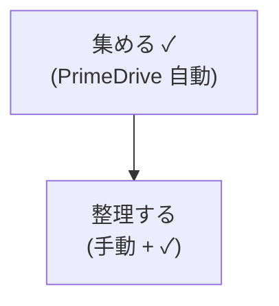
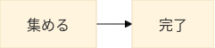
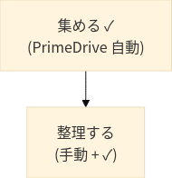

# SVG node padding verification - 2026-05-13

## Summary

The current implementation does **not** reduce the hardcoded inner padding of individual flowchart nodes in Mermaid's default `dagre-wrapper` renderer.

What is working:

- `flowchart.diagramPadding: 0` reduces the diagram outer margin.
- `flowchart.nodeSpacing: 30` and `flowchart.rankSpacing: 40` make the overall diagram more compact than Mermaid defaults.
- `flowchart.useMaxWidth: false` removes the root `<svg style="max-width: ...">` behavior and returns absolute `width` / `height` attributes.
- `themeCSS: ".label foreignObject { overflow: visible; }"` is applied and prevents foreignObject boundary clipping.
- Request-time `mermaid_config.flowchart.*` overrides are accepted and affect diagram-level layout.

What is not working as the original "reduce each node's internal blank space" goal:

- Rect node inner padding remains **60px horizontal / 30px vertical** in the generated SVG.
- This matches the original baseline measurement and appears to be Mermaid `dagre-wrapper` behavior rather than an exposed configurable flowchart setting.

## Context

The original investigation in `docs/svg-padding-investigation/REPORT.md` found that rect nodes had approximately:

- horizontal padding: `shape width - foreignObject width = 60px`
- vertical padding: `shape height - foreignObject height = 30px`

The implementation later avoided nonexistent / ineffective flowchart node-padding controls and instead set the following Beautiful Defaults in `src/config.ts`:

```ts
flowchart: {
  useMaxWidth: false,
  diagramPadding: 0,
  nodeSpacing: 30,
  rankSpacing: 40,
  defaultRenderer: 'dagre-wrapper'
}
```

It also added:

```ts
themeCSS: '.label foreignObject { overflow: visible; }'
```

## Verification Environment

- Date: 2026-05-13
- Branch: `investigate/svg-node-padding`
- Docker mode: `docker-compose.yml` + `docker-compose.dev-sysadmin.yml`
- API endpoint: `http://127.0.0.1:3100/render`
- Renderer mode: `programmatic`

Docker health checks were already confirmed in the current environment:

- `/healthz`: 200
- `/readyz`: 200
- `/livez`: 200
- `/render` SVG smoke: 200

## Test Cases

### Case 02: single CJK labels

Mermaid source:


### Case 10: multiline CJK labels

Mermaid source:



## Measurement Method

For each generated SVG:

- node shape size was measured from `<rect class="basic label-container" width height>`
- label box size was measured from the matching `<foreignObject width height>`
- node internal padding was computed as:

```text
horizontal padding = rect.width - foreignObject.width
vertical padding   = rect.height - foreignObject.height
```

This matches the earlier investigation's measurement style.

## Results

### Visual Outputs

The following files were generated from the current API and committed for visual inspection:

| Case | SVG | PNG preview |
|---|---|---|
| Case 02 current default | [current-case-02.svg](./svg-node-padding-verification-2026-05-13/current-case-02.svg) |  |
| Case 10 current default | [current-case-10.svg](./svg-node-padding-verification-2026-05-13/current-case-10.svg) |  |
| Case 02 wide spacing override | [current-case-02-wide-spacing.svg](./svg-node-padding-verification-2026-05-13/current-case-02-wide-spacing.svg) | SVG only |

The committed SVG files are the best source for checking root attributes such as `width`, `height`, `viewBox`, `max-width`, and `foreignObject` overflow behavior. The PNG previews are included for quick visual inspection in GitHub or a local Markdown viewer.

### Case 02 - baseline vs current

| Metric | Previous investigation output | Current output |
|---|---:|---:|
| root `viewBox` width | `266.03125` | `240.03125` |
| root `viewBox` height | `70` | `54` |
| root has inline `max-width` | yes | no |
| foreignObject overflow visible | no | yes |
| node A rect | `108.015625 x 54` | `108.015625 x 54` |
| node A foreignObject | `48.015625 x 24` | `48.015625 x 24` |
| node A internal padding | `60 x 30` | `60 x 30` |
| node B rect | `92.015625 x 54` | `92.015625 x 54` |
| node B foreignObject | `32.015625 x 24` | `32.015625 x 24` |
| node B internal padding | `60 x 30` | `60 x 30` |

Interpretation:

- The diagram became smaller overall due to outer margin / spacing / max-width changes.
- The individual node internal padding did not change.

### Case 10 - baseline vs current

| Metric | Previous investigation output | Current output |
|---|---:|---:|
| root `viewBox` width | `205.546875` | `189.546875` |
| root `viewBox` height | `222` | `196` |
| root has inline `max-width` | yes | no |
| foreignObject overflow visible | no | yes |
| node A rect | `189.546875 x 78` | `189.546875 x 78` |
| node A foreignObject | `129.546875 x 48` | `129.546875 x 48` |
| node A internal padding | `60 x 30` | `60 x 30` |
| node B rect | `129.796875 x 78` | `129.796875 x 78` |
| node B foreignObject | `69.796875 x 48` | `69.796875 x 48` |
| node B internal padding | `60 x 30` | `60 x 30` |

Interpretation:

- The graph's outer dimensions became smaller.
- The prior clipping risk is mitigated because `foreignObject` overflow is now visible.
- The individual node internal padding did not change.

### Request-time spacing override

Request:

```json
{
  "mermaid_config": {
    "flowchart": {
      "diagramPadding": 24,
      "nodeSpacing": 80,
      "rankSpacing": 90
    }
  }
}
```

Result for Case 02:

| Metric | Current default | Override result |
|---|---:|---:|
| root `viewBox` width | `240.03125` | `338.03125` |
| root `viewBox` height | `54` | `102` |
| node A internal padding | `60 x 30` | `60 x 30` |
| node B internal padding | `60 x 30` | `60 x 30` |

Interpretation:

- Request-time `flowchart.*` overrides are being applied.
- These controls affect diagram-level spacing and outer padding, not the node-internal rect padding.

## Conclusion

The maximum original goal, "narrow the padding inside each SVG node", is **not fully implemented** in the literal sense.

The implementation successfully improves the SVG output in related ways:

1. It makes the overall diagram more compact.
2. It removes the root `max-width` style conflict.
3. It prevents CJK label clipping at the `foreignObject` boundary.
4. It allows request-time flowchart layout overrides.

However, for standard `flowchart` rect nodes using Mermaid's `dagre-wrapper`, the node-internal padding remains unchanged at **60px horizontal / 30px vertical**.

## Recommended Next Step

If the product requirement is strictly "reduce blank space inside each node", this needs a follow-up task. Practical options:

1. Investigate whether a newer Mermaid renderer or opt-in ELK layout exposes a reliable node padding control.
2. Add a post-process SVG transform that rewrites rect and foreignObject geometry for simple flowchart nodes.
3. Provide a documented opt-in style preset that changes node appearance without pretending to alter Mermaid's internal layout model.

Option 2 is the most direct, but it is also the riskiest because it must preserve edges, marker alignment, labels, non-rect node shapes, and accessibility attributes.

---

## Conclusion Update — Padding Probe (2026-05-16)

The "Recommended Next Step" section above is **superseded** by the empirical probe described below.

### Probe Summary

Three back-to-back requests against the running API (`http://127.0.0.1:3100/render`, programmatic mode, Mermaid `11.15.0` bundled, `defaultRenderer: "dagre-wrapper"`, `htmlLabels: true`), same Mermaid source `flowchart LR\n  A["集める"] --> B["完了"]`, varying only `mermaid_config.flowchart.padding`:

| `flowchart.padding` | Node A rect (W × H) | Node A foreignObject (W × H) | Node A internal padding (H × V) | root viewBox |
|---:|---:|---:|---:|---|
| (unset, schema default 15) | `108.02 × 54` | `48.02 × 24` | **`60 × 30`** | `240 × 54` |
| `4` | `64.02 × 32` | `48.02 × 24` | **`16 × 8`** | `152 × 32` |
| `60` | `288.02 × 144` | `48.02 × 24` | **`240 × 120`** | `600 × 144` |

Linear relationship verified across all three samples:

```text
horizontal internal padding (rect.width  − foreignObject.width)  = 4 × flowchart.padding
vertical   internal padding (rect.height − foreignObject.height) = 2 × flowchart.padding
```

This contradicts the Mermaid `config.schema.yaml` comment **"Only used in new experimental rendering"** for the `padding` key. In our environment, `flowchart.padding` is honored by the legacy `dagre-wrapper` renderer as well.

### Source Code Reading

The relationship matches the formula in the bundled Mermaid module at `node_modules/mermaid/dist/chunks/mermaid.esm/chunk-HQMLCRZ6.mjs:3340-3351` for the non-`neo` look:

```text
labelPaddingX = nodePadding × 2
labelPaddingY = nodePadding × 1
rect_width    = foreignObject_width  + 2 × labelPaddingX  (= foreignObject_width  + 4 × nodePadding)
rect_height   = foreignObject_height + 2 × labelPaddingY  (= foreignObject_height + 2 × nodePadding)
```

`nodePadding` is sourced from `flowchart.padding` (default 15) at `flowDiagram-3HAHYXQ6.mjs:906`.

### Implications

1. **The original US-03 goal (reduce node-internal padding) is achievable via configuration alone.** No SVG post-processing or renderer switch is needed.
2. **The `Recommended Next Step` options above are no longer the only paths.** Adjusting `flowchart.padding` in `BEAUTIFUL_DEFAULTS` (or accepting it as a request-time override) is the simplest and most direct fix.
3. **The schema-comment-derived guarantee is absent.** Mermaid minor updates could change this behavior. Image-diff regression on dependency upgrade (NFR-02) is required.

### Spec Documents Updated as a Result

- `requirements.md` C-M-01 — restated to reflect empirical evidence
- `design.md` §1.1 (現行構造の課題) and §3.1 (BEAUTIFUL_DEFAULTS table) — adds `flowchart.padding: 8`
- `docs/expert-reviews/2026-05-10_mermaid-svg-rendering-best-practices.md` §1.2 and §6.2 — annotated with the empirical update

### Visual Artifacts

Probe SVG / PNG samples are kept outside the repository (under `/tmp/padding-probe/`) because they are derived artifacts re-creatable by repeating the three curl calls in the table above. The original `current-case-02.*` and `current-case-10.*` files in `./svg-node-padding-verification-2026-05-13/` continue to represent the **pre-tuning baseline** for visual comparison.
