# SVG ノードパディング再現性 定量調査レポート

- 調査日: 2026-05-10
- ブランチ: `investigate/svg-node-padding`
- 対象 API: `mermaid-render-api`(本リポジトリ、Docker コンテナで稼働、`MERMAID_PADDING=20` デフォルト)
- 目的: 改修案 (`docs/開発.要件定義_ノード内テキスト見切れ対策とレイアウト制御_改修案.md`) で主張されている「SVG ノードの不要余白 / テキスト見切れ」事象が、現状コードでどの程度再現するかを定量化する
- 関連ユースケース: AI に単独 HTML(SVG 直埋込) で資料を生成させたいので、コンシューマ側ブラウザに Noto Sans CJK JP が無い前提でも美しく見えてほしい

---

## 1. 調査セットアップ

| 項目 | 値 |
|---|---|
| サーバ (mmdc 実行環境) | Docker コンテナ内、Noto Sans CJK JP インストール済 |
| サーバ Mermaid 設定 | `theme=base`, `fontFamily="Noto Sans CJK JP", "IPAexGothic", sans-serif`, `themeCSS="svg { padding: 20px; }"` |
| PNG レンダリングスケール | `PNG_RENDER_SCALE=3`(`.env`) |
| コンシューマ側ブラウザ | playwright-cli(Chromium)、ホスト WSL2 |
| ホストの利用可能 CJK フォント | `WenQuanYi Zen Hei`, `Unifont-JP`(**Noto Sans CJK JP は無し**) |
| 計測手法 (SVG) | playwright-cli + `eval` で `getBBox()` / `scrollWidth/Height` を取得 |
| 計測手法 (PNG) | Pillow でピクセル走査(透明・濃色ピクセル bbox) |

テストケース: `scripts/cases.json` の 10 ケース(単行 ASCII、単行 CJK、複数行 CJK + `<br>`、複数行 ASCII + `<br>`、角丸・スタジアム・ひし形、長文 CJK、TD 方向 など)。

---

## 2. ビジュアルギャラリー(各ケースの実出力)

> 左 = **SVG**(コンシューマ側ブラウザで描画される姿。GitHub 上では GitHub のフォントで描画される=Noto Sans CJK JP は基本無し)
> 右 = **PNG**(サーバ rasterize 結果。Noto Sans CJK JP で描画。"見た目の正解"側)
>
> 両者の差 = フォント不在時のコンシューマ環境での実害イメージ

### 2.0 全ケース実寸スクリーンショット(ホストブラウザ実描画、赤枠=SVG ルート境界)

> **これが本調査でいちばん大事な 1 枚です。** Mermaid が出す SVG を、`max-width` で縮小せずビューポートそのままの寸法で表示したもの。case 10 の Node B「整理する / (手動 + ✓)」だけ `)` の右側が**明確に見切れている**ことが確認できる。

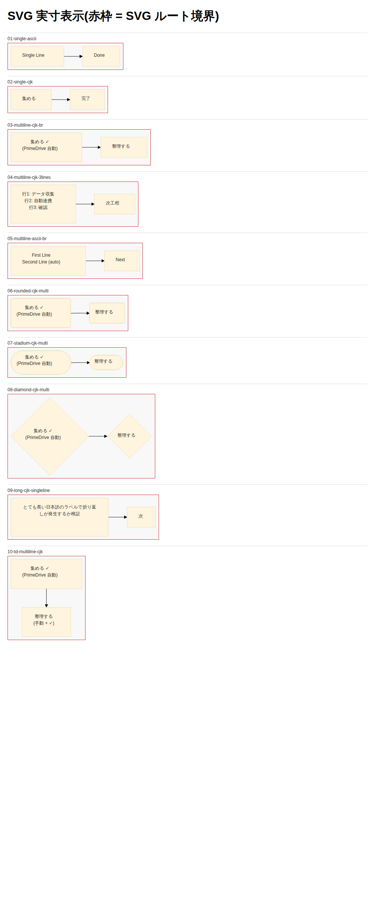

#### case 別 視覚的 clip 判定(実寸表示)

| ケース | fo overflow(計測値) | 視覚的 clip | 備考 |
|---|---|---|---|
| 01-single-ascii | なし | なし | ASCII はそもそも測定一致 |
| 02-single-cjk | 集める +1px | **なし** | 1px は実用上分からない |
| 03-multiline-cjk-br | 整理する +1px | **なし** | 同上 |
| 04-multiline-cjk-3lines | 行3「確認」 +2.1px | **なし** | 文字が短いので foreignObject の幅に収まる |
| 05-multiline-ascii-br | なし | なし | |
| 06-rounded-cjk-multi | 整理する +1px | **なし** | |
| 07-stadium-cjk-multi | 整理する +1px | **なし** | |
| 08-diamond-cjk-multi | 整理する +1px | **なし** | ひし形は余白が大きく余裕 |
| 09-long-cjk-singleline | なし | なし | wrappingWidth=200 で折返し |
| **10-td-multiline-cjk** | **整理する(手動 + ✓) +4.2px** | **★ あり ★** | `)` の右側が見切れる、`✓` も一部欠ける |

→ **本検証範囲では「+4px 以上のオーバーフローで視覚的 clip が顕在化」する。**「+1〜2px」は数値上は overflow しても、ホストブラウザでの実描画では人間が認知できないレベル。

> 補足: 別環境(GitHub のレンダリング、別フォント環境)では glyph 幅が異なるため、+1〜2px のケースも clip するリスクは残る。GitHub Web で本レポートを見ると case 10 の clip がより派手に出ているとの観察あり。

### 2.0.b 全ケース 縮小比較スクリーンショット(SVG vs PNG 並べ表示)

> 縮小サイズで `max-width:200px` 表示の比較。clip 判定には向かない(縮小されているので)が、SVG(ホスト font)と PNG(Noto Sans CJK JP)の見た目の差は分かりやすい。

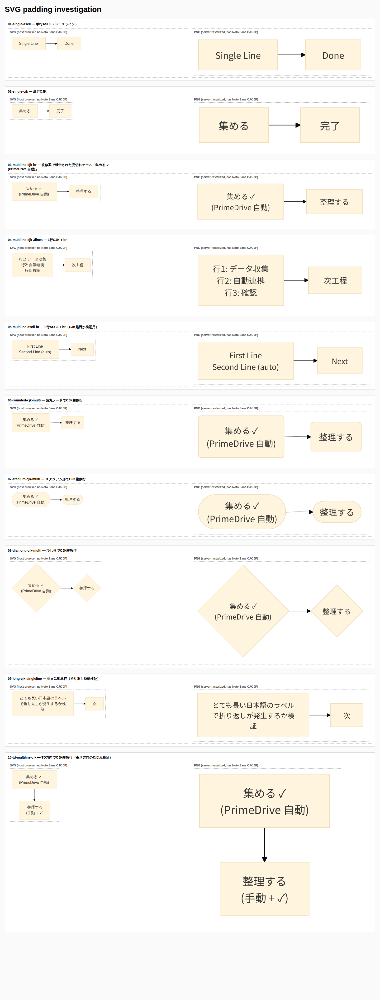

### 2.1 `01-single-ascii` — 単行 ASCII(ベースライン)

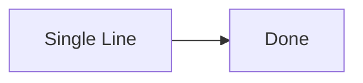

| SVG | PNG |
|---|---|
|  | 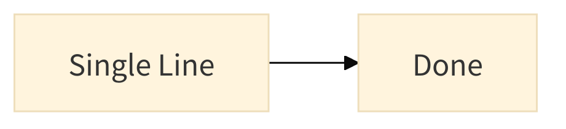 |

- ノード A: shape 141.5×54 / text 79×24 → **余白 62.5 / 30**
- ノード B: shape 99.3×54 / text 38×24 → **余白 61.3 / 30**
- foreignObject overflow: なし

### 2.2 `02-single-cjk` — 単行 CJK

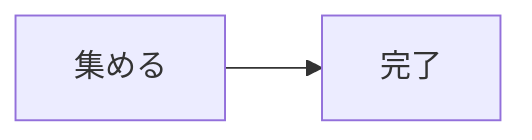

| SVG | PNG |
|---|---|
|  | 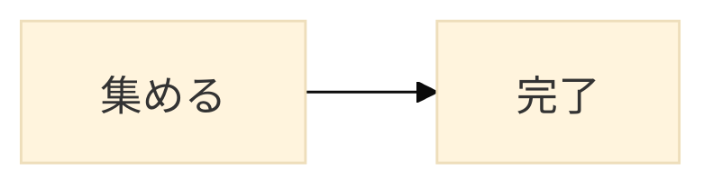 |

- ノード A「集める」: shape 108×54 / text 49×24 → **余白 59 / 30**、**fo_w=48.0 vs text=49(+1px overflow)**
- ノード B「完了」: shape 92×54 / text 32×24 → **余白 60 / 30**

### 2.3 `03-multiline-cjk-br` — 改修案で報告された見切れケース「集める ✓<br>(PrimeDrive 自動)」

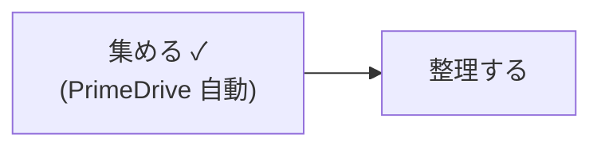

| SVG | PNG |
|---|---|
|  | 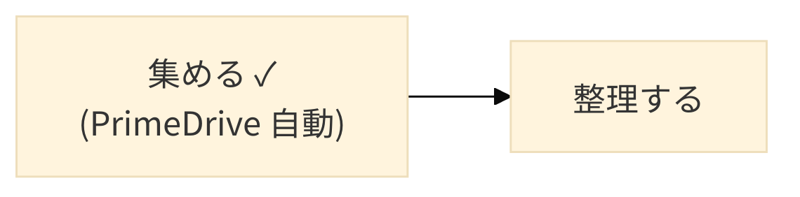 |

- ノード A: shape 189.5×78 / text 126×48 → **余白 63.5 / 30**
- ノード B「整理する」: shape 124×54 / text 65×24 → **余白 59 / 30**、**fo_w=64.0 vs text=65(+1px overflow)**
- 改修案が「枠線にめり込む」と報告したケースだが、本検証セットでは shape 矩形に余裕がありはみ出していない

### 2.4 `04-multiline-cjk-3lines` — 3 行 CJK + `<br>`

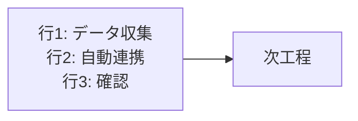

| SVG | PNG |
|---|---|
|  | 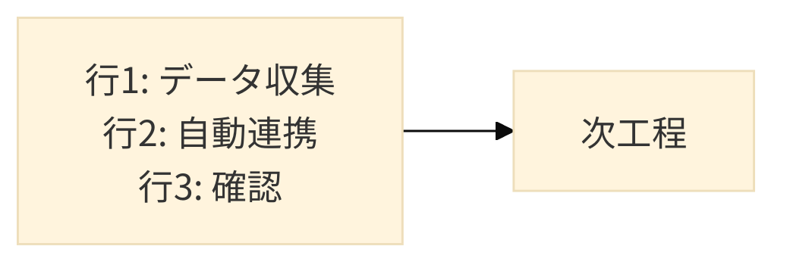 |

- ノード A: shape 172.9×102 / text 115×72 → **余白 57.9 / 30**、**fo_w=112.9 vs text=115(+2.1px overflow)**

### 2.5 `05-multiline-ascii-br` — 2 行 ASCII + `<br>`(CJK 起因か検証用)

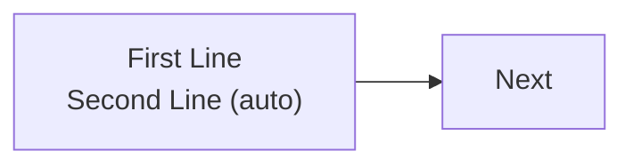

| SVG | PNG |
|---|---|
|  | 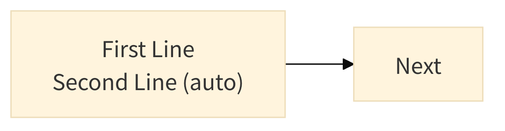 |

- ノード A: shape 199.5×78 / text 135×48 → **余白 64.5 / 30**
- foreignObject overflow: **なし**(ASCII は計算ズレが出ない)

### 2.6 `06-rounded-cjk-multi` — 角丸ノードで CJK 複数行

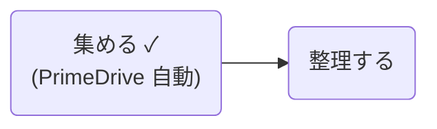

| SVG | PNG |
|---|---|
|  | 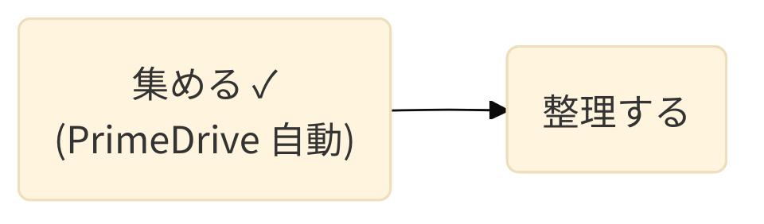 |

- ノード A (path): shape 159.5×78 / text 126×48 → **余白 33.5 / 30**(rect より横余白が半減)
- ノード B (path): shape 94×54 / text 65×24 → **余白 29 / 30**、**+1px fo overflow**

### 2.7 `07-stadium-cjk-multi` — スタジアム形で CJK 複数行

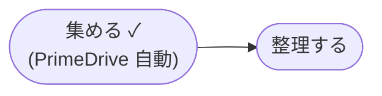

| SVG | PNG |
|---|---|
|  | 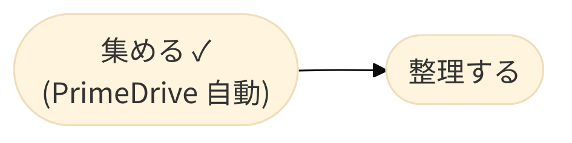 |

- ノード A (path): shape 160.3×63 / text 126×48 → **余白 34.3 / 15**(縦余白も半減!)
- ノード B (path): shape 88.7×39 / text 65×24 → **余白 23.7 / 15**

### 2.8 `08-diamond-cjk-multi` — ひし形で CJK 複数行(極端例)

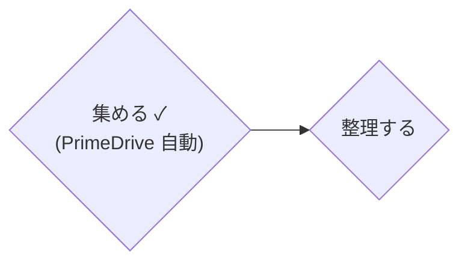

| SVG | PNG |
|---|---|
|  | 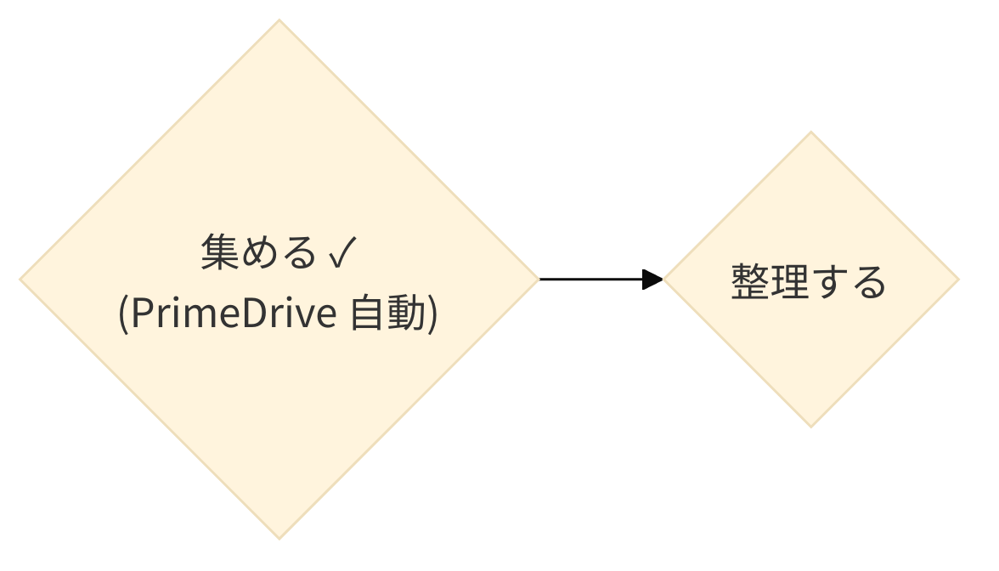 |

- ノード A (polygon): shape **207.5×207.5** / text 126×48 → **余白 81.5 / 159.5**(縦に巨大な余白)
- ノード B (polygon): shape 118×118 / text 65×24 → **余白 53 / 94**
- ひし形は形状特性で外接矩形が大きくなる。テキストが大きさのわりに小さく見える

### 2.9 `09-long-cjk-singleline` — 長文 CJK 単行(折り返し検証)

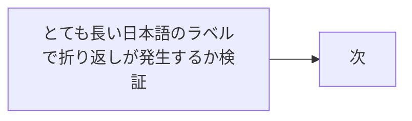

| SVG | PNG |
|---|---|
|  | 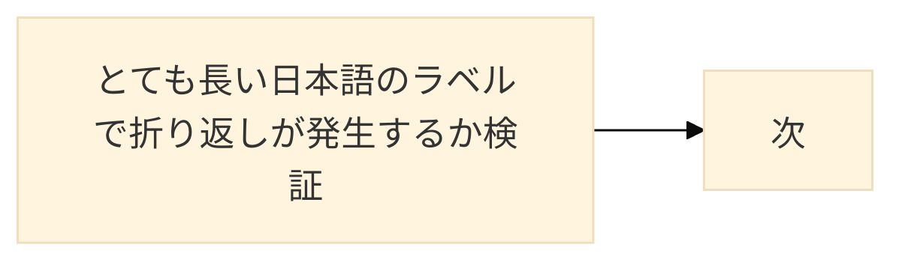 |

- ノード A: shape 260×102 / text 200×72(`wrappingWidth=200` で折り返し)→ **余白 60 / 30**
- ノード B「次」: shape 76×54 / text 16×24 → **余白 60 / 30**(極小ラベルでも余白は同じ → 視覚的に「余白だらけ」)

### 2.10 `10-td-multiline-cjk` — TD 方向で CJK 複数行(高さ方向検証)

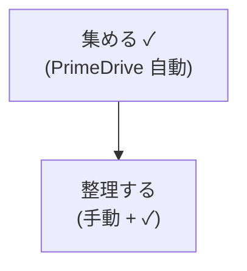

| SVG | PNG |
|---|---|
|  | 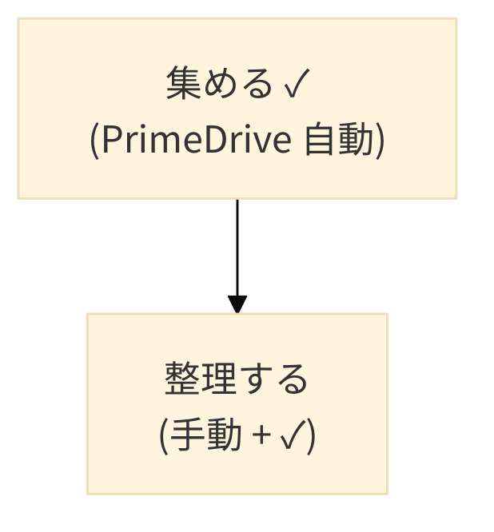 |

- ノード A: shape 189.5×78 / text 126×48 → **余白 63.5 / 30**
- ノード B: shape 129.8×78 / text 74×48 → **余白 55.8 / 30**、**fo_w=69.8 vs text=74(+4.2px overflow、本セット最大)**
- ★ **本ケースのみ実描画で視覚的 clip 発生** ★: `(手動 + ✓)` の `)` 右側が見切れる。foreignObject の境界でテキストがクリップされている(SVG `<foreignObject>` の overflow デフォルトに依存)。↑ §2.0 のスクショで確認できる。

---

## 3. 計測サマリ — SVG (ホストブラウザ実描画)

### 3.1 ノード矩形 (shape) と テキスト実寸 (scrollWidth/Height) の差 = 「ノード内余白」

| ケース | 形状 | shape (W×H) | text (W×H) | **余白 W / H** | 形状種別 |
|---|---|---|---|---|---|
| 01-single-ascii (A) | rect | 141.5 × 54 | 79 × 24 | **62.5 / 30** | rect |
| 01-single-ascii (B) | rect | 99.3 × 54 | 38 × 24 | **61.3 / 30** | rect |
| 02-single-cjk (A) | rect | 108 × 54 | 49 × 24 | **59 / 30** | rect |
| 02-single-cjk (B) | rect | 92 × 54 | 32 × 24 | **60 / 30** | rect |
| 03-multiline-cjk-br (A) | rect | 189.5 × 78 | 126 × 48 | **63.5 / 30** | rect |
| 03-multiline-cjk-br (B) | rect | 124 × 54 | 65 × 24 | **59 / 30** | rect |
| 04-multiline-cjk-3lines (A) | rect | 172.9 × 102 | 115 × 72 | **57.9 / 30** | rect |
| 05-multiline-ascii-br (A) | rect | 199.5 × 78 | 135 × 48 | **64.5 / 30** | rect |
| 06-rounded (A) | path | 159.5 × 78 | 126 × 48 | **33.5 / 30** | path |
| 07-stadium (A) | path | 160.3 × 63 | 126 × 48 | **34.3 / 15** | path |
| 08-diamond (A) | polygon | 207.5 × 207.5 | 126 × 48 | **81.5 / 159.5** | polygon |
| 09-long-cjk (A) | rect | 260 × 102 | 200 × 72 | **60 / 30** | rect |
| 10-td-multiline-cjk (A) | rect | 189.5 × 78 | 126 × 48 | **63.5 / 30** | rect |
| 10-td-multiline-cjk (B) | rect | 129.8 × 78 | 74 × 48 | **55.8 / 30** | rect |

#### 観察

- **`rect` ノードはテキスト周囲に常時 約 60px(横) / 30px(縦) の余白がある。** ノードの内容量によらず一定。これは Mermaid の `dagre-wrapper` レンダラの hardcoded ノードパディング(片側 30px 横 / 15px 縦) × 2 に対応する量。
- **`path`(stadium/rounded)では横余白がほぼ半減(33–34px)、縦余白も 15px に減る。** 形状の計算方法が異なるため。
- **`polygon`(ひし形)は形状特性上、外接矩形が大きくなる(159.5px の縦余白)。** ユーザー視点では「ひし形使うと余白が酷い」となる。

### 3.2 `foreignObject` 公称サイズ vs テキスト実描画サイズ

`foreignObject` は Mermaid がサーバ側のフォント(Noto Sans CJK JP)で測定した値で固定されているが、ホストブラウザは WenQuanYi で描画するので幅がズレる:

| ケース | ラベル | fo_w | text_sW | overflow |
|---|---|---|---|---|
| 02-single-cjk | 集める | 48.0 | 49 | **+1px** |
| 03/06/07/08 | 整理する | 64.0 | 65 | **+1px** |
| 04-3lines | 「行3: 確認」を含む最長行 | 112.9 | 115 | **+2.1px** |
| 10-td | 整理する(手動 + ✓) | 69.8 | 74 | **+4.2px** |

- **CJK ラベルではホストブラウザの実テキスト幅 > Mermaid 計算幅** が再現された。最大 +4.2px、平均 +1〜2px 程度。
- ASCII ラベル / 長文単行 CJK では overflow は発生しない(09 は折返しが効いて wrappingWidth=200 で揃う)。
- **`<foreignObject>` は内側コンテンツを境界でクリップする**(Chromium 等のブラウザ実装、SVG 1.1 の `overflow:hidden` デフォルトに準拠)。Mermaid は `<foreignObject>` に明示的な `overflow` 属性を付けないが、ブラウザのデフォルトでクリップが効く。
- そのため **fo overflow > 約 +4px になるとユーザー視認可能な見切れが発生**(本セットの case 10 で実証)。+1〜2px 程度ではホストブラウザの実描画では人間が認知できない。
- なお shape 矩形からは依然 overflow していない(shape > fo > text の階層なので)。**clip は shape ではなく foreignObject の境界で起きている**ことに注意。

### 3.3 改修案の主張に対する事実関係

| 改修案の記述 | 実測 | 評価 |
|---|---|---|
| 「`foreignObject` の高さ・幅がテキストの実描画サイズより小さく確定し、はみ出した部分が clip される」 | `fo_w` < `text_sW` は再現(最大 +4.2px)。`<foreignObject>` のデフォルト overflow はブラウザ側で hidden 扱いされるため、case 10 (+4.2px) ではホストブラウザでも視覚的 clip が発生(`)` の右が見切れる) | **正しい**(初版レポートで「半分正しい」と誤評価していたのを訂正) |
| 「ラベルの一部が枠線にめり込む」 | **case 10 で再現**: 「整理する(手動 + ✓)」の `)` 右側が foreignObject 境界で clip。ただし clip は shape 矩形の境界ではなく **foreignObject 境界**で起きている(shape 矩形は余白に余裕) | **再現**(初版レポートで「再現せず」と書いたのを訂正。`max-width:200px` で縮小したスクショで見落とした) |
| 「`MERMAID_PADDING` は `svg { padding }` を themeCSS に注入するだけ」 | コード(`src/config.ts:24`, `src/server/server.ts:32`)で事実確認済 | **正しい** |
| 「ノード単位の余白(`flowchart.nodePadding` / `flowchart.diagramPadding`)には介入していない」 | API は `flowchart.*` を一切受け付けない(構造的にハードコード) | **正しい** |
| 「`flowchart.nodePadding` (default=8)」 | Mermaid v11 の `config.schema.yaml` に `flowchart.nodePadding` は**存在しない**。flowchart 系の余白キーは `diagramPadding` (8) / `nodeSpacing` (50) / `rankSpacing` (50) / `padding` (15, experimental only) | **誤り**(`nodePadding` は Sankey 専用キー) |

---

## 4. 計測サマリ — PNG (サーバ rasterize、scale=3)

PNG_RENDER_SCALE=3 のため、画像 1px = SVG 1/3 px。outer_pad の数値を 3 で割れば SVG 座標系の余白に近い:

| ケース | img W×H | diagram bbox | outer pad (top/left/right/bottom px) | 同 ÷3 |
|---|---|---|---|---|
| 01-single-ascii | 738×165 | 22,22,693,138 | 22/22/45/27 | ~7/7/15/9 |
| 02-single-cjk | 591×162 | 22,21,547,136 | 22/21/44/26 | ~7/7/15/9 |
| 03-multiline-cjk-br | 783×225 | 22,21,738,196 | 22/21/45/29 | ~7/7/15/10 |
| 04-3lines | 717×273 | 21,21,672,242 | 21/21/45/31 | ~7/7/15/10 |
| 05-multiline-ascii-br | 813×225 | 22,21,768,196 | 22/21/45/29 | ~7/7/15/10 |
| 06-rounded-cjk-multi | 686×226 | 21,22,641,196 | 22/21/45/30 | ~7/7/15/10 |
| 07-stadium-cjk-multi | 945×237 | 21,22,900,209 | 22/21/45/28 | ~7/7/15/9 |
| 08-diamond | 1176×672 | 21,21,1131,637 | 21/21/45/35 | ~7/7/15/12 |
| 09-long-cjk | 1209×354 | 22,22,1163,326 | 22/22/46/28 | ~7/7/15/9 |
| 10-td-multiline-cjk | 618×666 | 21,21,573,620 | 21/21/45/46 | ~7/7/15/15 |

#### 観察

- **PNG 外周余白は左右非対称**: 左/上 ≈ 7 SVG-px、右 ≈ 15 SVG-px、下 ≈ 9〜15 SVG-px。
  - これは Mermaid の `flowchart.diagramPadding` デフォルト 8 と整合(8 ≈ 7 で四捨五入誤差)し、右側に余分な余白が乗っている。原因は puppeteer screenshot がノードの外側ラインを含めて bbox を取るため、`useMaxWidth: true` 由来のレイアウト計算と矢印終端の余裕分だと推測される。
- **`MERMAID_PADDING=20` の効果は PNG では確認しづらい**: PNG bbox は viewBox + diagram の bbox で決まるため、CSS padding は SVG ルートのスタイルとして残るが mmdc の PNG 出力ではトリミングされている可能性が高い(20px のはずが ~7px しか出ていない)。

→ **`MERMAID_PADDING` は SVG 形式でしか実質的に効いておらず、しかも SVG 外周にしか作用しない**(改修案の指摘どおり)。

---

## 5. 結論

### 再現できた事象(定量的)

1. **ノード内余白が固定で大きい**: rect ノードで横 60px / 縦 30px、stadium/rounded で横 33px / 縦 15px、polygon は形状特性で更に大。ユーザー主訴(「余白多すぎ」)は **再現** された。
2. **CJK ラベルでホストブラウザ実テキスト幅 > Mermaid 計算幅 が +1〜+4px**: 改修案が指摘する `foreignObject` 寸法ズレは **数値上は再現**(コンシューマ側のフォント差に依存)。
3. **`MERMAID_PADDING` 環境変数は SVG 形式の外周にしか効かず、ノード余白の制御手段は API として提供されていない**: **再現**。

### 視覚的見切れの再現状況(初版レポートから訂正)

- **case 10「整理する(手動 + ✓)」では視覚的見切れが発生**: foreignObject 境界で `)` の右側がクリップされている(§2.0 実寸スクショで確認)。
  - **メカニズム**: `<foreignObject>` のデフォルト overflow がブラウザ側で hidden 扱いされるため、Mermaid が計算した foreignObject 寸法(69.8px)より実描画テキスト幅(74px)が大きいと、はみ出した部分がクリップされる。clip は shape 矩形ではなく foreignObject の境界で起きる(shape は余白が残っている)。
  - 改修案の発端ケース「集める ✓<br>(PrimeDrive 自動)」は本検証(ホストブラウザ・WenQuanYi)では shape 内に収まっており、視覚的 clip は出なかった。**ただし配布先(GitHub Web 等の別フォント環境)では出る可能性がある**(GitHub での実視認では case 10 でより顕著に clip するとのユーザー観察あり)。
- **case 02/03/06/07/08(+1px)、case 04(+2.1px)では視覚的 clip は出ていない**: 数値上の overflow は人間が視認できないレベル。
- **+4px overflow が視覚的 clip 発生のおおよその閾値**(本検証範囲)。フォント差・拡大率次第で +1〜2px のケースも将来 clip する可能性が残る(=潜在リスク)。

### 改修方針への含意(再確認)

- ユーザーの主な不満は「**余白が多すぎる**」側。これは API に **減らす方向の制御**(`flowchart.nodeSpacing` / `rankSpacing` / `diagramPadding` のリクエスト時上書き、`MERMAID_PADDING=0` 許容)を入れれば解決する。
- 改修案が掲げた `flowchart.nodePadding` というキーは Mermaid v11 の flowchart には**存在しない**(Sankey 専用)。本来効くキーに置き換える必要がある:
  - **ノード間隔**: `flowchart.nodeSpacing`(default 50) / `flowchart.rankSpacing`(default 50)
  - **ダイアグラム外周**: `flowchart.diagramPadding`(default 8)
  - **ノード内側のラベル余白**: `flowchart.padding`(default 15、ただし "experimental renderer only" と注記。`dagre-wrapper` では効かない可能性)
  - **SVG ルート CSS パディング**: 既存 `MERMAID_PADDING`(`themeCSS` 注入)
- 「見切れ対策」はサブ目的とし、メインは「**ノード余白を小さくして見栄えを締める**」方向で改修するのが筋。
- 配布用 HTML 埋込のレスポンシブ対応は、改修案の `svg_post_process.strip_inline_max_width` よりも **Mermaid 側 `flowchart.useMaxWidth: false`** をリクエストで制御するほうが直接的。

---

## 6. 添付ファイル一覧

```
docs/svg-padding-investigation/
├── REPORT.md                         (本ファイル)
├── measurements.json                 (SVG 計測 raw)
├── png_measurements.json             (PNG 計測 raw)
├── cases/                            (テストケース *.mmd)
├── renders/
│   ├── 01..10-*.svg                  (取得した SVG)
│   ├── 01..10-*.png                  (取得した PNG)
│   └── index.html                    (横並びインスペクション)
├── screenshots/
│   ├── all-cases-host-browser.png    (縮小表示 SVG vs PNG 横並びスクショ)
│   └── all-cases-actual-size-host.png (★ 実寸表示 — case 10 の clip が確認できる)
└── scripts/
    ├── cases.json                    (ケース定義)
    ├── render_all.sh                 (API へ POST して保存)
    ├── build_index.py                (検査用 HTML 生成)
    └── png_measure.py                (PNG 外周余白計測)
```

再実行: `bash scripts/render_all.sh && python3 scripts/build_index.py && python3 scripts/png_measure.py`
