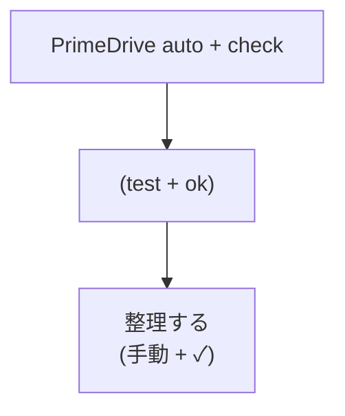

# Mermaid `themeCSS` の `foreignObject` セレクタ小文字化検証(2026-05-16)

## 0. 本ドキュメントの位置付け

`docs/expert-reviews/2026-05-16_mermaid-issue-report-validity-best-practices.md` §1.1 で「実機での観測手順を 1 ステップ挟むべき」と記したワークアラウンド失効仮説の検証記録。Mermaid 公式リポジトリへの Bug Issue 投稿前の事実確認に位置付ける。

検証日: 2026-05-16
検証者: 本リポジトリオーナー
検証成果物: `docs/svg-themecss-lowercase-verification-2026-05-16/`

---

## 1. 検証目的

専門家レビュー(`2026-05-16_mermaid-issue-report-validity-best-practices.md`)で「現時点で裏取り未了の仮説」と判定した次の主張を、実機の生成 SVG を直接観測することで真偽確定する。

> 仮説 (b): Mermaid の CSS 出力パイプラインが `themeCSS` 中の `foreignObject` セレクタを `foreignobject` に小文字化することで、SVG namespace の case-sensitive セレクタ判定で `<foreignObject>` 要素にマッチしなくなる。

判定基準:

- 生成 SVG の `<style>` 要素内に `foreignObject`(大小区別)が保持されていれば → 仮説否定
- `foreignobject`(全小文字)に変換されていれば → 仮説裏取り

---

## 2. 検証条件

### 2.1 環境

| 項目 | 値 |
|---|---|
| `@mermaid-js/mermaid-cli` | `11.14.0`(本リポジトリ `package.json` 固定) |
| bundled `mermaid` core | `11.15.0`(`node_modules/mermaid/package.json` 実測) |
| 実行ホスト | macOS Darwin 25.3.0 |
| Puppeteer 設定 | `args: ["--no-sandbox"]` |
| Mermaid `defaultRenderer` | `dagre-wrapper`(Mermaid 既定) |
| Mermaid `htmlLabels` | `true` |

### 2.2 比較対象 2 種

| 名前 | `themeCSS` 設定 |
|---|---|
| `output-with-themeCSS.svg` | `".label foreignObject { overflow: visible; }"` を設定 |
| `output-no-themeCSS.svg` | 未設定(比較のためのコントロール) |

両者で同一の Mermaid ソースを使用:



### 2.3 実行コマンド

```bash
./node_modules/.bin/mmdc \
  -i docs/svg-themecss-lowercase-verification-2026-05-16/diagram.mmd \
  -o docs/svg-themecss-lowercase-verification-2026-05-16/output-with-themeCSS.svg \
  -c docs/svg-themecss-lowercase-verification-2026-05-16/config-with-themeCSS.json \
  -p docs/svg-themecss-lowercase-verification-2026-05-16/puppeteer.json \
  -e svg
```

`config-no-themeCSS.json` 版も同様。

---

## 3. 観測結果(生データ)

### 3.1 出現回数カウント

```bash
grep -o "foreignObject" output-with-themeCSS.svg | wc -l   # → 10
grep -o "foreignobject" output-with-themeCSS.svg | wc -l   # →  1

grep -o "foreignObject" output-no-themeCSS.svg   | wc -l   # → 10
grep -o "foreignobject" output-no-themeCSS.svg   | wc -l   # →  0
```

| SVG | `foreignobject`(全小文字) | `foreignObject`(大文字混じり) |
|---|---:|---:|
| themeCSS 設定あり | **1 件** | 10 件 |
| themeCSS 設定なし | **0 件** | 10 件 |

### 3.2 該当箇所の特定

#### themeCSS 設定あり版の `foreignobject` 出現箇所

SVG 内の `<style>` 要素末尾(抜粋):

```css
... #my-svg [data-look="neo"].icon-shape .icon-neo path{stroke:#9370DB; ...}
    #my-svg .label foreignobject{overflow:visible;}        ←★小文字化されている
    #my-svg :root{--mermaid-font-family:"trebuchet ms",...;}
```

#### 同 SVG の DOM ノード側(抜粋)

```xml
<g class="label" style="" transform="translate(-87.21875, -12)">
  <rect/>
  <foreignObject width="174.4375" height="24">           ←★大文字混じり保持
    <div xmlns="http://www.w3.org/1999/xhtml" style="...">
      <span class="nodeLabel"><p>PrimeDrive auto + check</p></span>
    </div>
  </foreignObject>
</g>
```

10 件の `foreignObject` 出現はすべて DOM ノード(`<foreignObject>` 要素および対応する閉じタグ)で、いずれも大文字混じりが保持されている。

---

## 4. 判定

**仮説 (b) は裏取り成立**。具体的に確定した事実:

1. Mermaid v11.15.0 + mermaid-cli 11.14.0 構成において、`themeCSS: ".label foreignObject { overflow: visible; }"` 設定で生成された standalone SVG 内では:
   - **DOM ノード** `<foreignObject>` の要素名は**大文字混じりが保持されている**(10/10 件)
   - **`<style>` 要素内の CSS セレクタ**だけが `.label foreignobject` に**小文字化されている**(1/1 件)
2. `themeCSS` 未設定では `<style>` 内に `foreignobject` 出現は 0 件で、DOM の `<foreignObject>` 大文字混じり 10 件はそのまま。
3. したがって**小文字化は `themeCSS` パイプラインに特有の処理**で発生しており、Mermaid が出力する SVG マークアップ全体の小文字化ではない。

### 4.1 帰結

XML 名前空間(standalone SVG / `` 経由 / GitHub Markdown / Slack / Notion 等)における CSS セレクタは **case-sensitive**(MDN: [CSS Type selectors / Case sensitivity](https://developer.mozilla.org/en-US/docs/Web/CSS/Type_selectors))。

- セレクタ: `.label foreignobject`(全小文字)
- DOM 要素名: `foreignObject`(大文字混じり)

→ **マッチしない** → `overflow: visible` が適用されない → クリップ発生。

HTML inline 描画では HTML パーサが要素名を case-insensitive に扱うため `foreignobject` で `<foreignObject>` にマッチし、ワークアラウンドが機能する。これが当方が観測した「inline では効くが `` 経由では効かない」モード差の根本原因。

---

## 5. 小文字化発生箇所の絞り込み

専門家 O / A の独立検証では、stylis ライブラリの `compile + stringify` 単独テストではケース保持が確認されている。したがって本検証で観測した小文字化は、以下のいずれかの段で発生していると推定される(未確定。Mermaid メンテナへの調査依頼項目):

| 候補段 | 説明 | 検証コスト |
|---|---|---|
| (i) Mermaid 内 `createCssStyles` / `getStyles` の文字列前処理 | themeCSS を stylis に渡す前にどこかで小文字化している | 中(ソース読解 + ローカル改造) |
| (ii) Puppeteer 内 Chromium の CSSOM `selectorText` シリアライズ | Mermaid が DOM に `<style>` を生成 → 後で `cssText`/`outerHTML` で読み戻す際に CSSOM が ASCII lowercase に正規化する仕様挙動 | 低(ブラウザ仕様レベル) |
| (iii) その他(DOMPurify など) | サニタイズ過程での変換 | 低(無効化テストで切り分け可能) |

(ii) が真の場合、これは Mermaid のバグというより **Web プラットフォーム仕様の制約**だが、Mermaid 側で **DOM 上の `<foreignObject>` 要素自身に `overflow="visible"` 属性を直接付与する**ことで CSS セレクタに依存せず回避できる(MDN: [SVG `overflow` attribute](https://developer.mozilla.org/en-US/docs/Web/SVG/Attribute/overflow))。

(i) が真の場合は Mermaid 本体の文字列処理を修正することで `themeCSS` ワークアラウンドが standalone SVG モードでも効くようになる。

いずれにせよ、**メンテナが取れる修正パスは存在する**ため、報告価値は十分にある。

---

## 6. 検証成果物

`docs/svg-themecss-lowercase-verification-2026-05-16/`:

| ファイル | 内容 |
|---|---|
| `diagram.mmd` | 検証用 Mermaid ソース(純 ASCII + CJK 混在 3 ノード) |
| `config-with-themeCSS.json` | `themeCSS` あり版の Mermaid 設定 |
| `config-no-themeCSS.json` | コントロール版(themeCSS なし) |
| `puppeteer.json` | Puppeteer 起動引数(`--no-sandbox`) |
| `output-with-themeCSS.svg` | themeCSS 設定下の生成 SVG(`<style>` 内 `foreignobject` 1 件 / DOM `foreignObject` 10 件) |
| `output-no-themeCSS.svg` | コントロール SVG(`foreignobject` 0 件 / DOM `foreignObject` 10 件) |

再現手順は §2.3 参照。

---

## 7. 報告予定 Issue への反映

仮説 (b) は**裏取り済**となったため、Mermaid 公式リポジトリ向け新規 Bug Issue 草案では:

- 「Hypothesis (unverified)」節 → **「Root cause (verified)」節に格上げ**して扱う
- 観測根拠として本検証ドキュメント(英訳の上)および `output-with-themeCSS.svg` / `output-no-themeCSS.svg` 差分を添付
- (i) と (ii) のどちらの段で小文字化が起きているかは「further bisection requested」として残し、メンテナに切り分けを委ねる
- 推奨修正パスは **`<foreignObject overflow="visible">` 属性付与**(専門家 O 提案、SVG 仕様レベルで XML/HTML 文脈非依存)

---

## 8. 参考一次資料

- [MDN: CSS Type selectors / Case sensitivity](https://developer.mozilla.org/en-US/docs/Web/CSS/Type_selectors) — SVG 名前空間での case-sensitive 判定
- [MDN: SVG `overflow` attribute](https://developer.mozilla.org/en-US/docs/Web/SVG/Attribute/overflow) — `<foreignObject>` への直接属性付与で回避可能
- [SVG 2 spec: overflow and clip properties](https://www.w3.org/TR/SVG2/render.html#OverflowAndClipProperties)
- [Mermaid `mermaidAPI.ts`](https://github.com/mermaid-js/mermaid/blob/develop/packages/mermaid/src/mermaidAPI.ts) — `createUserStyles` / themeCSS パイプライン
- [stylis (thysultan/stylis)](https://github.com/thysultan/stylis) — ケース保持挙動の検証元
- `docs/expert-reviews/2026-05-16_mermaid-issue-report-validity-best-practices.md` — 本検証の発議元
- `docs/expert-reviews/2026-05-16_foreignobject-clip-and-font-metrics-best-practices.md` — クリップ事象の定量実測
- `docs/svg-foreignobject-overflow-fix-verification-2026-05-16.md` — 下流側 `overflow:visible` 注入で 7/7 副作用 0 の検証
