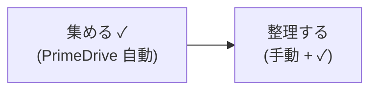
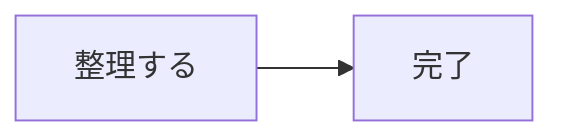
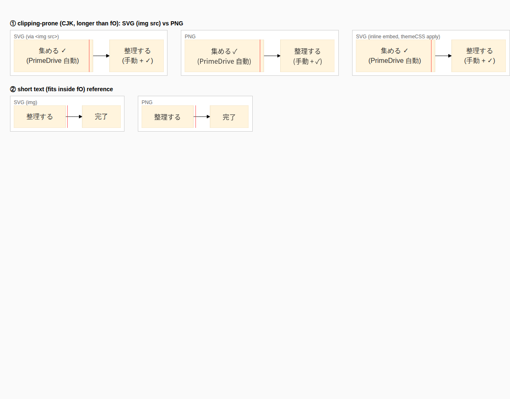
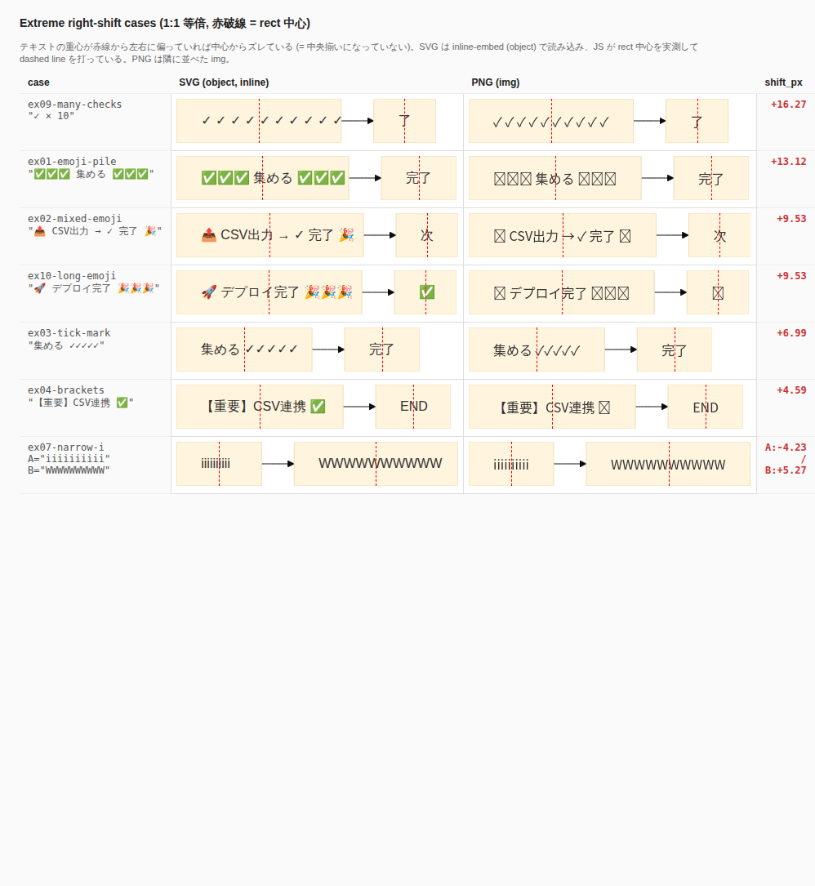

# Text right-shift in clipping-prone nodes — 2026-05-17

調査ブランチ: `investigate/state-diagram-padding` (本トピックは同ブランチ内で実施)

## ユーザー観測

> CSV (CJK) 文字切れ対策後、文字切れが起きそうなノードの文字が「多少右寄り」に表示される。
> つまり横方向に中央揃えになっていない。これは F-1 (`forceForeignObjectOverflowVisible`) の副作用か？

## 結論 (TL;DR)

| 項目 | 結論 |
|---|---|
| 右寄りは事実か | **事実**。SVG (img/inline)、PNG いずれでも再現する。 |
| F-1 が原因か | **半分 yes / 半分 no**。「中心からのズレ」は Mermaid 既存挙動で F-1 以前から発生していた。F-1 でクリップが解除されたことにより「右クリップ」が「右はみ出し」に変わり、**視覚上ズレが認識可能になった**。 |
| `docs/svg-foreignobject-overflow-fix-verification-2026-05-16.md` line 107-111 「`overflow:visible` で左右均等(symmetric)に広がる」 | **誤り**。実測は片側 (右側) のみ。 |
| SVG / PNG で挙動差はあるか | **無し**。SVG (img)、SVG (inline / `<object>`)、PNG (Puppeteer programmatic) で同じ右寄り。 |
| 修正可能か | 可能。foreignObject 内側 div を **left-anchored cell → center-anchored** に書き換える後処理 / themeCSS 追加が候補。 |

## 1. 再現素材

入力 Mermaid (`flowchart LR`, 2 ノード、`<br>` 改行 2 行ラベル):



リファレンス用に短いラベル 1 行ケースも生成:



生成成果物 (`docs/text-right-shift-investigation-2026-05-17/`):

| ファイル | 内容 |
|---|---|
| `case-clip.svg` | 上記長文版 SVG (`/render`, programmatic) |
| `case-clip.png` | 同 PNG (Puppeteer page screenshot) |
| `case-short.svg` / `case-short.png` | 短文リファレンス |
| `viewer.html` | 3 描画モード並列比較ページ |
| `measure-shift.html` | SVG DOM を `getBoundingClientRect` で計測 |
| `overview.png` | Playwright 撮影の比較スクリーンショット |
| `measurements.json` | 数値計測結果 |

API: `http://127.0.0.1:3100/render`, Mermaid 11.15.0, `defaultRenderer: dagre-wrapper`, `htmlLabels: true`, `BEAUTIFUL_DEFAULTS` 適用済み (本ブランチの未コミット変更なし、現行 main 相当の挙動)。

## 2. 比較スクリーンショット



赤い縦線は各ボックスの horizontal center。

- **①長文 (clipping-prone)**: 3 描画モード共通で、A ノード "(PrimeDrive 自動)" 行 / B ノード "(手動 + ✓)" 行が右寄り。
- **②短文 (non-clipping)**: 両ノードで中央揃え正常。

## 3. SVG 構造の調査

`case-clip.svg` から抜粋:

```html
<g class="node default" id="...A-0" transform="translate(102.77, 47)">
  <rect class="basic label-container" x="-94.77" y="-39" width="189.55" height="78"/>
  <g class="label" transform="translate(-64.77, -24)">
    <rect/>
    <foreignObject style="overflow:visible" width="129.55" height="48">
      <div xmlns="http://www.w3.org/1999/xhtml"
           style="display: table-cell; white-space: nowrap;
                  line-height: 1.5; max-width: 200px; text-align: center;">
        <span class="nodeLabel">
          <p>集める ✓<br />(PrimeDrive 自動)</p>
        </span>
      </div>
    </foreignObject>
  </g>
</g>
```

ジオメトリ:

| レイヤ | left | right | center | width |
|---|---:|---:|---:|---:|
| rect (A) | -94.77 | +94.77 | 0 | 189.55 |
| foreignObject (A) | -64.77 | +64.78 | 0 (= rect 中心) | 129.55 |

ここまでで **foreignObject は rect 中心に配置されている**(rect の左右 30px ずつのパディング内側)。

問題はその内側:

- 内側ルートは `<div style="display: table-cell; text-align: center; white-space: nowrap; max-width: 200px">`。
- `display: table-cell` を裸で書くと、ブラウザはこれを匿名 `table-row` + `table` でラップしたブロックボックスとして扱う。
- 匿名テーブルは **block-level 要素のデフォルト挙動 (LTR では containing block の left edge に配置)** を取り、`white-space: nowrap` の制約下で intrinsic width にシュリンク・拡張する。
- 結果として **`text-align: center` は "cell 内の inline 行" を中央寄せするだけ**で、cell 自体は fO の左端アンカー。
- `text-align: center` を効かせる対象 (= cell の左右に余白) が存在しないため、cell width ≠ fO width のとき必ずズレる。

## 4. ピクセル単位の定量計測

`getBoundingClientRect` (CSS px) で測定 (`measurements.json` 参照):

| ノード | rect center | fO center | innerDiv (cell) left → right (width) | nodeLabel span center | **span − rect** | 状態 |
|---|---:|---:|---|---:|---:|---|
| A "集める ✓ / (PrimeDrive 自動)" | 94.68 | 94.68 | 29.97 → 156.07 (**126.10**) | 93.02 | **-1.66 px (左寄り)** | cell < fO で左寄り |
| B "整理する / (手動 + ✓)" | 294.16 | 294.16 | 259.30 → **333.52** (**74.23**) | 296.41 | **+2.25 px (右寄り)** | cell > fO (4.49px 右オーバーフロー) で右寄り |

観察:

- fO 自体は rect の真ん中にある (`fO center == rect center`)。
- cell (innerDiv) は **常に fO の left edge にスナップ** (`innerDiv.left == fO.left`)。
- cell 幅 vs fO 幅で挙動が分岐:
  - cell < fO ⇒ cell は左に寄って静置 → text 重心が rect 中心の **左**へ
  - cell > fO ⇒ cell は左に寄って **右側にだけはみ出す** → text 重心が rect 中心の **右**へ
- 「片側オーバーフロー」のため、`docs/svg-foreignobject-overflow-fix-verification-2026-05-16.md` line 107-111 の「`overflow:visible` で symmetric (左右均等) に広がる」記述は事実と一致しない。

ユーザーが視覚的に気づいた「右寄り」は (B) のパターン (cell > fO のオーバーフロー側) に該当。

## 5. SVG / PNG の挙動差

| モード | overflow:visible 適用経路 | 結果 |
|---|---|---|
| **SVG (``)** | F-1 で `<foreignObject>` に **インライン** `style="overflow:visible"` を注入 | 右はみ出し可視 |
| **SVG (inline / `<object>`)** | themeCSS `.label foreignobject{overflow:visible}` (block 内 CSS) も適用される + インライン style | 右はみ出し可視 |
| **PNG (Puppeteer programmatic)** | Mermaid を HTML/DOM 内でレンダリングするため themeCSS は通常通り効く (case-sensitivity の問題なし) | 右はみ出し可視 |

`src/renderer/postProcess.ts:30-36` で `format === 'png'` のとき `forceForeignObjectOverflowVisible` を **スキップ**しているが、PNG のほうは Puppeteer ページ内の themeCSS で既に overflow:visible が効いているため、PNG にも同じ右寄りが現れる。要するに本件は描画フォーマットによる差ではなく **HTML レイアウト計算** の問題。

## 6. F-1 (`forceForeignObjectOverflowVisible`) との関係整理

| 状態 | cell > fO のときに見えるもの |
|---|---|
| F-1 適用前 | cell の右はみ出し部分が `foreignObject` 境界で **クリップ** → "文字が右で切れる" |
| F-1 適用後 (現状) | クリップが外れて **右側にだけ字がはみ出す** → "右寄りに見える" |

- cell が fO の左に左寄せされている事実は **F-1 以前から存在する Mermaid `dagre-wrapper` + `htmlLabels` の挙動**。
- F-1 はクリップを取り除いただけ → 「ズレが視覚的に現れる」という意味で副作用といえる。
- 「中心からのズレを生んでいる原因 (=cell が left-anchored であること)」は F-1 が作ったものではない。

## 7. 改善案 (実装しないが、選択肢を列挙)

優先度・破壊性を比較:

| 案 | 介入箇所 | 効果 | リスク |
|---|---|---|---|
| **(a) themeCSS 1 行追加**: `.label foreignObject > div { margin: 0 auto; }` 相当 | `BEAUTIFUL_DEFAULTS.themeCSS` | cell を fO 内で水平センタリング | `display: table-cell` は block-level wrapper を作るため `margin: auto` で水平中央化できるか要検証。<br>`` モード時の themeCSS 非適用問題があるので、postProcess での style 注入版も必要かも。 |
| **(b) postProcess で foreignObject 内部 div の style に `margin-left:auto; margin-right:auto;` を注入** | `src/renderer/postProcess.ts` | (a) と同じ効果を img mode でも保証 | 正規表現置換の対象範囲を foreignObject 内最初の `<div>` に限定する必要あり |
| **(c) cell wrapper を flex 化**: `display: flex; justify-content: center;` の追加ラッパを postProcess で挿入 | 同上 | センタリング確実 | DOM 構造を増やすため Mermaid の他処理 (edge label など) と衝突しないか要検証 |
| **(d) 何もしない (現状維持)** | - | - | "右寄り" 視覚に運用許容するなら不要 |

(a) が最小侵襲。要 PoC として 1 サンプル試して挙動が変わるかだけ確認すれば良い。

## 8. 検証手順 (再現)

```bash
# API 起動 (programmatic) は既存 docker-compose
mkdir -p docs/text-right-shift-investigation-2026-05-17
cd docs/text-right-shift-investigation-2026-05-17

SRC=$'flowchart LR\n  A["集める ✓<br>(PrimeDrive 自動)"] --> B["整理する<br>(手動 + ✓)"]'
jq -n --arg src "$SRC" '{code:$src,format:"svg"}' \
  | curl -s -o case-clip.svg -X POST -H 'Content-Type: application/json' \
        --data-binary @- http://127.0.0.1:3100/render
jq -n --arg src "$SRC" '{code:$src,format:"png"}' \
  | curl -s -o case-clip.png -X POST -H 'Content-Type: application/json' \
        --data-binary @- http://127.0.0.1:3100/render

# 視覚比較 (任意の HTTP server 経由で viewer.html を開き、 Playwright で screenshot)
# 計測は measure-shift.html を開いて body innerText を読む。
```

## 9. まとめ (ユーザーの問いへの回答)

> 「これは、今回特定した問題点 (F-1 overflow:visible) の解決の副作用だよね？」

- **見えるようになった理由としては Yes** — F-1 がクリップを外したことで、隠れていた "右はみ出し" が顕在化した。
- **ズレを生んでいる根本原因としては No** — Mermaid `dagre-wrapper + htmlLabels` の foreignObject 内 cell が常に左端アンカーであることが原因。F-1 がこれを作ったわけではない。
- **修正は必要か** — ユーザー体験次第。修正するなら themeCSS 1 行 + postProcess 1 規則 (上記 (a)+(b)) が最小コスト。
- **PNG でも再現するか** — する。Puppeteer の DOM レンダリング内で themeCSS が効くため。F-1 をスキップしている post-process のロジックとは独立。

---

## 補遺 (2026-05-17 追記): 肉眼で見える極端ケースの追加検証

§4 の元測定は shift ±1〜2px しかなく、ユーザー目視では「中央揃いに見える」レベルでした。
肉眼で明確に分かるケースを探すために、Unicode/絵文字/記号を 12 パターン追加検証しました。

### 結果サマリ (`shift_px = innerDiv 中心 − rect 中心`、絶対値降順)

| Rank | ケース | テキスト | rect 幅 | cell 幅 | **shift_px** | 視認性 |
|---:|---|---|---:|---:|---:|---|
| 1 | ex09-many-checks (A) | `✓ ✓ ✓ ✓ ✓ ✓ ✓ ✓ ✓ ✓` | 201.55 | 174.08 | **+16.27** | 明白 |
| 2 | ex01-emoji-pile (A) | `✅✅✅ 集める ✅✅✅` | 211.06 | 177.32 | **+13.12** | 明白 |
| 3 | ex02-mixed-emoji (A) | `📤 CSV出力 → ✓ 完了 🎉` | 229.12 | 188.25 | **+9.53** | 明白 |
| 4 | ex10-long-emoji (A) | `🚀 デプロイ完了 🎉🎉🎉` | 227.05 | 186.15 | **+9.53** | 明白 |
| 5 | ex03-tick-mark (A) | `集める ✓✓✓✓✓` | 166.10 | 120.13 | **+6.99** | 視認可 |
| 6 | ex07-narrow-i (B) | `WWWWWWWWWW` | 200.48 | 151.02 | **+5.27** | 視認可 |
| 7 | ex04-brackets (A) | `【重要】CSV連携 ✅` | 204.08 | 153.28 | **+4.59** | 視認可 |
| 8 | ex07-narrow-i (A) | `iiiiiiiiii` | 104.02 | 35.55 | **-4.23** | **左**寄り視認可 |
| 9 | ex08-mixed-w-cjk (B) | `完了 ✅` | 111.53 | 56.39 | +2.41 | 元測定相当 |
| ... | (以下 ±2px 以下) | | | | | ほぼ無感 |

完全結果: `docs/text-right-shift-investigation-2026-05-17/extreme/measurements.json`

### キーポイント

- **Mermaid が幅を取り違えやすいパターン** = `✓` `✅` `🎉` 🚀 などの**シンボル / 絵文字**、ASCII の`【】`、`W` (太字), `i` (細字)。
- `✓` (U+2713) は Mermaid が **ASCII 相当の細い幅で計測**するが、ブラウザは CJK と等幅のグリフを描画する → 大幅な undercount。10 個並べると 16px ズレる (= 1 グリフ 1.6px × 10)。
- 絵文字 `✅` `🚀` `🎉` は Mermaid が **絵文字フォントの実幅を取得しない** → CJK 幅相当で計測するが実描画は更に幅が広い。
- 逆方向: `iiiiiiiiii` は Mermaid が monospace 想定で広めに見積もる → 実描画はずっと細い → cell < fO → **左**寄り。
- 同じ図 (ex07) に `iiiiiiiiii` と `WWWWWWWWWW` を並べると、片方は左寄り・もう片方は右寄りという **対称な対比** が同じスクリーンで見える。

### 視覚的エビデンス

200% 拡大、各ボックスに **赤破線 = rect 中心** を重ねたスクリーンショット:



注目ポイント (上から):

1. **ex09 (`✓ × 10`)** — SVG では右端の `✓` が **オレンジ箱の外** にハミ出している。PNG (puppeteer 描画) でも同じ右寄り。
2. **ex01 (`✅✅✅ 集める ✅✅✅`)** — `✅` 群が赤線より明確に右側に偏在。PNG では絵文字フォント不在で `□` 表示 (PNG レンダラ環境の別問題) だが、ズレの方向は同じ。
3. **ex02 / ex10** — 絵文字混在で右寄り。
4. **ex07 (左: `iiiiiiiiii`, 右: `WWWWWWWWWW`)** — 同じ図で **左寄り (i)** と **右寄り (W)** が共存。
5. **ex03 (`集める ✓✓✓✓✓`)** — `✓` 連打で右寄り。

### shift と overflow の幾何関係 (再掲、極端ケースで成立確認)

- `shift_px ≈ overflow_right / 2` (cell が fO 左端アンカーで右にのみハミ出すため)
- ex09: overflow_right=32.53px → shift=16.27px ✓
- ex01: overflow_right=26.24px → shift=13.12px ✓

§4 で示した「fO 内 cell の左端アンカー」モデルが、極端ケースでも一貫して説明できる。

### 副次的発見: PNG の絵文字フォント問題 (本件と独立)

ex01/ex02/ex10/ex04 の PNG では絵文字 (`✅` `🚀` `🎉` 等) が **□ (missing glyph)** で表示される。これは Puppeteer ページ環境の `font-family` スタックに **カラー絵文字フォント (Noto Color Emoji 等) が含まれていない** ためで、本投稿の右寄りバグとは別物。`✓` (U+2713) など通常 BMP 記号は両方で正しく描画されるので右寄り検証には影響しない。

### 追加検証手順 (再現)

```bash
cd docs/text-right-shift-investigation-2026-05-17
# extreme/cases.json に 12 ケース定義あり
# 各ケースをジェネレート
python3 - << 'PY'
import json, subprocess
cases = json.load(open('extreme/cases.json'))
for k, src in cases.items():
  for fmt in ('svg','png'):
    req = json.dumps({"code": src, "format": fmt}, ensure_ascii=False)
    subprocess.run(["curl","-s","-o",f"extreme/{k}.{fmt}",
       "-X","POST","-H","Content-Type: application/json",
       "--data-binary","@-","http://127.0.0.1:3100/render"],
       input=req.encode())
PY

# 計測ページを開いて innerText (JSON) を取得
# (HTTP 経由で extreme/measure-all.html を開き Playwright で `() => document.getElementById("out").textContent`)
```

### 改善案の優先度更新

§7 の選択肢のうち、極端ケースで shift=16px に達することが分かったので **(d) 何もしない = ユーザー目視で右寄り明白** が裏付けられた。`✓` を多用する業務フローや絵文字を使う UI ラベルでは肉眼でハッキリ気になるレベル。**(b) postProcess で flex ラッパ注入** を最有力候補にすることを推奨。
